# JUC
## 基础
### 创建和运行线程
###### 直接使用Thread类
```java
Thread t = new Thread() {
    @Override
    public void run() {
        // 线程要执行的代码
    }
};
t.start();
```

###### Runnable接口
```java
Runnable r = new Runnable() {
    @Override
    public void run() {
        // 线程要执行的代码
    }
};
Thread t = new Thread(r);
t.start();
```

###### Callable接口与FutureTask
```java
Callable<Integer> c = new Callable<Integer>() {
    @Override
    public Integer call() throws Exception {
        // 线程要执行的代码
        return 100;
    }
};
FutureTask<Integer> ft = new FutureTask<>(c);
Thread t = new Thread(ft);
t.start();
int result = ft.get(); // 获取线程执行结果
```

> `FutureTask`实现了`RunnableFuture`接口，而`RunnableFuture`接口继承了`Runnable`和`Future`接口，所以可以将`FutureTask`作为线程的任务提交到线程池中执行。

### 常用方法
###### start-run
- 启动一个新线程
- start方法会让线程进入**就绪态**，等待进入运行态后执行run方法
- 每个线程只能调用一次

###### sleep-yield
- 让当前线程暂停一段时间（从Running进入Timed Waiting状态）
- 可以通过`interrupt()`方法打断**正在睡眠**的线程，此时sleep线程会抛出`InterruptedException`异常
- 睡眠结束后的线程未必会立刻得到执行
- `yield()`方法让当前线程让出CPU（Running进入Runnable状态），让其他线程**有机会**执行

###### join
- 调用`join()`方法的线程会被阻塞，直到被调用的线程执行结束
- `join(int timeout)`方法可以设置超时时间，超时后线程会抛出`InterruptedException`异常


###### interrupt
- 打断sleep、wait、join等阻塞的线程，抛出异常并清除中断状态，即中断状态置为：false
- **干扰**正在运行的线程或调用了`LockSupport.park()`方法的park线程，中断状态为：true
- 设计模式：两阶段终止模式（提供“善后”）
  - `stop()`方法：立即终止线程，不提供“善后”，可能导致锁未释放
  - 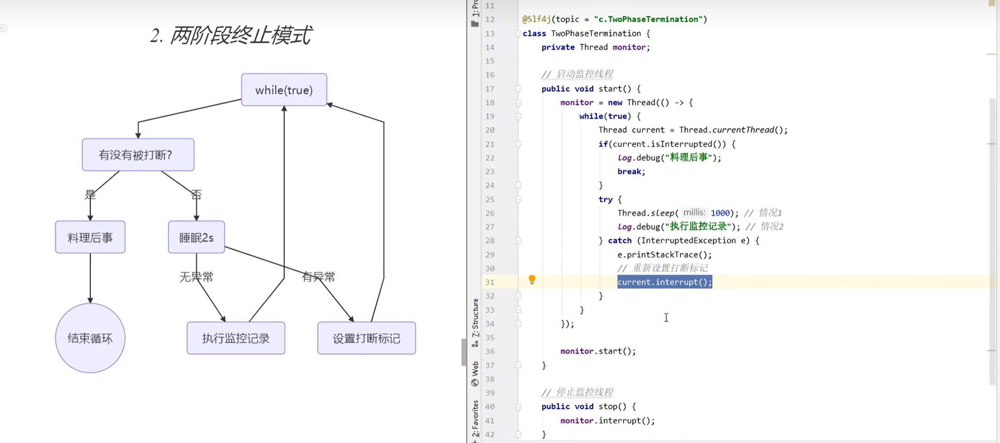

> “打断标记（中断状态）” 的本质是 “是否有未处理中断请求”，true表示 “有未处理的中断请求”。当异常抛出时，系统认为中断已被处理，因此清除标记。若希望保持标记为true，可在捕获异常后手动调用`Thread.currentThread().interrupt()`重新设置。

###### setDaemon
- 设置线程为守护线程（默认false）
- 守护线程会在所有非守护线程结束后自动结束

###### 过时方法
- `stop()`
- `suspend()`：挂起线程，不推荐使用，因为容易造成死锁
- `resume()`：恢复线程，但不推荐使用，因为容易造成死锁

### Java线程六种状态
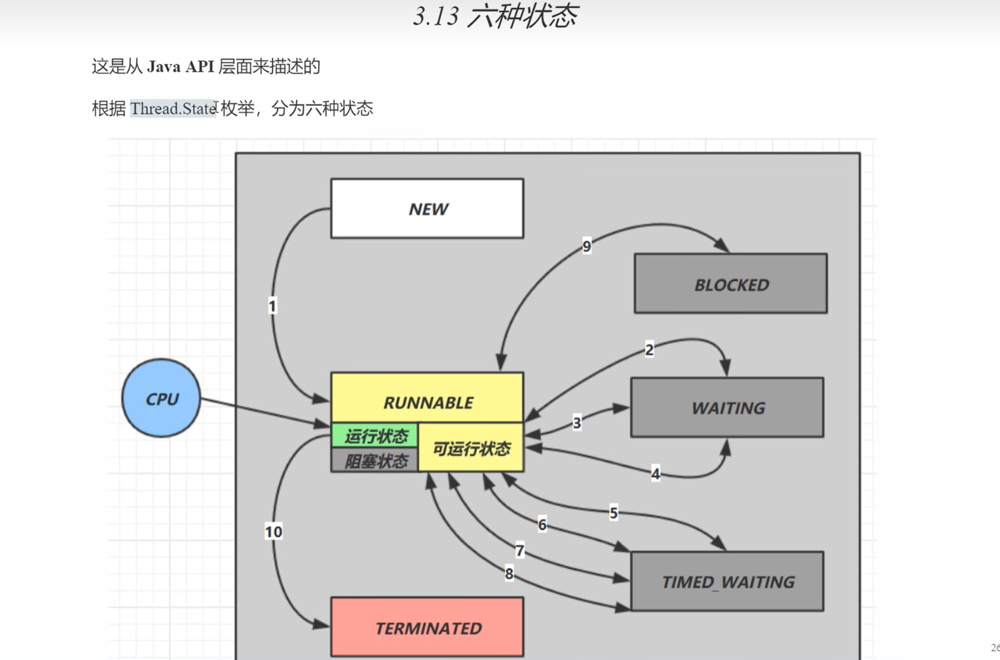
- `WAITING`：线程在`Object.wait()`方法中，正在等待其他线程调用`notify()`方法或`notifyAll()`方法唤醒。
- `TIMED_WAITING`：线程在`Thread.sleep()`方法中，正在等待一段时间后自动唤醒。
- `BLOCKED`：线程在`synchronized`代码块或方法中，正在等待锁的释放。


## 共享模型-管程（悲观锁）
### synchronized
#### 基础
- 同步代码块：`synchronized(this){...}`
- 同步方法：`synchronized void method(){...}`
- 同步静态方法：`synchronized static void method(){...}`
- 同步类：`synchronized(ClassName.class){...}`
> 1和2等效；3和4等效。

> 当执行到`synchronized`代码时，底层会在线程栈帧中创建Lock Record对象，内部可以存储锁定对象的MarkWord和对象的引用指针。

> ==线程安全类中每个方法都是原子的，但是要注意它们多个方法的组合不是原子的。==

#### 优化
###### 轻量级锁
刚执行`synchronized`代码优先使用轻量级锁，创建Lock Record后：
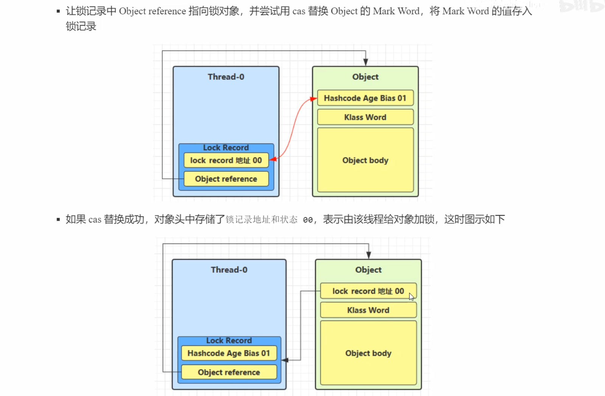
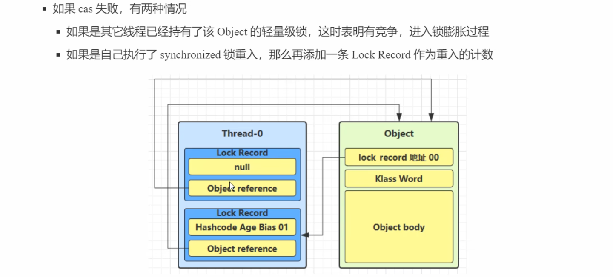

退出代码块后，释放锁：
- 根据Lock Record中的MarkWord判断
  - 若为null，则表示有重入，这时重入计数减一
  - 若不为null，正常CAS释放：若释放失败，则说明轻量级锁已经进行锁膨胀或升级为重量级锁，进入重量级锁流程

###### 偏向锁
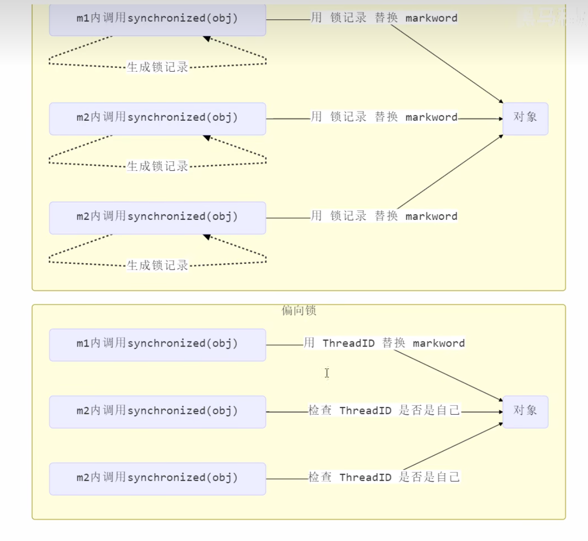

> 偏向锁默认是延迟的。

###### 锁膨胀
当有另一个线程尝试通过CAS获取轻量级锁时，发现一个线程已经拥有了锁，这时会将锁膨胀为重量级锁（因为有竞争了）：
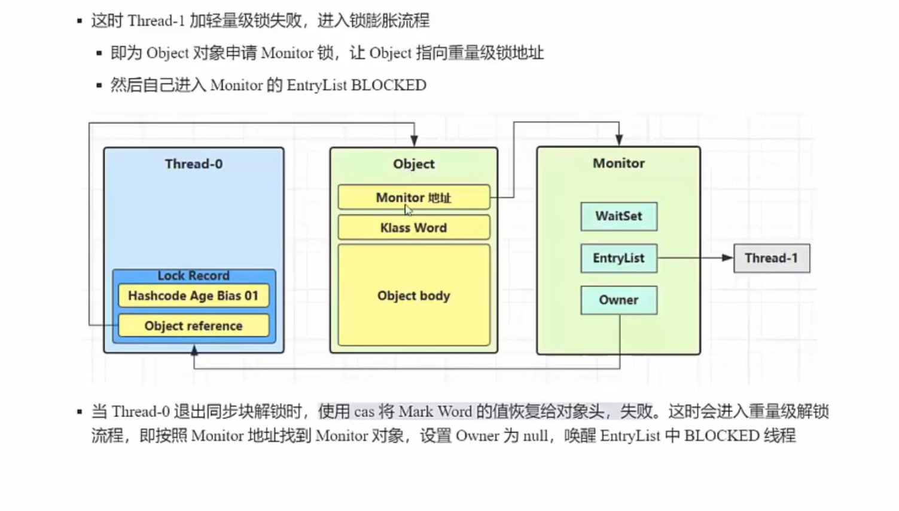


###### 自旋优化
当线程持有轻量级锁时，如果另一个线程也尝试获取锁，那么那个线程会先进行自旋，不断尝试获取锁，如果自旋重试失败过多，则才进入阻塞状态。

> 避免过多上下文切换，提高性能。

###### 其他
- 锁粗化
- 锁消除


### 底层
#### Java对象头
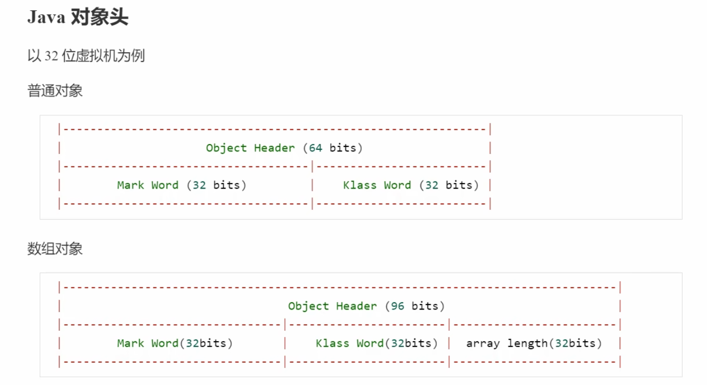

> 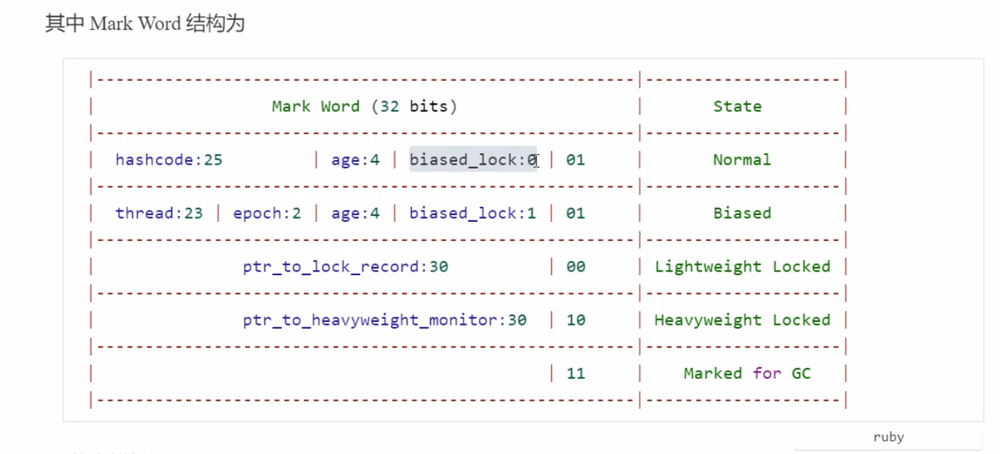

#### Monitor管程
每个Java锁对象都可以关联一个Monitor管程（C++对象），管理重量级锁的获取和释放。
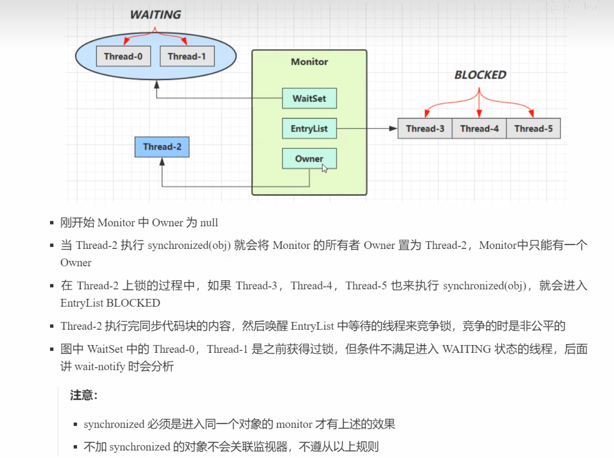

> 携带重量级锁的Java对象获取hashCode：通过MarkWord找到Monitor，并直接返回Monitor对象中的`_hash`字段（成功获取到锁对象会将对象的hashCode自动拷贝到Monitor）。

### wait-notify
- 是Object类的方法
- 必须要在`synchronized`代码块中调用
- 调用`wait()`方法后，线程会释放锁，进入等待状态，直到被notify或notifyAll唤醒
- 当然也可以用`wait(long timeout)`方法设置超时时间，超时后线程会抛出`InterruptedException`异常
- 会将锁自动升级为重量级锁

### park-unpark
- `LockSupport.park()`方法：将当前线程置于**WAIT**状态，直到被`unpark()`方法唤醒
- `LockSupport.unpark(Thread thread)`方法：唤醒线程
- 与`wait-notify`类似，但不释放锁，适用于**线程间通信**
- 利用了信号量机制，信号量上限为1

> 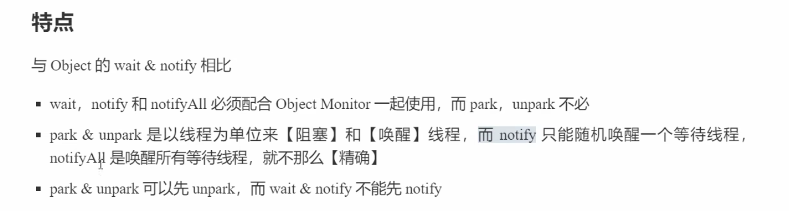


### ReentrantLock
#### 特点
相对于`synchronized`：
- 可中断
- 可设置超时时间
- 可设置为公平锁
- 支持多个条件变量
> 与`synchronized`一样，都支持可重入。


#### 使用
- 基本使用：
```java
ReentrantLock lock = new ReentrantLock();
lock.lock(); // 获取锁，会阻塞
try{
    // 线程安全的代码
}
finally{
    lock.unlock(); // 释放锁
}
```
- `lockInterruptibly()`方法：可中断获取锁，即在等待锁的过程中，可通过`Thread.interrupt()`方法中断线程的等待，抛出`InterruptedException`异常。
- `tryLock(long time, TimeUnit unit)`方法：尝试获取锁，在指定时间内，如果获取失败，则返回false，否则返回true。
- `new ReentrantLock(true)`：创建一个公平锁。


#### 条件变量
- `Condition`接口：用于线程间通信，可以实现等待/通知模式。
- `newCondition()`方法：创建条件变量。
- `await()`方法：等待通知，释放锁，进入等待状态（可被唤醒、打断、超时）。
- `signal()`方法：唤醒一个等待线程。
- `signalAll()`方法：唤醒所有等待线程。


## 共享模型-内存
### 原子性
保证指令的原子性，即一个指令要么全部执行，要么全部不执行。

### 可见性
保证指令不受CPU缓存影响
- `volatile`关键字：保证变量的修改对其他线程可见（看到最新的值），即修改后的值立即刷新到主存，其他线程可以立即看到修改后的值。
- `synchronized`

### 有序性
保证指令不受指令语句重排影响。

### volatile底层
#### 概述
- 内存屏障：指令重排序时，为了保证指令的执行顺序，编译器和处理器会在指令之间插入内存屏障来禁止特定类型的重排序。
- 对`volatile`变量的写指令后会加入写屏障。
- 对`volatile`变量的读指令前会加入读屏障。

#### 保证可见性
- 写屏障：在该屏障之前的对共享变量的改动都同步到主存中。
- 读屏障：在该屏障之后的对共享变量的读取，都会从主存中读取最新数据。

#### 保证有序性
- 写屏障：不会将屏障之前的代码排在屏障之后。
- 读屏障：不会将屏障之后的代码排在屏障之前。


### happens-before
- 单一线程内的操作
- 锁的释放与获取
- `volatile`变量的写与读
- `Thread.start()`方法前的写
- `join()`方法

## 乐观锁
### CAS：Compare-And-Swap
- 原子操作，用于解决多线程并发访问共享变量时的同步问题。
- 无锁操作：
  - 没有线程上下文切换，提高性能。
  - 需要占用CPU

### 原子整数
- `AtomicBoolean`、`AtomicInteger`、`AtomicLong`
- `get()`方法：获取当前值。
- `compareAndSet(expectedValue, newValue)`方法：
  - 如果当前值等于预期值，则以原子方式将变量值设置为newValue，返回true。
  - 如果当前值不等于预期值，则说明已经有其他线程修改了变量值，则返回false。
- `updateAndGet(IntegerUnaryOperator updateFunction)`方法：
  - 以原子方式更新变量值，并返回更新后的值。

### 原子引用
###### AtomicReference<>
- `get()`方法：获取当前引用。
- `compareAndSet(expectedReference, newValue)`方法：
  - 如果当前引用等于预期引用(==值比较==)，则以原子方式将变量值设置为newValue，返回true。
  - 如果当前引用不等于预期引用，则说明已经有其他线程修改了变量值，则返回false。

> 普通原子引用会有ABA问题。

###### AtomicStampedReference<>
- 带有版本号的原子引用。
- `getStamp()`方法：获取当前版本号。
- `getReference()`方法：获取当前引用。
- `compareAndSet(expectedReference, newValue, expectedStamp, newStamp)`：比普通原子引用多了一个版本号的比较。

###### AtomicMarkableReference<>
- 带有标记位的原子引用。
- `isMarked()`方法：判断标记位是否为true。

### 原子数组
- `AtomicIntegerArray`、`AtomicLongArray`、`AtomicReferenceArray`
- `get(int index)`方法：获取指定位置的值。
- `set(int index, int newValue)`方法：设置指定位置的值。
- `compareAndSet(int index, int expectedValue, int newValue)`方法：
  - 如果当前值等于预期值，则以原子方式将变量值设置为newValue，返回true。
  - 如果当前值不等于预期值，则说明已经有其他线程修改了变量值，则返回false。


## 并发工具
### 线程池
#### 概述及池状态
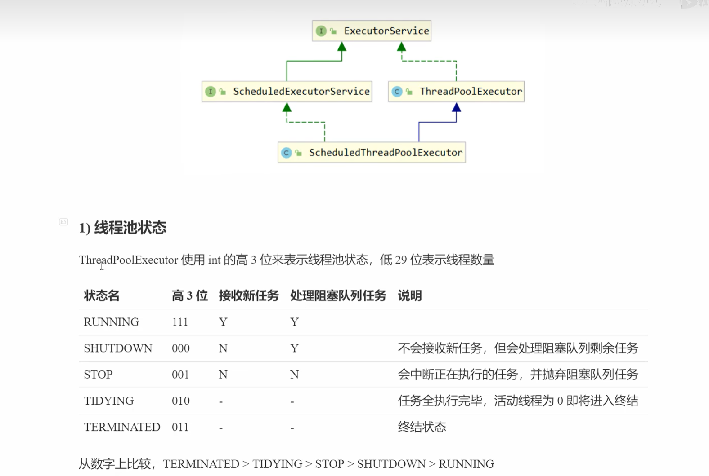


#### 构造方法
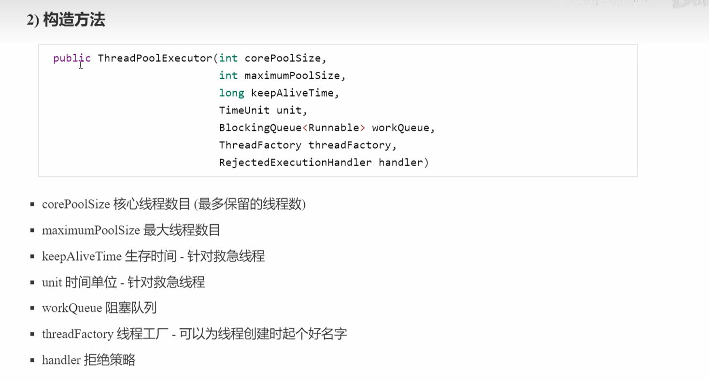


#### Timer
- 定时执行任务
- 所有任务都由同一个线程来串行调用
```java
Timer timer = new Timer();
TimerTask task1 = new TimerTask() {
    @Override
    public void run() {
        // 任务代码
        Thread.sleep(2000);
    }
};
TimerTask task2 = new TimerTask() {
    @Override
    public void run() {
        // 任务代码
    }
};
timer.schedule(task1, delay1); // 延迟delay1毫秒后执行
timer.schedule(task2, delay2); // 延迟delay2毫秒后执行，受上个任务影响
```


#### 具体类
- 具体大小线程池`newFixedThreadPool(int nThreads)`
- 无限救急线程池`newCachedThreadPool()`
  - 采用`SynchronousQueue`：没有容量，没有线程`poll()`是`offer`不进去的
- 单线程线程池`newSingleThreadExecutor()`
  - 保证时时刻刻仅有一个正常线程工作
  - 采用装饰器模式：不能调用`ThreadPoolExecutor`中的特有方法，如强制调用`setCoreSize()`等
- 定时线程池`newScheduledThreadPool(int corePoolSize)`
  - 延迟执行任务
  - `schedule(Runnable command, long delay, TimeUnit unit)`
  - `scheduleAtFixedRate(Runnable command, long initialDelay, long period, TimeUnit unit)`：定期执行任务，首次延迟initialDelay毫秒后执行，之后每隔period毫秒执行一次


#### 常用方法
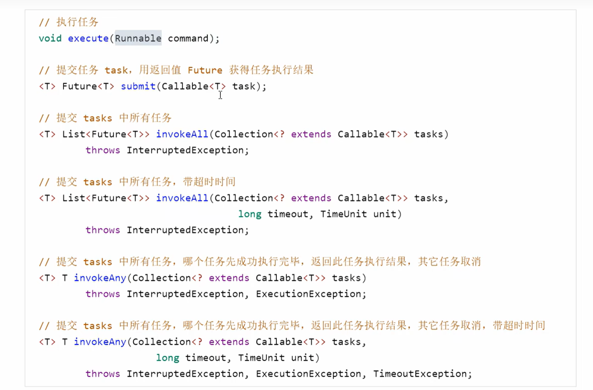

- `shutdown()`：状态变为SHUTDOWN
- `shutdownNow()`：状态变为STOP，并尝试中断所有线程

#### 处理异常
- 主动加`try-catch`
- 用`Future`获取结果，并用`get()`方法获取异常


### J.U.C
#### AQS同步器类
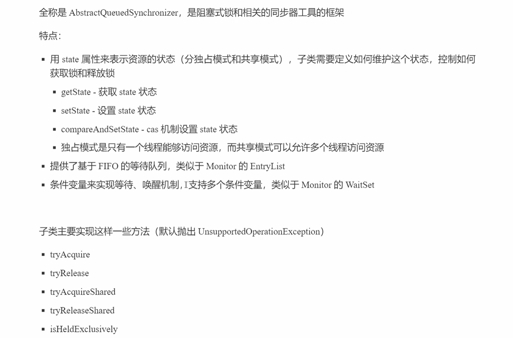
> 关键方法：`compareAndSetState(int expect, int update)`

#### ReentrantLock原理
[见黑马JUC](https://www.bilibili.com/video/BV16J411h7Rd?spm_id_from=333.788.player.switch&vd_source=6b2289837dfccb43df55bc1350b7990c)


#### ReentrantReadWriteLock
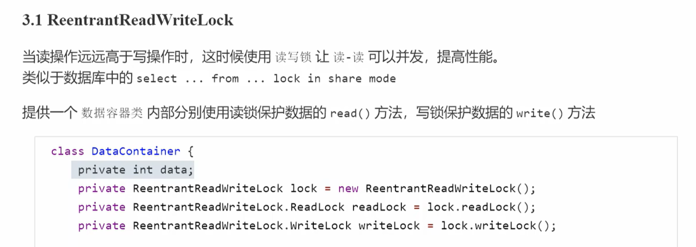

> - [ ] 重入锁：先获取读锁再获取写锁（升级）
> - [x] 重入锁：先获取写锁再获取读锁（降级）

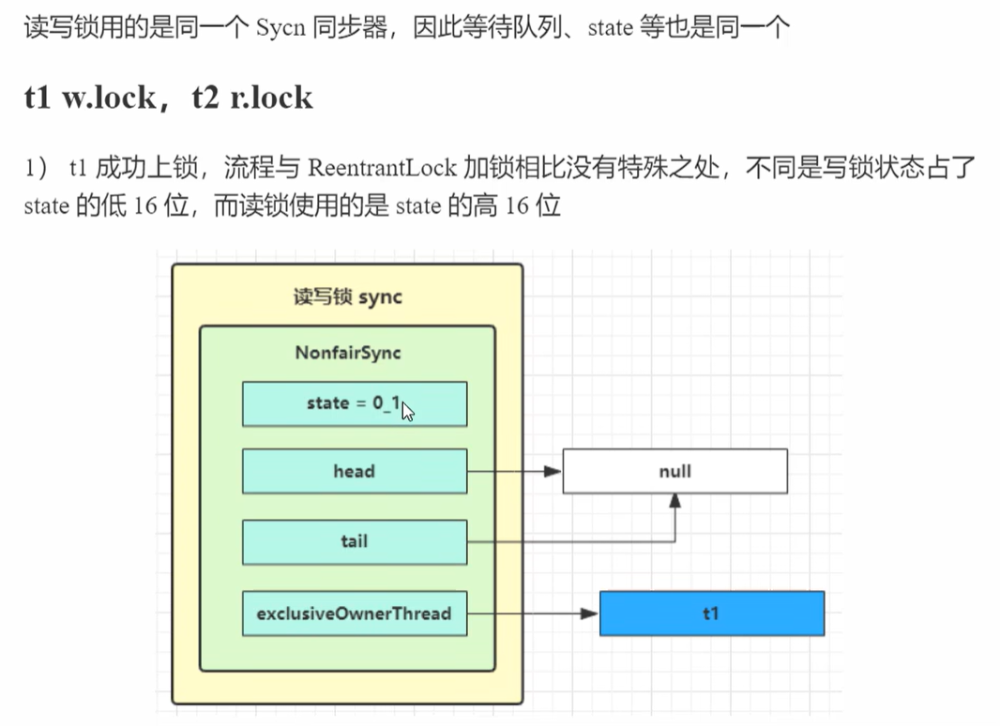


#### Semaphore
- 信号量：控制同时访问共享资源的线程数量
```java
Semaphore semaphore = new Semaphore(3); // 最多3个线程同时访问
semaphore.acquire(); // 获取一个许可
try{
    // 线程安全的代码
} finally{
    semaphore.release(); // 释放一个许可
}
```

#### CountDownLatch-计数锁
- 用于多线程之间同步，充当计数器（一次性的）
```java
CountDownLatch latch = new CountDownLatch(3); // 计数器为3
new Thread(() -> {
    try{
        // 线程安全的代码
        log.info(latch.getCount()); // 输出3
        latch.countDown(); // 计数器减1
    } catch(Exception e){
        e.printStackTrace();
    }
}).start();
---
try{
    latch.await(); // 等待计数器为0
} catch(Exception e){
    e.printStackTrace();
}
```

### 线程安全的集合类
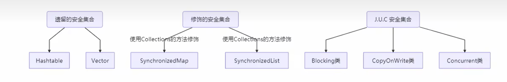

### ThreadLocal
ThreadLocal类用于提供线程内部的局部变量。

#### 常用方法
- `ThreadLocal<>()`：构造方法
- `set(T value)`：设置当前线程的局部变量
- `get()`：获取当前线程的局部变量
- `remove()`：移除当前线程的局部变量

#### 内部结构
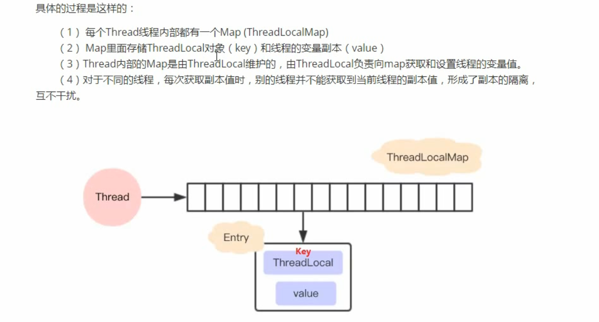

> ThreadLocal类实例只是Map中Key的引子，Map中的Key的值为ThreadLocal类实例的弱引用。

> ThreadLocalMap解决hash冲突：线性探测法。 