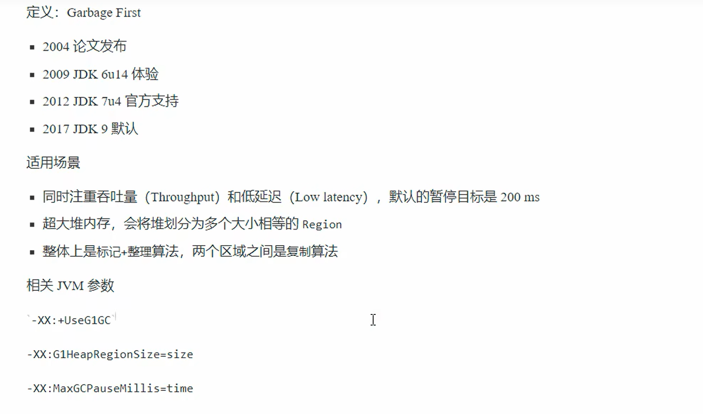

# JVM
## 基本架构


## 内存结构
### 程序计数器
#### 作用


#### 特点
- 线程私有，随着线程创建而创建，销毁而销毁
- 唯一一个不会存在内存溢出的区域

### 虚拟机栈
#### 基本概念


#### 特点
1. 每个线程运行时所需要的内存，称为虚拟机栈
2. 一个栈帧（Frame）对应一个方法调用，包含局部变量表、操作数栈、动态链接、方法出口信息
3. 每个线程只能有一个活动栈帧
4. 垃圾回收不涉及栈内存

#### 内存溢出
- 栈帧过多
- 栈帧过大

### 本地方法栈
给本地方法（Native Method）提供的内存空间

### 堆
- `new`创建的对象和数组都保存在堆内存中
- 它是线程共享的，堆中的对象都需要考虑线程安全问题
- 有垃圾回收机制

### 方法区
#### 组成


#### 常量池和运行时常量池
- 常量池：可以理解为就是一张表，虚拟机指令根据这种常量表找到要执行的类名、方法名、参数类型、字面量等信息。
- 运行时常量池：常量池是*class文件中的，当该类被加载，它的常量池信息就会放入运行时常量池，并把里面的符号地址变为真实地址。


#### StringTable串池
```java
public class Main {
    public static void main(String[] args) {
        // 下边两种都会存入串池
        String s1 = "hello";
        String s2 = new String("world");
        // new StringBuilder().append(s1).append(s2).toString();
        // toString() -> new String("helloworld"); 
        String s3 = s1 + s2; 
        String s4 = "helloworld";
        // s3 != s4

        // "test" "str"会存入串池，但"teststr"不会
        String s5 = new String("test") + new String("str");
    }
}
```
对于s1和s2：
- 还未加载`Main.class`，`"hello"`等字符串还是常量池中的信息。
- 当该类被加载，`"hello" "world"`就会被放入运行时常量池。
- 随后，StringTable（无法扩容hashtable结构，初始为空）会添加`"hello"`等字符串。


对于s3和s4：
- 详见代码注释，s3最终是堆中对象的引用，堆中对象`"helloworld"`不会放入串池（可以用`intern`方法放入）。
- 对于s4，语句等价`String s4 = "hello" + "world";`，因为都是常量，编译器可以优化。

> JDK1.7及之前的版本，StringTable在堆中，其实也是存放了一个个String对象。

### 直接内存
#### 基本特点
- 属于操作系统，是系统为Java程序提供的内存，使Java程序可以直接访问物理内存，可以提高性能
- 常见于NIO操作，用于数据缓冲区
- 分配回收成本较高，但读写性能高
- 不受JVM内存回收管理


#### 分配与回收
- 底层：使用`Unsafe`对象完成直接内存的分配回收，分配需要`allocateMemory()`方法，回收需要`freeMemory()`方法（类似C中的`malloc()`和`free()`）
- 与JVM-gc的联动：`ByteBuffer`的实现类内部，使用了`Cleaner`虚引用来检测`ByteBuffer`对象，一旦`ByteBuffer`对象被回收，那么就会由`ReferenceHandler`线程通过`Cleaner`的`clean()`方法调用`freeMemory()`方法释放直接内存

## 垃圾回收
### 判断垃圾
- 引用计数法：每个对象有一个引用计数器，当计数器为0时，说明没有任何对象引用它，可以回收。缺点是**循环引用问题**。
- 可达性分析算法：GC Roots作为起点，从这些节点开始向下搜索，搜索所走过的路径称为引用链，当一个对象到GC Roots没有任何引用链相连时，则证明此对象是不可达的，可以回收。


### 五种引用


> 引用队列：将栈中非强引用加入引用队列，等待被释放。

### 垃圾回收算法
- 标记清除法
- 标记整理法
- 复制算法：内存区划为两块

### 分代回收


### 垃圾回收器
#### 概述
- 串行（Serial）
  - 单线程
  - 堆内存较小，适合个人电脑
- 吞吐量优先（Parallel）
  - 多线程
  - 堆内存较大，多核CPU
  - 单位时间内，STW的时间最短
- 响应时间优先（CMS）
  - 多线程
  - 堆内存较大，多核CPU
  - 尽可能让单次STW时间最短

> 

#### CMS

- 初始标记：仅仅标记GC Roots能直接关联到的对象，速度很快，**需要STW**。
- 并发标记：从GC Roots开始，并发标记所有可达对象，**不需要STW**。
- 重新标记：并行修正并发标记期间因用户程序继续运行而导致标记产生变动的那一部分对象的标记记录，**需要STW**。
- 并发清除：清除GC标记的对象，**不需要STW**。

> 由于CMS应用于老年代且使用的是标记清除算法，当内存碎片过多时，CMS会退化为Parallel Old。

#### G1
##### 概述


> 也可以卸载Class、Classloader等。

##### 回收过程
$Young Collection\rightarrow Young Collection+Concurrent Mark\rightarrow Mixed Collection\rightarrow Young Collection$
###### 新生代回收


> 跨代引用：

###### 新生代回收 + 并发标记


###### 混合回收


## 类加载和字节码
### 类文件结构


### cinit和init
###### cinit
- 编译器会按从上至下的顺序，顺记所有`static`静态代码块和静态成员赋值的代码，合成为一个特殊的方法`<cinit>()V`
- 该方法会在类加载的初始化阶段被调用

###### init
- 编译器会按从上至下的顺序，顺记{}代码块和成员变量赋值的代码，**并在最后填上构造函数**，合成为一个特殊的方法`<init>(args)V`
- 该方法会在每个实例被创建时被调用


### 多态原理


### 异常
- 字节码中存在`Exceptions Table`，记录异常处理的位置
- `finally`中如果`return`则返回`finally`中的值，但可能吞掉`throw`操作
- `finally`中如果没有`return`，则按正常流程返回，但`finally`块一定会执行

### 类加载
#### 加载


> 

> 加载仅仅生成原始的二进制结构，而完整的元数据（如 instanceKlass 的 _field、_method）会在后续阶段（验证后）逐步构建。

#### 连接
- 验证：检查字节码文件格式、元数据、符号引用等，安全性检查
- 准备：为类变量分配内存，并设置默认初始值（常量直接赋值[非String引用类型除外]，静态变量赋默认值）
- 解析：将常量池的符号引用解析为直接引用

#### 初始化
调用`<cinit>()V`方法，执行类变量的初始化。


#### 类加载器
###### 概述


###### 双亲委派模型
```java
自定义类加载器收到 "java.util.ArrayList" 的加载请求  
↓ 委派给父类加载器  
扩展类加载器 → 委派给父类加载器  
启动类加载器 → 找到 rt.jar 中的 ArrayList.class → 返回 Class 对象  
```
- 确保共有类的唯一加载
- 防止核心类被篡改


###### 线程上下文类加载器
线程上下文类加载器（Thread Context ClassLoader）是 Java 中打破双亲委派机制的关键工具，在 JDBC 等框架中发挥核心作用。以下结合 `DriverManager` 和 `Driver` 类详细解析其原理和应用场景：

已知：
- **`DriverManager` 类**：位于 `java.sql` 包，由**启动类加载器**加载（属于 JRE 核心类）。
- **数据库驱动实现类**（如 `com.mysql.cj.jdbc.Driver`）：由**应用类加载器**加载（位于应用的 ClassPath 中）。

当 `DriverManager` 尝试加载数据库驱动时：
- 根据双亲委派规则，`DriverManager` 的类加载器（启动类加载器）会优先处理加载请求。
- 但启动类加载器**无法访问应用类路径下的驱动实现类**（如 `mysql-connector-java.jar`），导致 `ClassNotFoundException`。


解决方法：
通过 `Thread.currentThread().getContextClassLoader()` 获取当前线程的上下文类加载器（默认是**应用类加载器**），并使用它来加载驱动类。这允许**父类加载器（启动类加载器）委托子类加载器（应用类加载器）完成加载**，打破双亲委派的层级限制。


`DriverManager` 类在初始化时会调用 `loadInitialDrivers()` 方法，通过线程上下文类加载器加载驱动：
```java
public class DriverManager {
    static {
        loadInitialDrivers(); // 静态代码块，类加载时执行
        println("JDBC DriverManager initialized");
    }
    
    private static void loadInitialDrivers() {
        // 1. 获取线程上下文类加载器
        ClassLoader cl = Thread.currentThread().getContextClassLoader();
        
        // 2. 使用 ServiceLoader 机制查找所有实现了 Driver 接口的类
        ServiceLoader<Driver> loadedDrivers = ServiceLoader.load(Driver.class, cl);
        Iterator<Driver> driversIterator = loadedDrivers.iterator();
        
        // 3. 加载并注册所有驱动
        try {
            while(driversIterator.hasNext()) {
                driversIterator.next(); // 触发驱动类的加载和注册
            }
        } catch (Throwable t) {
            // 忽略错误
        }
    }
}
```

###### 自定义类加载器
- 继承`ClsasLoader`类
- 遵循双亲委派机制，重写`findClass()`方法
- 读取类文件的字节码
- 调用父类的`defineClass()`方法，来加载类
- 使用者调用该类加载器的`loadClass()`方法，来加载类

```java
public class MyClassLoader extends ClassLoader {
    @Override
    protected Class<?> findClass(String name) throws ClassNotFoundException {
        String path = "filepath" + name + ".class";
        try {
            byte[] b = Files.readAllBytes(Paths.get(path));
            return defineClass(name, b, 0, b.length);
        } catch (IOException e) {
            throw new ClassNotFoundException(name);
        }
    }
}
```

