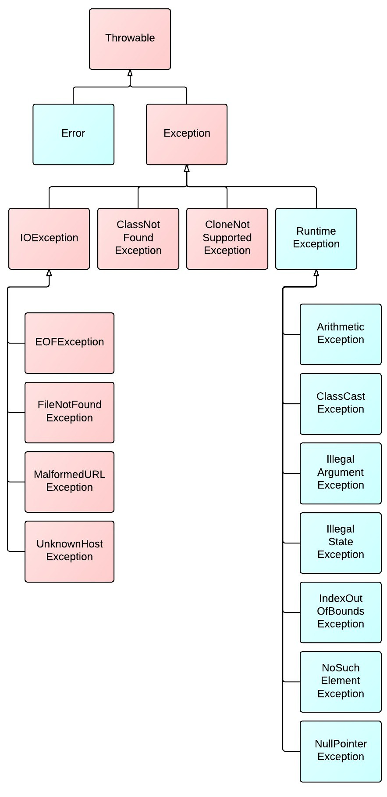
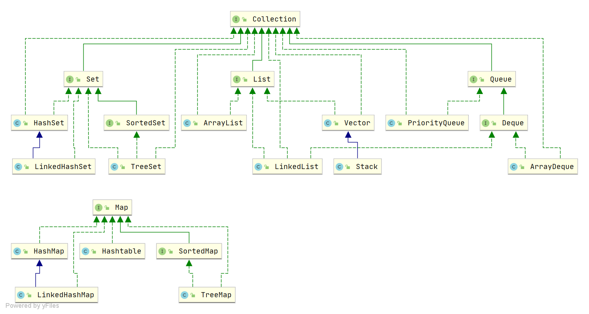

# Java学习笔记
>Java是世界上最好的语言.cpp

## Java基本知识

### 编译及执行过程
$$
\text{*.java} \xrightarrow{\text{编译器(javac)}} \text{*.class} \xrightarrow{\text{java运行(JVM)}} \text{在不同OS上运行}
$$
  
- JDK：Java Development Kit，包含编译器、运行环境、类库等。$JDK = JRE + Development Tools$。
- javac：Java编译器，将.java文件编译为.class文件(*每一个类都对应一个class文件*)。
- javap：Java反汇编器，将.class文件反汇编为汇编代码。
- JRE：Java运行环境，包含Java虚拟机（JVM）、类库等。$JRE = JVM + Class Libraries$。
- Java虚拟机（JVM）：Java字节码指令集在JVM上运行，JVM是Java运行的核心。==其使得Java成为跨平台语言，因为JVM可以运行在各种操作系统上。==     

### 基础开发细节
- 大多与C++类似
- 一个源文件中最多只能有**一个**public类，且如果包含public类，则源文件名必须与public类名相同。
- main函数可以在public类中定义，也可以在其他类中定义。==main函数有标准定义，且可以有多个。==  
```java
public class Main {
    public static void main(String[] args) {
        // main函数的代码
    }
}
```
### 注释
- 单行注释：`//`
- 多行注释：`/* */`
- 文档注释(**注释内容可以被JDK下边的javadoc工具解析，以html形式呈现程序说明文档，主要注释类、方法等**)：
```java
/**
 * 类注释
  * @author 作者名
  * @version 版本号
  */
public class 类名 {
    /**
     * 成员变量注释
      */
    private int 变量名;
    /**
     * 方法注释
      */
    public void 方法名() {
        // 方法代码
    }
}
```

## Java基础语法
### 数据类型和运算符
#### 数据类型
- **基本数据类型**：
  - **未提及的类型与C++大体相同**
  - `byte` : 一个字节，存放整数。
  - `long` : 并非 **long long** 。
  - `char` : 两个字节，存放单个字符。
  - `boolean` : 一个字节，存放true或false。
- **引用数据类型**：
  - `class` : 类，用于创建对象。
  - `interface` : 接口，用于定义方法签名。
  - `array 或 []` : 数组，用于存储同一类型的数据。
- **基础数据类型细节**
  - `int n = 1L;` **是错误的**，`1L` 是一个 `long` 类型，不能赋值给 `int` 类型。
  - 声明定义`float`类型时，需要在数字后面加上`f`或`F`表示`float`类型（==不加会报错，原因同上==），如`float f = 3.14f;`。
  - ==警惕浮点数精度问题，不要简单的相等判断。==
  - `Java`中字符是按**Unicode**编码的。
  - **编码表和编码方案是不同的**，编码表（Unicode，ASCII等），编码方案（UTF-8等）。编码表是字符集，编码方案是字符编码存储方式的规则。
  - `boolean`类型，只有`true`和`false`两个值（==不可以用`0`或`非0`替代false和true==）。
- **自动类型转换**：
  - 向精度更高的类型转换（**将精度高的变量、值赋值给精度低的类型时会报错**），==下有例外==。
  - `byte`和`short`类型不会自动转换为`char`。
  - `char`类型不会自动转换为`byte`或`short`，会**先**转换为`int`。
  - `byte`、`short`和`char`参与运算时，==会**先**转换为`int`==。
  - `boolean`不参与自动类型转换。
  - **`char`类型可以保存int的常量值**，如`char c = 65;`；但不能保存int的变量值。
- **强制类型转换**：
  - 基本与C++相同。
  - `+=` `-=` `*=` `/=` `%=` 等运算符，==会将结果强转为左边变量的类型==。
  - 基础数据类型转换为`String`类型，可以利用以下格式强制转换`String s1 = 100 + "";` ，**此外还有很多方法**。
  - `String`类型转换为基础数据类型，可以利用`parse（解析）`方法，如`int i = Integer.parseInt("100");`。
    - `Boolean.parseBoolean()` ：将字符串转换为`boolean`类型，如果字符串为`"true"或"true"的任意大小写形式`，则返回`true`，==**否则返回`false`**==。
    - ==不存在`String`转换为`char`==，可以用`char s = s.charAt(n);`来获取字符串的第$n$个字符。
    - **如果字符串格式不成功，会抛出异常。**
#### 运算符
**算术运算符**
- `+` : 当左右两边都是数值时，表示加法；**当左右两边有一方为字符串时，表示拼接**。`println("C++ " + 11);`语句输出==C++ 11==。
- `%`：算式$a \% b = a - ((int)a/b) \times b$，==和被除数的符号相同==。

**关系运算符与逻辑运算符**
- 基本与C++相同。
- `instanceof`：判断对象类型是否为某类型或某类型的子类（==运行类型==）。`"abc" instanceof String` 返回`true`。

**特殊运算符**
- 基本与C++相同。
- `=`：赋值运算符，存在类型隐式强制转换。
- `?:`：三元运算符，与C++用法相同:==三元运算符视为一个整体，注意精度问题。==
- 位运算
  - `>>` `<<`：算数右移、左移，**不改变符号位**。
  - `>>>`：逻辑右移，**改变符号位，高位补0**。
  - ==无`<<<`运算符==。

### 基本输入输出
- `System.out.println()`：输出到控制台，默认换行。
- `System.in`：从控制台输入流。
- `Scanner`类：在`java.util`包中，用于从控制台输入，默认以空格、制表符、回车符分隔输入。
**具体操作如下**
```java
import java.util.Scanner;

public class Main {
    public static void main(String[] args) {
        Scanner scanner = new Scanner(System.in);
        System.out.print("请输入第一个数：");
        int a = scanner.nextInt();
        System.out.print("请输入第二个数：");
        double b = scanner.nextDouble();
        double c = a + b;
        String s1 = scanner.next(); 
        // 读取下一个字符串，结束标志为空格、制表符、回车符
        String s2 = scanner.nextLine();   // 读取下一行，结束标志为换行
        scanner.close();
        System.out.println("两数之和为：" + c + "，字符串为：" + s1);
    }
}
```

### 分支控制
- `if-else`：基本与C++相同。
- `switch-case`：表达式数据类型，应和`case`后的常量类型一致（或能自动类型转换$\rightarrow$`case`后的转换为表达式的）。==不能是浮点数==
> 表达式数据类型支持`byte` `short` `int` `long` `char` `enum` `String`

- `break`：出现在多层嵌套的语句块中时，可以通过==标签==来指明要终止的层次。如：
```java
label1: 
for (int i = 0; i < 10; i++) {
    for (int j = 0; j < 10; j++) {
        if (i == 5 && j == 5) {
            break label1;
        }
        System.out.println("i = " + i + " j = " + j);
    }
}
```
- `continue`：与`break`同理。


### 数组、排序、查找
#### 数组
- 数组声明：数据类型[] 数组名 = new 数据类型[$n$]。
- **数组长度**：用`*.length`得到。
- ==当数据空间没有变量指向（引用）的时候，Java会自动回收内存（JVM垃圾回收机制）==
> Java是世界上最好的语言！

- 二维数组：`int[][] arr = new int[m][n];`，表示创建一个$m\times n$的二维数组。**其中$n$可不填，即`int[][] arr = new int[m][]`表示创建$m$行的二维数组。**

## 面向对象
### 基本概念
#### 可变参数
- 定义：`public void method(int... args)`，表示可变参数,==参数本质就是数组==。
- 可变参数的实参可以是0个或多个，也可以是数组。
- 可变参数可以和普通类型参数放在一起，但可变参数必须放在最后。
```java
class Sum {
  public int getSum(int... nums) {
    int res = 0;
    for (int i = 0; i < nums.length; ++i) {
      res += nums[i];
    }
    return res;
  }
}
```

#### 作用域
**基本与C++相同。**
- 局部变量不能有修饰符。

#### 构造器
**即C++中的构造函数。不可被继承、重写**
- 可以有修饰符。
- ==一旦定义了自己的构造器，默认的构造器就不存在了（可以自己显示定义）。==

#### this
- 关键字，表示当前对象的引用。
- **访问构造器：`this(args...)`（此语句必须放在第一条语句），只能在构造器中使用，意为在构造器中利用另一个构造器。**

### 封装、继承、多态
#### 包
- 本质实际上就是创建不同的文件夹保存类文件。
- 包的概念与操作基本与C++中命名空间等相同。
- `package`：声明当前源文件所在的包，需要放在类的最上方，一个类最多只有一个。

#### 访问修饰符
- `public`：公共的，可以在任何地方访问。
- `proteceted`：受保护的，对子类和同一个包内的类可见。
- `无修饰符号`：默认的，对同一个包内的类可见。
- `private`：私有的，只能在当前类中访问。

|访问级别|控制修饰符|同类|同包|子类|不同包|
|-------|--------|----|-----|----|-----|
|公开|public  |$\checkmark$   |$\checkmark$    |$\checkmark$  |$\checkmark$    |
|受保护|protected   |$\checkmark$    |$\checkmark$   |$\checkmark$    |$\times$   |
|默认|无修饰符号   |$\checkmark$    |$\checkmark$    |$\times$    |$\times$   |
|私有|private   |$\checkmark$   |$\times$    |$\times$   |$\times$    |
> `public`和默认才可以作为外部类的修饰符。

#### 封装
- 基本与C++相同。

#### 继承
- 使用`extends`关键字，表示继承。
- 子类构造器必须调用父类的构造器。
```java
class Dervied extends Base {
  public Dervied() {
    super(); // 调用父类的构造器，不写也会默认隐式提供。
  }
}
```
- 当创建子类对象时，不管使用子类哪个构造器，**默认情况总会调用父类的无参构造器**，如果没有无参构造器，则编译报错（==可用`super`显式调用需要的父类构造器==）。
- `this`和`super`不能同时出现在构造器中。
- 所有类都是`Object`的子类，`Object`类中定义了所有类的共有方法。
- **Java是单继承机制**，子类最多只能继承一个父类。
- 不接受类C++这样的语法：~~`a.Base::name`~~

**`super`关键字**
- **实际上是个语法糖，相当于子类中对父类的引用，但其实不占用内存**，可以调用父类的有访问权限的方法和属性。
```java
class A {
  public int age;
}
class B extends A {
  public int age;
}
class C extends B {
  public int age;
}

public class Main {
  public static void main(String[] args) {
    C c = new C();
    System.out.println(c.age);
    System.out.println(c.super.age);
    System.out.println(c.super.super.age);
  }
}
```

#### 覆盖Override
- 子类重写父类的方法，方法名、参数列表必须完全相同。
- **子类重写的方法的返回值类型必须与父类的对应方法返回值类型相同或是其子类。**
- **重写的子类方法不能缩小父类方法的访问权限。**
> 上述粗体规则主要出于安全性和协同性。
> 可以这样理解：越是“父类”越是接近底层，越是不能触碰。
> ==子类权限的缩小会导致多态性、封装性的破坏==

|名称|发生范围|方法名|形参列表|返回值类型|访问权限|
|----|--------|------|--------|-------|-|
|重载$Overload$|同一类|相同|不同|没有限制|没有限制|
|覆盖$Override$|父子类|相同|相同|相同或为其子类|子类必须大于等于父类|

#### 多态
- 方法的多态
- 对象的多态
  - 一个对象的编译类型和运行类型可以不一致
  - 变异类型在定义对象时，就确定了且不能改变
  - 运行类型是可以变化的
  - 变异类型看声明时的类型，运行类型看定义或初始化时赋予变量的类型
- **多态的向上转型**
  - 本质：父类的引用指向了子类的对象
  - 有所有父类的成员，要遵守访问权限
  - 不能调用子类独有的成员（==编译阶段确定的是父类，无法识别子类独有的成员，调用子类的成员会报错==）
- **多态的向下转型**
  - `子类类型 引用名 = (子类类型)父类引用;`
  - ==必须是父类引用，而不是父类对象==
  - 向下转型后，就可以调用子类独有的成员
  - 类似C++中的`dynamic_cast`
- ==**动态绑定机制**==
  - 当调用对象方法时，该方法与运行类型绑定
  - 当调用对象属性时，没有动态绑定机制，哪里声明的就访问哪里（可能和偏移地址有关）
- 多态数组
- 多态形参
- 多态返回值

### Object类
- `Object`类是所有类的父类，所有类都继承了`Object`类。
- `Object`类中定义了所有类的共有方法。
  - `toString()`：返回对象的字符串表示。
    - 默认返回`类名@十六进制哈希地址`
    - 直接输出对象时，默认调用`toString()`方法。
    `System.out.println(obj);`等价于`System.out.println(obj.toString());`
  - `equals()`：判断两个对象是否相等。
  - `hashCode()`：返回对象的哈希值。
  > 重写`equals()`时，==强烈建议同时重写`hashCode()`方法。==
  > Java中如果`equals()`判断二者相等，则`hashCode()`返回相同的哈希值。
  - `getClass()`：返回对象的**运行类型**。
  - `finalize()`：垃圾回收器调用，用于释放资源。


### 静态变量
- 静态变量：类变量，所有对象共享同一个变量。
- 静态变量声明：`static 数据类型 变量名`。
- 静态变量的作用域：类级别，所有对象共享。
- 静态变量的初始化：
  - 直接赋值。
  - 通过静态代码块初始化：`static { 代码块 }`。
- 静态变量的内存分配：
  - 静态变量在**类加载时**分配内存，只分配一次。
  - 静态变量在堆上创建，每个对象都有自己的副本。
- 静态变量的访问：
  - 直接访问：`类名.变量名`。
  - 通过对象访问：`对象名.变量名`。

### 静态方法
- 静态方法：类方法，不依赖于对象，可以直接通过类名调用。
- 静态方法声明：`static 返回值类型 方法名(参数列表)`。
- 静态方法的作用域：类级别，所有对象共享。
- 静态方法的调用：
  - 直接调用：`类名.方法名(参数列表)`。
  - 通过对象调用：`对象名.方法名(参数列表)`。
- ==**静态方法不能访问非静态变量和非静态方法。**==
> 因为静态方法没有this指针，所以无法访问非静态变量和非静态方法。
> 静态方法中也没有super指针。


### main函数
- 必须是`public static void`类型。
```java
public class Main {
  public static void main(String[] args) {
    // 程序代码
  }
}
```
```bash
javac Main.java
java Main first_arg second_arg
```
- 编译执行过程中`first_arg`和`second_arg`会以`String[]`形式被传递给`main`函数。

### 代码块
```java
[修饰符] {
  // 代码
}
```
- **修饰符可写可不写，要写只能用`static`**，只会在类加载的时候加载一次。
- 用途：
  - **本质上是构造器的补充**


**初始化或调用顺序**
$$
  父类静态 \rightarrow 子类静态 \rightarrow 父类构造器 \rightarrow 子类构造器
$$

> 调用构造器前会先初始化或调用对应类的普通属性和普通代码块。

### final
- 修饰类时，表示该类不能被继承。
- 修饰方法时，表示该方法不能被重写。
- 修饰变量时，表示该变量只能被赋值一次。（即C++中的`const`）
  - `final` + `static`修饰不会导致类加载

### abstract
**大部分与C++相同**
- 修饰类时，表示该类不能实例化。
- 修饰方法时，表示该方法为抽象方法，只能在子类中实现。
- ==抽象类可以没有抽象方法，但有抽象方法的类必须是抽象类。==
- **如果一个类继承了抽象类，那么子类必须实现父类的所有抽象方法，否则子类也必须是抽象类。**
- `static`、`final`、`private`不能修饰抽象方法。

### 接口
- 接口就是给出一些没有实现的方法封装到一起，到某个类要使用的时候，再根据具体要求实现方法。
- **接口不能实例化，只能被实现。**
- ==继承是类似`is a`的关系，而接口是类似`like a`的关系。继承是亲爹，接口是干爹。==
```java
public interface Animal {
  (public static final) int MAX_AGE = 100;
  // 接口属性：默认修饰符为public static final

  (public abstract) void eat(); 
  // 接口方法，默认修饰符为public abstract
  (public abstract) void sleep();

  default (public abstract) void run() {
    System.out.println("动物跑");
  }
  // 如果需要接口方法的默认实现（有方法体）
  // 需要用default关键字修饰
  // JDK8开始支持接口的默认方法、静态方法、私有方法
}

class Dog implements Animal {
  public void eat() {
    System.out.println("狗吃骨头");
  }
  public void sleep() {
    System.out.println("狗睡觉");
  }
}

class Cat implements Animal {
  public void eat() {
    System.out.println("猫吃鱼");
  }
  public void sleep() {
    System.out.println("猫睡觉");
  }
}
```
- **普通类需要实现接口的所有方法，抽象类可以没有全部实现。**
- **一个类可以实现多个接口，但只能继承一个抽象类。**
```java
class Dog implements Animal, Runnable {
  public void eat() {
    System.out.println("狗吃骨头");
  }
  public void sleep() {
    System.out.println("狗睡觉");
  }
  public void run() {
    System.out.println("狗跑");
  }
}
```
- **一个接口可以继承多个别的接口。**
```java
interface A extends B, C {
  // 接口继承多个接口
}
```
- ==类实现接口时，若出现同名方法，只用实现一次即可。==
- **接口的多态性：** 类似继承。

### 内部类
- 局部内部类：**与局部变量类似，不能添加访问修饰符。**
- 成员内部类：
  - 普通类
  - 静态类：**可以实例化**
  - ==外部类访问内部类的成员，一般需要先创建对应的对象。==
> 外部类可以直接访问内部类的所有成员，包括`private`
```java
public class Main {
  public static void main(String[] args) {

    Outer outer = new Outer();
    Outer.Inner inner = outer.new Inner();
    inner.method();

    Outer.StaticInner staticInner = new Outer.StaticInner();
    staticInner.method();

  }
}
class Outer {
  public int i = 10;

  public void test() {
    // 普通方法
  }

  class CommmonInner {
    // 成员内部类
  }
  static class StaticInner {
    // 静态内部类
  }
  public void method() {
    // 局部内部类
    class LocalInner {
      public int i = 100;

      public void method() {
        this.i = 200;
        Outer.this.i = 300;
        // 利用这种方法访问重名的属性
        // Outer.this是一个语法糖：编译器会在内部类生成一个隐式字段
        // 如（this$0），用于保存外部类的引用。
      }
    }
  }
}
```
- ==匿名内部类==
```java
Runnable r = new Runnable() {
  @Override
  public void run() {
    // 匿名内部类
    // 匿名内部类有类名，系统自动分配
  }
}
```

## 枚举和注解
### 枚举
#### 基本用法
- **使用`enum`关键字时**，会隐式继承`java.lang.Enum`类。
- 枚举类型中的成员都是`public static final`的。
- ==枚举类型中的属性必须写在类的最前面。==
```java
enum Season {
  // 等价于不用enum关键字中的public static final Season SPRING = new Season("春天", "春暖花开");
  SPRING("春天", "春暖花开"),
  SUMMER("夏天", "夏日炎炎"),
  AUTUMN("秋天", "秋高气爽"),
  WINTER("冬天", "冰天雪地");

  private String name;
  private String desc;

  private Season(String name, String desc) {
    this.name = name;
    this.desc = desc;
    System.out.println(name + " " + desc);
    // 会调用4次。
  }
  
}
```

#### Enum类
- `Enum`类是所有枚举类型的父类。
- `Enum`类中定义了一些方法：
  - `values()`：以数组形式返回枚举类型的所有成员。
  - `valueOf(String name)`：根据名称返回枚举类型中的一个成员。
  - `name()`：返回枚举成员的名称。
  - `ordinal()`：返回枚举成员的位置。
  - `compareTo(Enum other)`：比较两个枚举成员的位置。
- `Enum`类不能继承，但可以实现接口。


### 注解
- 注解是Java5.0引入的新特性，可以用来修饰代码和限制代码，但不会影响代码的运行。
- `isAnnotationPresent(Class<? extends Annotation> annotationClass)`：判断是否存在某个注解。
- `getAnnotation(Class<? extends Annotation> annotationClass)`：获取某个注解。
- `getDeclaredAnnotations()`：获取所有注解。
- 注解的属性：注解可以有属性。
- `@Override`：用来修饰方法，表示该方法覆盖了父类的方法。
- `@Deprecated`：用来标记过时的方法或类。
- `@SuppressWarnings(value = "")`：用来抑制警告信息。
- `@FunctionalInterface`：用来修饰接口，表示该接口只有一个抽象方法。

```java
// 保留注解至运行时
@Retention(RetentionPolicy.RUNTIME)
// 可以加在方法或者类上
@Target({ElementType.TYPE, ElementType.METHOD})
public @interface MyAnnotation {
  // 自定义注解属性
  String value() default ""; // new MyAnnotation().value()获取
}

@MyAnnotation("自定义注解")
public class MyClass {
  // 注解可以修饰类、方法、属性、构造器、局部变量、包、注解、泛型等
}
```
> 元注解：
> - `@Target`：注解可以使用的位置。
> - `@Retention`：注解的生命周期。
> - `@Documented`：是否生成文档。
> - `@Inherited`：是否被子类继承。

## 异常处理

> 粉色：checked exception，必须处理，否则编译报错。
> 蓝色：unchecked exception，可以不处理，但不推荐。
> 蓝色：error，无法通过异常处理继续程序。
### 概述
- `try`块：可能出现异常的代码。
- `catch`块：处理异常的代码。
- `finally`块：无论是否出现异常，都会执行的代码。
- `throw`关键字：手动抛出异常。
- `throws`关键字：声明方法可能抛出的异常。
- `Throwable`类：所有异常和错误的父类。
  - **`Exception`类：所有异常的父类。**
    - `getMessage()`：返回异常的详细信息。
    - `printStackTrace()`：打印异常的堆栈信息。
  - `Error`类：所有错误的父类，无法通过异常处理继续程序。
    - `StackOverflowError`、`OutOfMemoryError`...

### try-catch-finally及throws
**处理异常时，try-catch-finally和throws二选一**
**对于编译异常，程序必须处理**
**对于运行时异常，程序中如果没有处理，默认就是throws处理**
```java
try {
  // 可疑代码
  // 将异常生成的对象，传递给catch块
}
catch (NullPointerException e) {
  // 处理NullPointerException异常
}
catch (Exception e) {
  // 处理上述没有匹配的异常
}
finally {
  // finally可有可没有
  // 无论是否发现异常或是否return，执行try块后都会执行finally块中的代码
}
```

```java
class Test {
  public void method() throws NullPointerException, RuntimeException {
    throw new NullPointerException("Its a message.");
  }
}
```
> 子类重写父类方法时，抛出的异常类型应当与父类对应方法相同或为其子类型。

**自定义异常**
```java
class CustomException extends RuntimeException {
  public CustomException(String message) {
    super(message);
  }
}
```

## 常用类
> 有个大致的规律：如`Object`、`Collection`等父类，`Objects`、`Collections`等就为工具类。
### 基本类型包装类
#### 装箱与拆箱
- JDK5引入的新特性：可以自动装箱和拆箱。
```java
int i = 100;
Integer integer1 = new Integer(i);
Integer integer2 = Integer.valueOf(i);
// 注意valueOf()方法的源码
// 比如Integer类中的：-128~127的整数值，会返回缓存IntegerCache中的对应引用
// 否则，会创建新的Integer对象
// 上述为手动装箱

int i = integer1.intValue();
// 上述为手动拆箱

int j = 200;
Integer integer3 = j; // 底层是Integer integer3 = Integer.valueOf(j);
// 上述为自动装箱

Integer integer4 = 300;
int k = integer4;
// 上述为自动拆箱


// 自动的底层仍是手动的过程
```

#### 常用方法
**以`Character`类和`Integer`类为例**
- `toString()`：返回对象值的字符串表示。
- `isLowerCase()`：判断字符串是否全部为小写字母。
- `isUpperCase()`：判断字符串是否全部为大写字母。
- `isDigit()`：判断字符串是否全部为数字。
- `parseInt()`：将字符串转换为整数。
- `intValue()`：返回整数值。
- `isLetter()`：判断字符串是否全部为字母。
- `toLowerCase()`：将字符串转换为小写。
- `toUpperCase()`：将字符串转换为大写。


### 字符串类
#### String类 
**构造方法**
- `String()`：默认构造方法，创建一个空字符串。
- `String(String original)`：根据字符串构造字符串。
- `String(char[] value)`：根据字符数组构造字符串。
- `String(char[] value, int startIndex, int count)`：根据字符数组的子数组构造字符串。
- `String(byte[] bytes)`：根据字节数组构造字符串。
- `String(byte[] bytes, int offset, int length, Charset charset)`：根据字节数组的子数组构造字符串。

**特性**
- ==与C++非常类似==
- 字符串常量、字符串变量等
- `String c = "Hello" + "World";`：在常量池创建**一个**字符串对象。
- `String c = a + b`：在堆上创建一个字符串对象。

**常用方法**
- `length()`：返回字符串的长度。
- `intern()`：返回常量池中字符串对象的**引用**，如果字符串已经存在常量池中，则返回常量池中的引用，否则，将字符串添加到常量池中。
- `charAt(int index)`：返回指定索引处的字符。
- `equals(Object obj)`：判断两个字符串是否相等。
- **`getBytes()`：将字符串转换为字节数组。**
- `equalsIgnoreCase(String str)`：判断两个字符串是否相等，忽略大小写。
- `indexOf(char ch/String str)`: 返回指定字符第一次出现的索引。
- `lastIndexOf(char ch/String str)`：返回指定字符最后一次出现的索引。
- `trim()`：返回去除首尾空格的字符串。
- `substring(int beginIndex)`：返回从指定索引开始到结尾的子字符串。
- `substring(int beginIndex, int endIndex)`：返回从指定索引开始到指定索引结束（==左闭右开==）的子字符串。
- `concat(String... strs)`：返回多个字符串连接后的字符串，**可以作用于`StringBuilder`类**（与`+`不同）。
- `replace(String oldStr, String newStr)`：返回将原字符串中的所有指定子字符串替换为新字符串后的字符串。
- `split(String regex)`：根据正则表达式分割字符串，返回分割后的**字符串数组**。
- `format(String format, Object... args)`：格式化字符串，返回格式化后的字符串。
```java
String format = "Hello %s, your age is %.2f";
String str = String.format(format, "Tom", 20.0001);
// 输出：Hello Tom, your age is 20
```
- `toCharArray()`：==返回字符串中的字符数组。==

#### StringBuffer类
- `StringBuffer`类是`String`类的线程安全版本。
- `StringBuffer`中的`value`是不可访问的。
- `StringBuffer`类不能被继承。
- **有点类似C++中的`std::string`，但功能更强大。**
- **构造方法**
  - `StringBuffer()`：默认构造方法，创建一个空字符串。
  - `StringBuffer(String original)`：根据字符串构造字符串。
  - `StringBuffer(int capacity)`：根据容量构造字符串。
- **常用方法**
  - `append(String str)`：添加字符串。
  - `delete(int start, int end)`：删除指定索引处的字符。
  - `insert(int offset, String str)`：在指定索引处插入字符串。
  - `indexOf(String str)`：返回指定字符串第一次出现的索引。
  - `lastIndexOf(String str)`：返回指定字符串最后一次出现的索引。
  - `replace(int start, int end, String str)`：替换指定索引处的字符。
  - `setCharAt(int index, char ch)`：设置指定索引处的字符。

#### StringBuilder类
- `StringBuilder`类是`StringBuffer`类的线程不安全版本，它比`StringBuffer`类更快，但不保证线程安全。
- `StringBuilder`中的`value`是不可访问的。
- `StringBuilder`类不能被继承。
- 单线程优先采用`StringBuilder`，多线程优先采用`StringBuffer`。


### Math类
- `Math`类提供了一些常用的数学函数。
- `Math.PI`：圆周率。
- `Math.abs(double a)`：返回绝对值。
- `Math.ceil(double a)`：返回大于等于`a`的最小整数。
- `Math.floor(double a)`：返回小于等于`a`的最大整数。
- `Math.round(double a)`：返回`a`四舍五入后的整数。
- `Math.random()`：返回0~1之间的随机数。
- `Math.pow(double a, double b)`：返回`a`的`b`次方。
- `Math.sqrt(double a)`：返回`a`的平方根。
- `Math.sin(double a)`：返回`a`的正弦值。
- `Math.cos(double a)`：返回`a`的余弦值。
- `Math.tan(double a)`：返回`a`的正切值。
- `Math.asin(double a)`：返回`a`的反正弦值。
- `Math.acos(double a)`：返回`a`的反余弦值。
- `Math.atan(double a)`：返回`a`的反正切值。
- `Math.toDegrees(double angrad)`：将弧度转换为角度。
- `Math.toRadians(double angledeg)`：将角度转换为弧度。
- `Math.exp(double a)`：返回`e`的`a`次方。
- `Math.log(double a)`：返回`a`的自然对数。
- `Math.log10(double a)`：返回`a`的以10为底的对数。
- `Math.max(double a, double b)`：返回`a`和`b`中的最大值。
- `Math.min(double a, double b)`：返回`a`和`b`中的最小值。


### Arrays类
**sort(Array a, Comparator\<T\> c)方法**
```java
int[] arr = {3, 1, 4, 1, 5, 9, 2, 6, 5, 3, 5};
Arrays.sort(arr, new Comparator<Integer>() {
  @Override
  public int compare(Integer o1, Integer o2) {
    int i1 = o1;
    int i2 = o2;
    return i1 - i2;
  }
});
```

**toString(Array a)方法**
```java
int[] arr = {3, 1, 4, 1, 5, 9, 2, 6, 5, 3, 5};
String str = Arrays.toString(arr);
// 输出：[3, 1, 4, 1, 5, 9, 2, 6, 5, 3, 5]
```


**binarSearch(Array a, Object key)方法**
- 返回指定元素在数组中的索引，如果不存在，返回`-(理应在数组中的索引)`。
- ==要求数组必须是有序的。==


**copyOf(Array a, int newLength)方法**
- 返回一个新的数组，其长度为`newLength`，内容为原数组的子数组。
- 新数组的长度不能小于原数组的长度。

**fill(Array a, Object obj)方法**
- 用指定对象填充数组。

**equals(Array a1, Array a2)方法**
- 判断两个数组是否相等。

**asList(T... a)**
- 将数组转换为`ArrayList`类。

### System类
- `System`类提供了一些系统相关的常用方法。
- `System.out.println(Object obj)`：打印输出。
- `System.out.printf(String format, Object... args)`：格式化输出。
- `System.exit(int status)`：退出程序。
- `System.currentTimeMillis()`：返回当前时间戳。
- `System.gc()`：运行垃圾回收器。
- `System.arraycopy(Object src, int srcPos, Object dest, int destPos, int length)`：数组拷贝。


### 大数类
#### BigInteger类
- `BigInteger`类是`java.math`包中的一个类，可以处理任意精度的整数。
- `BigInteger(String val)`：根据字符串构造`BigInteger`对象。
- `BigInteger(int val)`：根据整数构造`BigInteger`对象。
- `BigInteger(long val)`：根据长整数构造`BigInteger`对象。
- `BigInteger(byte[] val)`：根据字节数组构造`BigInteger`对象。
- `BigInteger(BigInteger val)`：根据`BigInteger`对象构造`BigInteger`对象。
- `add(BigInteger val)`：加法。
- `subtract(BigInteger val)`：减法。
- `multiply(BigInteger val)`：乘法。
- `divide(BigInteger val)`：除法。
- `mod(BigInteger val)`：取模。
- `pow(int exponent)`：求幂。
  - 快速幂原理：
  $$
    a^b = \begin{cases}
      a^{\frac{b}{2}} & \text{if } b\text{ is even}\\
      a^{b-1} \times a & \text{if } b\text{ is odd}
    \end{cases}
  $$
- `abs()`：取绝对值。
- `modInverse(BigInteger val)`：求乘法逆元元素。
  - 费马小定理：
  $$
  \begin{split}
    &\text{已知:  } (a / b) \mod p \neq ((a \mod p) / (b \mod p)) \mod p \\
    &引理：\text{if } a*x \equiv 1 (\text{mod } p) , \text{a、x互为乘法逆元。} \\
    &条件：\text{a存在mod p的乘法逆元的充要条件是：}\gcd(a, p) = 1 \\
    &应用：(a/b) \mod p = (a * b的逆元) \mod p \\
    &用费马小定理求逆元：\\
    &\text{前提：p为质数，a为整数。}\\
    &有：
    \begin{cases}
      a^p \equiv a (\text{mod }p) &\text{ 如果a是p的倍数}\\
      a^{p-1} \equiv 1 (\text{mod } p) &\text{ 如果a不是p的倍数}\\
    \end{cases} \\
    &一般利用\circ{2}式：a * a^{p-2} \equiv 1 (\text{mod } p) ,则a^{p-2}(\text{mod p})为a的逆元。
  \end{split}
  $$
- `negate()`：取负值。
- `signum()`：返回符号。
- `compareTo(BigInteger val)`：比较大小。
- `equals(Object obj)`：判断是否相等。
- `toString()`：返回字符串表示。

#### BigDecimal类
- `BigDecimal`类是`java.math`包中的一个类，可以处理任意精度的十进制数。
- `BigDecimal(String val)`：根据字符串构造`BigDecimal`对象。
- `BigDecimal(double val)`：根据浮点数构造`BigDecimal`对象。
- `BigDecimal(BigInteger val)`：根据`BigInteger`对象构造`BigDecimal`对象。
- `BigDecimal(BigDecimal val)`：根据`BigDecimal`对象构造`BigDecimal`对象。
- `add(BigDecimal val)`：加法。
- `subtract(BigDecimal val)`：减法。
- `multiply(BigDecimal val)`：乘法。
- `divide(BigDecimal val, RoudingMode roundingMode/int scale)`：除法。
- `remainder(BigDecimal val)`：取余。
- `abs()`：取绝对值。
- `negate()`：取负值。
- `compareTo(BigDecimal val)`：比较大小。
- `equals(Object obj)`：判断是否相等。
- `toString()`：返回字符串表示。

### 日期类


## 集合
### 概述
**集合框架**


**Collection接口基本方法**
- `add(Object obj)`：添加元素。
- `addAll(Collection c)`：添加集合中的所有元素。
- `clear()`：清空集合。
- `contains(Object obj)`：判断集合中是否包含指定元素。
- `containsAll(Collection c)`：判断集合中是否包含指定集合中的所有元素。
- `isEmpty()`：判断集合是否为空。
- `remove(Object obj/int index)`：删除指定元素。
- `removeAll(Collection c)`：删除指定集合中的所有元素。
- `retainAll(Collection c)`：保留指定集合中的元素。
- `size()`：返回集合的大小。

**迭代器**
- `iterator()`：返回迭代器。
- `hasNext()`：判断是否有下一个元素。
- `next()`：返回**下一个迭代器指向的元素**并使迭代器前进一步。
```java
Iterator<String> iterator = list.iterator();
while (iterator.hasNext()) {
  String str = iterator.next();
  // 处理元素
}
```
> List类可以使用ListIterator接口进行迭代：
> ListIterator接口功能更强大：
> `ListIterator<E> listIterator(int index)`：返回`ListIterator`对象。
> `boolean hasNext()`：判断是否有下一个元素。
> `E next()`：返回**下一个迭代器指向的元素**并使迭代器前进一步。
> `int nextIndex()`：返回下一个元素的索引。
> `boolean hasPrevious()`：判断是否有上一个元素。
> `E previous()`：返回**上一个迭代器指向的元素**并使迭代器后退一步。
> `int previousIndex()`：返回上一个元素的索引。
> `void add(E e)`：在迭代器指向的位置添加元素。
> `void remove()`：删除迭代器指向的元素。
> `void set(E e)`：设置迭代器指向的元素。


### Collection
#### Collections工具类
- `Collections.sort(List list)`：对列表进行排序。
- `Collections.reverse(List list)`：反转列表。
- `Collections.shuffle(List list)`：随机排序列表。
- `Collections.swap(List list, int i, int j)`：交换两个元素的位置。
- `Collections.fill(List list, Object obj)`：用指定对象填充列表。
- `Collections.copy(List dest, List src)`：拷贝列表。
- `Collections.max(Collection coll)`：返回最大元素。
- `Collections.min(Collection coll)`：返回最小元素。


#### List
**基本方法**
- `add((int index), Object obj)`：在指定位置插入元素。
- `get(int index)`：获取指定位置的元素。
- `set(int index, Object obj)`：设置指定位置的元素。
- `indexOf(Object obj)`：返回指定元素的索引。
- `lastIndexOf(Object obj)`：返回指定元素的最后一次出现的索引。
- `subList(int fromIndex, int toIndex)`：返回子列表。
- `ensureCapacity(int minCapacity)`：确保容量。
- `trimToSize()`：缩减容量。
- `toArray()`：转换为数组。

#### Set 
**常用方法基本与List相同，但无`get`有`contains`**
**注意没有顺序可言且不能有重复元素。**
**切记String类的`hashCode()`是根据String的*内容*计算的。**
**重复元素的判断是根据`equals()`方法判断的。**
> 巧用`Objects`里的方法
> `Objects.equals(Object a, Object b)`：判断两个对象是否相等。
> `Objects.hash(Object obj)`：返回对象的哈希码。

##### HashSet
**HashSet底层实现其实就是HashMap，只不过HashSet的value是`null`。**
**需要注意的是，底层中`table`数组存放对象的类型是`private Node<K, V> implements Map.Entry<K, V>`**

##### TreeSet
- `TreeSet`是**有序**的，线程不安全的。
- `TreeSet`的元素必须实现`Comparable`接口，或者提供`Comparator`对象。
**常用方法**
- `ceiling(E e)`：返回大于等于`e`的最小元素。
- `floor(E e)`：返回小于等于`e`的最大元素。
- `higher(E e)`：返回大于`e`的最小元素。
- `lower(E e)`：返回小于`e`的最大元素。

### Map 
#### 常用方法
- `clear()`：清空Map。
- `containsKey(Object key)`：判断Map中是否包含指定键。
- `containsValue(Object value)`：判断Map中是否包含指定值。
- `entrySet()`：返回Map中所有键值对的集合。
- `get(Object key)`：获取指定键对应的值。
- `getOrDefault(Object key, V defaultValue)`：获取指定键对应的值，如果不存在，返回默认值。
- `isEmpty()`：判断Map是否为空。
- `put(Object key, Object value)`：添加键值对。
- `putIfAbsent(Object key, V value)`：添加键值对，如果键不存在，则添加；如果键存在，则不添加。
- `computeIfAbsent(K key, Function<? super K,? extends V> mappingFunction)`：计算并添加键值对，如果键不存在，则添加；如果键存在，则不添加。
- `putAll(Map m)`：添加Map中的所有键值对。
- `remove(Object key)`：删除指定键对应的值。
- `size()`：返回Map的大小。


#### 遍历方式
**单纯的Map没有迭代器，但可以转化为Set类。**
- `keySet()`：返回Map中所有键的集合。
  - 返回`Set<K>`集合。
- `values()`：返回Map中所有值的集合。
  - 返回`Collection<V>`集合。
- `entrySet()`：返回Map中所有键值对的集合。
  - 返回`Collection<Map.Entry<K, V>>`集合。
  - `Map.Entry<K, V>`接口：
    - `getKey()`：获取键。
    - `getValue()`：获取值。

#### HashMap
- `HashMap`是无序的，线程不安全的。

#### Hashtable
- ==`Hashtable`键和值都不能为`null`。==
- `Hashtable`是同步的，线程安全的。

#### TreeMap
- `TreeMap`是**有序**的，线程不安全的。
- `TreeMap`的键必须实现`Comparable`接口，或者提供`Comparator`对象。
**常用方法**
- `ceilingKey(K key)`：返回大于等于`key`的最小键。
- `floorKey(K key)`：返回小于等于`key`的最大键。
- `higherKey(K key)`：返回大于`key`的最小键。
- `lowerKey(K key)`：返回小于`key`的最大键。


### Stack 类 Queue 接口 PriorityQueue 类 Deque 接口
#### Stack 类
**继承`Vector`类。**
- `push(Object obj)`：压栈。
- `pop()`：出栈。
- `peek()`：查看栈顶元素。
- `isEmpty()`：判断栈是否为空。
- `size()`：返回栈的大小。
- `clear()`：清空栈。
```java
Stack<String> stack = new Stack<>();
stack.push("hello");
stack.push("world");
String str = stack.pop();
```

#### Queue 接口
- `add(Object obj)`：入队。
- `remove()`：出队。
- `peek()`：查看队首元素。
- `isEmpty()`：判断队列是否为空。
- `size()`：返回队列的大小。
- `clear()`：清空队列。
```java
Queue<String> queue = new LinkedList<>();
queue.add("hello");
queue.add("world");
String str = queue.poll();
```

#### PriorityQueue 类
**继承`Queue`接口。**
- `add(Object obj)`：入队。
- `remove()`：出队。
- `peek()`：查看队首元素。
- `isEmpty()`：判断队列是否为空。
- `size()`：返回队列的大小。
- `comparator()`：返回队列的比较器。
- `clear()`：清空队列。
```java
PriorityQueue<Integer> queue = new PriorityQueue<>(new Comparator<Integer>() {
  @Override
  public int compare(Integer o1, Integer o2) {
    // 优先队列中，大的元素排在前面
    return o2 - o1;
  }
});
queue.add(3);
queue.add(1);
int num = queue.poll();
```

#### Deque 接口
**继承`Queue`接口。**
> 要使用现成类，可以使用`ArrayDeque、LinkedList`等。
- `addFirst(Object obj)`：添加元素到队首。
- `addLast(Object obj)`：添加元素到队尾。
- `offerFirst(Object obj)`：尝试添加元素到队首，成功返回`true`，失败返回`false`。
- `offerLast(Object obj)`：尝试添加元素到队尾，成功返回`true`，失败返回`false`。
- `peekFirst()`：查看队首元素。
- `peekLast()`：查看队尾元素。
- `pollFirst()`：尝试获取并移除队首元素，成功返回元素，失败返回`null`。
- `pollLast()`：尝试获取并移除队尾元素，成功返回元素，失败返回`null`。
- `removeFirst()`：移除队首元素。
- `removeLast()`：移除队尾元素。
- `element()`：查看队首元素。
- `peek()`：查看队首元素。
- `poll()`：尝试获取并移除队首元素，成功返回元素，失败返回`null`。
- `remove()`：移除队首元素。

## 泛型
### 基本概念
- 泛型是JDK5.0引入的新特性，允许程序员在编译时对类型进行检查，以提高代码的安全性和可靠性。
- **与C++中的模板类似。**

### 注意事项
- 泛型具体类必须是**引用类型**。
- 菱形写法，编译器自行推断：`List<Integer> list = new ArrayList<>();`
- 不实例具体泛型：==则默认`Object`类==
- **泛型类中静态属性、静态方法不能使用泛型。**
- 泛型方法
```java
public static <T> void printArray(T[] arr) {
  for (T t : arr) {
    System.out.println(t);
  }
}
---
printArray(new Integer[]{1, 2, 3});
// 编译器会自动推断出T是Integer类型
```
### 继承与通配符
1. 泛型不具备继承性
   `List<Object> list = new ArrayList<String>();`是错误的。
   `List<String> list = new ArrayList<String>();`是正确的。
2. 通配符
   - `<?>`：表示任何类型。
   - `<? extends T>`：表示类型T及其子类。
   - `<? super T>`：表示类型T及其父类。
3. 泛型的子父类
```java
class Base<K, T> {}

class Derived$0 extends Base<Integer, String> {}

class Derived$1<K, T> extends Base<K, T> {}

class Derived$2<T> extends Base<Integer, T> {}

class Derived$3<T extends Number> extends Base<Integer, T> {}

class Derived$4<T extends Comparable<T>> extends Base<Integer, T> {}

class Derived$5<K extends Base<K, T>> extends Base<K, T> {}

class Derived$6<K, T, V> extends Base<K, T> {}

// error
class Derived$7<K, T super Number> extends Base<K, T> {}
```
> 为什么方法可以`super`而类不可以呢？
> 类的类型参数在类定义时就已经固定，编译器需要在类定义时就明确知道类型参数的具体约束。
> Java 的泛型在运行时会进行类型擦除，类的类型参数在运行时是不可见的，因此需要简单的`=`判断，而编译中只接受父类`=`子类。
>
> 而方法的类型参数可以在方法调用时由编译器动态推断。编译器可以根据方法调用的上下文来确定具体的类型参数。
## Java绘图
### 基本概念
- Java提供了一系列的图形绘制类，包括`Graphics`、`Graphics2D`、`BufferedImage`等。
- `Graphics`类是所有图形绘制类的父类，提供了绘制线条、矩形、椭圆、文本等基本方法。
- `Graphics2D`类是`Graphics`类的子类，提供了更高级的绘制方法，如画弧线、绘制图像、设置抗锯齿、设置渲染 hints等。
- `BufferedImage`类是`java.awt.image`包中的类，用于存储像素信息。

## 线程
### Runnable接口
- `Runnable`接口是`java.lang`包中的一个接口，表示一个线程的目标对象。
- `Runnable`接口只有一个方法`run()`，当线程启动时，会调用`run()`方法。
- `Thread`类实现了`Runnable`接口，因此可以作为线程的目标对象。
```java
public class MyThread implements Runnable {
  @Override
  public void run() {
    // 线程要做的事情
  }
}

MyThread thread = new MyThread();
Thread t = new Thread(thread);
t.start(); 
```

### Thread类
**`Thread`类的简易版本**
```java
public class ezThread {
  private Runnable target = null;

  public ezThread(Runnable target) {
    this.target = target;
  }

  public void start() {
    this.run();
  }

  public void run() {
    if (target!= null) {
      target.run();
    }
  }
}
```
- ==当一个类继承`Thread`类，并重写`run()`方法时，该类就成为一个线程类，可以当做一个线程来使用。==
- `Thread`类是`java.lang`包中的一个类，表示一个线程。
- **`Thread`类实现了`Runnable`接口，因此可以作为线程的目标对象。**
- `Thread`类提供了创建线程、运行线程、暂停线程、停止线程等方法。
```java
public class MyThread extends Thread {
  @Override
  public void run() {
    // 线程要做的事情
  }
}

MyThread thread = new MyThread();
thread.start();
// 为什么是start()而不是run()？
// 如果用run()，则只是简单的执行run()方法，而不会启动新线程。
// 如果用start()，则会启动新线程，此时线程处于就绪状态
// 一旦遇到CPU时间片，才会真正运行并执行run()方法。
```
- `Thread`类提供了一些方法来控制线程的运行：
  - `start()`：启动线程。
  - `run()`：线程的入口方法，线程启动后，会调用该方法。
  - `sleep(long millis)`：暂停当前线程指定时间。
  - `setName(String name)`：设置线程名称。
  - `getName()`：获取线程名称。
  - `getState()`：获取线程状态。
  - `setPriority(int priority[1-10])`：设置线程优先级。
  - `getPriority()`：获取线程优先级。
  - `interrupt()`：中断当前线程。
    - ==向线程`throw`一个`InterruptedException`异常，会导致线程的中断状态==。
  - `isAlive()`：判断线程是否存活。
  - `join()`：线程的插队方法，一旦插队成功就会等待指定线程结束后再继续运行。
  - `yield()`：让出当前线程的执行权限，**不一定成功**。
  - `setDaemon(boolean on)`：设置线程是否为守护线程。
    - **守护线程**：守护线程在所有非守护线程结束后，也会自动结束。

### 线程的7种状态
- **新建状态**：线程刚被创建，尚未启动。
- **就绪状态**：线程已启动，但因为某种原因还不能运行。
- **运行状态**：线程正在运行。
- **阻塞状态**：线程在等待一个事件，比如等待输入/输出完成、等待同步锁、等待其他线程执行完毕。
- **等待状态**：线程在等待另一个线程执行特定操作。
- **超时等待状态**：线程在等待另一个线程执行特定操作，但在指定的时间内没有获得执行权限。
- **终止状态**：线程已经执行完毕。


### 线程同步
- 线程同步是指多个线程共同访问同一资源，并在访问时对共享资源进行协调，以保证共享资源的正确性和一致性。
- Java提供了多种线程同步机制，如`synchronized`关键字、`volatile`关键字、`Lock`接口、`Condition`接口等。

#### synchronized关键字
- `synchronized`关键字是Java中的一种同步机制，可以用来控制多个线程对共享资源的访问。
- `synchronized`关键字可以修饰方法、代码块或静态方法，用来实现对共享资源的独占访问。
```java
public class MyClass implements Runnable {
  public void solve() {
    synchronized (this(对象)) {
        // 获取对象的锁
        // 需要同步的代码
    }

  }

  public static void solution() {
    synchronized (MyClass.class) {
        // 获取类锁
        // 需要同步的代码
    }
  }

  public synchronized void method() {
    // 需要同步的代码
  }
}
```
> 注意：`synchronized (对象)` 中 先各个线程对应的“对象”应当是相同的
> 因为类`implements Runnable`，所以对象`this`各个线程是相同的
> 如果类`extends Thread`，则可能要用静态变量来解决


### 锁的释放
- 当一个线程获得了某个对象的锁后，其他线程就只能排队等待，直到该线程释放了锁，其他线程才能获得该锁。
- 当一个线程释放锁后，其他线程就可以获得该锁，并继续运行。
- 锁的释放有两种方式：
  - 正常执行完毕：线程正常执行完毕，释放锁。
  - 发生异常：线程由于抛出异常而终止，锁也会被释放。
  - **`obj.wait()`：线程调用对象的`wait()`方法，释放当前对象的锁，并进入等待状态，直到其他线程调用`obj.notify()`方法或`obj.notifyAll()`方法唤醒该线程**。


## I/O
### 文件
#### 流
$$
  \text{Java程序(内存)}
  \begin{split}
    \xRightarrow{输出流}  \\
    \xLeftarrow{输入流}
  \end{split}
  \text{文件(磁盘)}
$$

#### File类常用方法
**构造器**
- `File(String pathname)`：根据路径名构造文件对象。
- `File(String parent, String child)`：根据父路径和子路径构造文件对象。
- `File(File parent, String child)`：根据父文件对象和子路径构造文件对象。

**方法**
- `createNewFile()`：创建文件。
- `getName()`：获取文件名。
- `getAbsoluteFile()`：获取绝对路径。
- `getParent()`：获取父路径。
- `length()`：获取文件大小（**字节为单位**）。
- `exists()`：判断文件是否存在。
- `delete()`：删除文件。
- `mkdir()`：创建目录。
- `mkdirs()`：创建多级目录。
- `isFile()`：判断是否为文件。
- `isDirectory()`：判断是否为目录。

### I/O流
#### 流的分类
|抽象基类|字节流|字符流|
|-|-|-|
|输入流|InputStream|Reader|
|输出流|OutputStream|Writer|
> 不要同时打开访问一个文件
### 节点流
#### InputStream类/OutputStream类
##### FileInputStream类
**构造器**
- `FileInputStream(String name)`：根据文件名构造输入流。
- `FileInputStream(File file)`：根据文件对象构造输入流。
- `FileInputStream(FileDescriptor fdObj)`：根据文件描述符构造输入流。

**方法**
- `read()`：读取一个字节。
- `read(byte[] b)`：读取`b.length`个字节，并存储在`b`数组中，**如果读取成功，返回成功读入的字节数**。
- `skip(long n)`：跳过指定字节数。
- `available()`：返回可读取字节数。
- `close()`：关闭输入流。


##### FileOutputStream类
> 写入时，如果文件不存在，会创建文件（前提是目录存在）。
> **构造器`append`参数默认为`false`，表示覆盖原文件，如果为`true`，表示在文件末尾追加内容。**


**构造器**
- `FileOutputStream(String name, boolean append)`：根据文件名构造输出流。
- `FileOutputStream(File file, boolean append)`：根据文件对象构造输出流。
- `FileOutputStream(FileDescriptor fdObj, boolean append)`：根据文件描述符构造输出流。

**方法**
- `write(int b)`：写入一个字节。
- `write(byte[] b, (int off, int len))`：写入`b.length(len)`个字节。
- `flush()`：刷新缓冲区。
- `close()`：关闭输出流。


#### Reader类/Writer类
##### FileReader类
**构造器**
- `FileReader(String fileName)`：根据文件名构造字符输入流。
- `FileReader(File file)`：根据文件对象构造字符输入流。

**方法**
- `read()`：读取一个字符。
- `read(char[] cbuf)`：读取`cbuf.length`个字符，并存储在`cbuf`数组中，**如果读取成功，返回成功读入的字符数**。
- `skip(long n)`：跳过指定字符数。
- `ready()`：判断是否有可读取的字符。
- `close()`：关闭输入流。

##### FileWriter类
> 写入时，如果文件不存在，会创建文件（前提是目录存在）。
> ==`FileWriter`使用后，必须要关闭`close()`或刷新`flush()`，否则写入失败。==
> **构造器`append`参数默认为`false`，表示覆盖原文件，如果为`true`，表示在文件末尾追加内容。**

**构造器**
- `FileWriter(String fileName, boolean append)`：根据文件名构造字符输出流。
- `FileWriter(File file, boolean append)`：根据文件对象构造字符输出流。

**方法**
- `write(int c)`：写入一个字符。
- `write(char[] cbuf, (int off, int len))`：写入`cbuf.length(len)`个字符。
- `write(String str, (int off, int len))`：写入字符串或子串。
- `flush()`：刷新缓冲区。
- `close()`：关闭输出流。

### 处理流
**包装节点流，即可以消除不同节点流的实现差异，也可以提供更方便的方法来完成输入输出。**
结构：
> 以`BufferedReader`为例。
```java
class BufferedReader extends Reader {
  private Reader in;
  // 其他属性

  public BufferedReader(Reader in) {
    super(in);
    // 初始化
  }

  // 重写父类方法
  public int read() throws IOException {
    // 调用父类方法
  }

  // 新增方法
  public String readLine() throws IOException {
    // 读取一行
    in.function();
    // 可以利用父类方法
  }
}
```

#### BufferedReader类/BufferedWriter类
##### BufferedReader类
**构造器**
- `BufferedReader(Reader in)`：根据字符输入流构造字符缓冲输入流。

**方法**
- `readLine()`：读取一行。
- `readLine(char[] cbuf)`：读取一行，并存储在`cbuf`数组中。
- `close()`：关闭输入流。

##### BufferedWriter类
**构造器**
- `BufferedWriter(Writer out)`：根据字符输出流构造字符缓冲输出流。

**方法**
- `newLine()`：写入换行符。
- `flush()`：刷新缓冲区。
- `close()`：关闭输出流。

#### BufferedInputStream类/BufferedOutputStream类
**差不多，略。**

#### ObjectInputStream类/ObjectOutputStream类
**访问对象时，会访问其的`值+数据类型`**
- 序列化：保存数据时，保存数据的值和==数据类型==
- 反序列化：读取数据时，恢复数据的值和==数据类型==
- 要实现上述功能，类需要实现下列两个接口之一：
  - `Serializable`：表示该类可以被序列化（**标记性质的接口，没有要实现的方法**）。
  - `Externalizable`：表示该类可以被外部化。
- ==`static`和`transient`关键字修饰的属性不会被序列化。==

##### ObjectInputStream类
**构造器**
- `ObjectInputStream(InputStream in)`：根据字节输入流构造对象输入流。

**方法**
- `read()`：读取一个字节。
- `readObject()`：读取一个对象。
- `close()`：关闭输入流。
```java
class MyClass implements Serializable {
  private int a;
  private String b;

  public MyClass(int a, String b) {
    this.a = a;
    this.b = b;
  }

  // 实现Serializable接口
}

ObjectInputStream ois = new ObjectInputStream(new FileInputStream("file.ser"));
MyClass obj = (MyClass) ois.readObject();
int num = ois.readInt();
boolean flag = ois.readBoolean();
String str = ois.readUTF();
ois.close();
```

##### ObjectOutputStream类
**构造器**
- `ObjectOutputStream(OutputStream out)`：根据字节输出流构造对象输出流。

**方法**
- `write(int b)`：写入一个字节。
- `writeObject(Object obj)`：写入一个对象。
- `close()`：关闭输出流。
```java
class MyClass implements Serializable {
  private int a;
  private String b;

  public MyClass(int a, String b) {
    this.a = a;
    this.b = b;
  }

  // 实现Serializable接口
}

ObjectOutputStream oos = new ObjectOutputStream(new FileOutputStream("file.ser"));
oos.writeObject(new MyClass(1, "hello"));
oos.writeInt(123);
oos.writeBoolean(true);
oos.writeUTF("hello");
oos.close();
```

### InputStreamReader类/OutputStreamWriter类
**将字节流转换为字符流，以便于处理文本文件。**

#### InputStreamReader类
**构造器**
- `InputStreamReader(InputStream in)`：根据字节输入流构造字符输入流。
- `InputStreamReader(InputStream in, Charset charset)`：根据字节输入流和字符集构造字符输入流。
- `InputStreamReader(InputStream in, String charsetName)`：根据字节输入流和字符集名构造字符输入流。

**方法**
- `read()`：读取一个字符。
- `read(char[] cbuf)`：读取`cbuf.length`个字符，并存储在`cbuf`数组中，**如果读取成功，返回成功读入的字符数**。
- `close()`：关闭输入流。
```java
InputStream in = new FileInputStream("file.txt");
InputStreamReader isr = new InputStreamReader(in, "UTF-8");
BufferedReader br = new BufferedReader(isr);
String line = null;
while ((line = br.readLine()) != null) {
  // 处理每一行
}
br.close();
```

#### OutputStreamWriter类
**构造器**
- `OutputStreamWriter(OutputStream out)`：根据字节输出流构造字符输出流。
- `OutputStreamWriter(OutputStream out, Charset charset)`：根据字节输出流和字符集构造字符输出流。
- `OutputStreamWriter(OutputStream out, String charsetName)`：根据字节输出流和字符集名构造字符输出流。

**方法**
- `write(int c)`：写入一个字符。
- `write(char[] cbuf, (int off, int len))`：写入`cbuf.length(len)`个字符。
- `write(String str, (int off, int len))`：写入字符串或子串。
- `flush()`：刷新缓冲区。
- `close()`：关闭输出流。
```java
OutputStream out = new FileOutputStream("file.txt", false);
OutputStreamWriter osw = new OutputStreamWriter(out, "UTF-8");
osw.write("hello");
osw.close();
```

### 打印流
**只有输出流，没有输入流**
#### PrintStream类
**本质是`OutputStream`类，但多了部分方法。**
- `new PrintStream(OutputStream out)`：构造器。
- 如`println(Object obj)`：输出一个对象，并自动换行。

#### PrintWriter类
**本质是`Writer`类，基本和`PrintStream`相同，可以利用`OutputStream`类构造**
- `new PrintWriter(OutputStream out)`：存在这样的构造器。

### 标准输入输出流
- `System.in`：实际运行类型是`BufferedInputStream`，标准输入流，从键盘输入。
- `System.out`：实际运行类型是`PrintStream`，标准输出流，输出到屏幕。

### Properties类
**用于处理配置文件，类似于Map，键值对`<String, String>`形式。**
- `Properties`类：用于处理配置文件。
- `load(InputStream inStream)`：从输入流中加载配置。
- `list(PrintStream out)`：列出所有配置项。
- `getProperty(String key)`：根据键获取值。
- `setProperty(String key, String value)`：设置键值对。
- `store(OutputStream out, String comments)`：将配置存储到输出流中。

```java
Properties prop = new Properties();
prop.load(new FileInputStream("config.properties"));
String name = prop.getProperty("name");
String age = prop.getProperty("age");
System.out.println("name=" + name + ", age=" + age);
prop.setProperty("name", "Tom");
prop.setProperty("age", "20");
prop.store(new FileOutputStream("config.properties"), "This is a config file");
```

## 网络编程
**Java 提供的网络类库，可以实现无痛的网络连接，联网的底层细节被隐藏在 *Java 的本机安装系统中，由 JVM 进行控制。* 并且 Java 实现了一个跨平台的网络库。**

### 概述
#### 软件架构
- `C/S架构`：$Client/Server$架构，指客户端和服务器结构。
- `B/S架构`：$Browser/Server$架构，指浏览器和服务器结构。

#### 网络基础
**三要素：IP地址、端口号、协议**
#### IP
IP地址：唯一标识网络上计算机的地址。
- IP地址按字段协议分类：
  - `IPv4`：32位，由4个字节组成，通常用点分十进制表示，如`192.168.1.1`。
    - $IP地址 = 网络地址 + 主机地址$：
      - 网络地址：标识计算机或网络设备所在的网段
      - 主机地址：表示特定主机或网络设备
  - `IPv6`：128位，由16个字节组成，共8段，通常用冒号分隔的16进制表示，如`2001:0db8:85a3:0000:0000:8a2e:0370:7334`。
- IP地址按作用分类：
  - `公网IP`：公共IP地址，可以从万维网上访问。
  - `私网IP`：私有IP地址，只能在局域网内访问，`192.168.x.x`。
- 本地回路地址：`127.0.0.1`。
- 域名系统：域名到IP地址的转换服务，域名是人类可读的，如`www.baidu.com`。

#### 端口号
端口号：可以唯一标识设备中的进程。
- 不同的进程分配不同的端口号
- 范围：$0 \sim 65535$
  - 公认端口：$0 \sim 1023$：被预先定义的服务通信占用：
    - `FTP`：21
    - `SSH`：22
    - `TELNET`：23
    - `SMTP`：25
    - `HTTP`：80
    - `POP3`：110
    - `IMAP`：143
    - `HTTPS`：443
  - 注册端口：$1024 \sim 49151$：分配给用户进程或应用程序。
  - 动态/私用端口：$49152 \sim 65535$


> 如果端口号被另外一个进程占用，会导致程序启动失败。


#### 网络通信协议与模型
网络通信协议：计算机网络中连接和通信的规则。
网络通信模型：计算机网络中通信的基本模型。
- `OSI参考模型`：7层模型，过于理想化。


- `TCP/IP模型`：4层模型，应用层、传输层、网络层、网络接口层。
  - 应用层对应结构：应用程序
  - 传输层对应结构：操作系统
  - 网络层对应结构：操作系统
  - 网络接口层对应结构：设备驱动程序、网络接口


> 传输层有两大协议：TCP 与 UDP 协议
> 


### InetAddress类
**用于表示IP地址，可以获取IP地址的各种信息，如主机名、域名。**
- `getHostName()`：获取`InetAddress`对象的主机名。
- `getHostAddress()`：获取`InetAddress`对象的IP地址。
- `getByName(String host)`：==静态方法==，根据IP地址或域名获取`InetAddress`对象。
- `getByAddress(byte[] addr)`：==静态方法==，根据字节数组获取`InetAddress`对象。
- `getLocalHost()`：==静态方法==，获取本地主机的`InetAddress`对象。
- `isIPv4Address()`：判断是否为IPv4地址。
- `isIPv6Address()`：判断是否为IPv6地址。


### Socket 与 ServerSocket 类（基于TCP/IP模型）
**用于实现网络通信，Socket 用于客户端与服务器间的通信，ServerSocket 用于服务器监听客户端的连接请求。**
#### Socket 类
**网络上具有唯一标识的IP地址和端口号组合在一起构成唯一能识别的标识符套接字。**
> 套接字就像古代飞鸽传书中的鸽子，它是两端点的通信信道。
- `Socket(String host, int port)`：根据主机名和端口号构造套接字。
- `Socket(InetAddress address, int port)`：根据IP地址和端口号构造套接字。
- `getInputStream()`：获取输入流。
- `getOutputStream()`：获取输出流。
- `getInetAddress()`：获取套接字的IP地址。
- `getPort()`：获取套接字的端口号。
- `connect(SocketAddress endpoint)`：连接到指定套接字。
- `bind(SocketAddress bindpoint)`：绑定到指定套接字。
- `isConnected()`：判断是否已连接。
- `shutdownInput()`：关闭输入流。
- `shutdownOutput()`：关闭输出流。
- `close()`：关闭套接字。

#### ServerSocket 类
**用于服务器监听客户端的连接请求，并为每个客户端创建一个新的套接字。**
- `ServerSocket(int port)`：构造服务器套接字，监听指定端口。
- `accept()`：==有阻塞的功能，会等待客户端连接==，接受客户端的连接请求，并返回新的套接字。
- `getInputStream()`：获取输入流。
- `getOutputStream()`：获取输出流。
- `getLocalSocketAddress()`：获取服务器的IP地址。
- `getLocalPort()`：获取服务器的端口号。
- `close()`：关闭服务器套接字。

---
```java
class TestClass {
    @Test
    public void server() throws IOException {
        File file = new File("D:\\Programs\\Java\\Test\\src\\ret.txt");
        ServerSocket serverSocket = new ServerSocket(8989);
        Socket socket = serverSocket.accept();

        InputStream is = socket.getInputStream();
        InputStreamReader inputStreamReader = new InputStreamReader(is, "UTF-8");
        OutputStreamWriter outputStreamWriter = new OutputStreamWriter(new FileOutputStream(file, true), "gbk");

        int readData = 0;
        while ((readData = inputStreamReader.read()) != -1) {
            outputStreamWriter.write(readData);
        }

        serverSocket.close();
        socket.close();
        is.close();
        inputStreamReader.close();
        outputStreamWriter.close();
    }

    @Test
    public void client() throws IOException {
        InetAddress inetAddress = InetAddress.getByName("127.0.0.1");
        Socket socket = new Socket(inetAddress, 8989);

        File file = new File("D:\\Programs\\Java\\Test\\src\\test.txt");
        FileInputStream fileInputStream = new FileInputStream(file);
        OutputStream outputStream = socket.getOutputStream();

        int readData = 0;
        while ((readData = fileInputStream.read()) != -1) {
            outputStream.write(readData);
        }

        fileInputStream.close();
        socket.close();
        outputStream.close();
    }
}
```


### DatagramSocket 与 DatagramPacket 类（基于UDP/IP模型）
**UDP协议中，将数据、源地址、目的地址封装成数据包，通过网络传输，不需要建立连接。**
**发送不管对方是否准备好，接收方收到也不确认，不能保证数据的完整性。**
**但以包的形式发送，可以减少网络流量开销，提高通信效率。**
#### DatagramSocket 类
**用于实现UDP通信，DatagramSocket 用于客户端与服务器间的通信，DatagramPacket 用于封装数据包。**
- `DatagramSocket()`：Sender：构造数据报套接字。
- `DatagramSocket(int port)`：Receiver：构造数据报套接字，绑定指定端口。
- `send(DatagramPacket packet)`：发送数据报。
- `receive(DatagramPacket packet)`：==有阻塞的功能==，会等待接收到数据报。
- `close()`：关闭数据报套接字。

#### DatagramPacket 类
**用于封装数据报，包括数据、源地址、目的地址。**
- `DatagramPacket(byte[] buf, int length)`：Receiver：构造数据报，指定缓冲区大小。
- `DatagramPacket(byte[] buf, int length, InetAddress address, int port)`：Sender：构造数据报，指定缓冲区大小、目的地址。
- `getData()`：获取数据报的缓冲区。
- `getLength()`：获取数据报的长度。
- `getAddress()`：获取数据报的源地址。
- `getPort()`：获取数据报的目的地址。
- `setData(byte[] buf)`：设置数据报的缓冲区。
- `setLength(int length)`：设置数据报的长度。
- `setAddress(InetAddress address)`：设置数据报的源地址。
- `setPort(int port)`：设置数据报的目的地址。

---
```java
class TestClass {
    @Test
    public void sender() throws IOException {
        DatagramSocket sender = new DatagramSocket();

        byte[] buffer = "I am sender".getBytes(StandardCharsets.UTF_8);
        DatagramPacket packet = new DatagramPacket(buffer, buffer.length, InetAddress.getByName("127.0.0.1"), 9090);

        sender.send(packet);

        sender.close();
    }

    @Test
    public void receiver() throws IOException {
        DatagramSocket receiver = new DatagramSocket(9090);

        byte[] buffer = new byte[1024];
        DatagramPacket packet = new DatagramPacket(buffer, buffer.length);

        receiver.receive(packet);

        byte[] data = packet.getData();

        System.out.println(new String(data, 0, packet.getLength()));

        receiver.close();
    }
}
```

#### URL(Uniform Resource Locator) 
**统一资源定位符：一个URL对应着互联网上某一资源的地址。**
- URL的格式：`应用层协议://主机名:端口号/路径?参数#片段`
  - 如：`http://www.baidu.com/index.html?name=Tom#comment`
- 实例及常用方法，见代码：

```java
class TestClass {
    @Test
    public void test() {
        String str = "http://www.baidu.com/index.html?name=Tom#comment";
        try {
            URL url = new URL(str);
            System.out.println(url.getProtocol());
            System.out.println(url.getHost());
            System.out.println(url.getPort());
            System.out.println(url.getPath());
            System.out.println(url.getFile());
            System.out.println(url.getQuery());
            // 输出：
            // http
            // www.baidu.com
            // -1
            // /index.html
            // /index.html?name=Tom
            // name=Tom
        }
        catch (MalformedURLException e) {
            e.printStackTrace();
        }
    }
}
```

- 利用URL类得到URLConnection对象，可以获取网络资源的各种信息，如：
```java
class TestClass {
    @Test
    public void test() {
        try {
            String str = "http://www.baidu.com/index.html?name=Tom#comment";
            URL url = new URL(str);

            URLConnection urlConnection = url.openConnection();
            // HttpURLConnection httpURLConnection = (HttpURLConnection) urlConnection;
            InputStream inputStream = urlConnection.getInputStream();
            // 输出流同理
        } catch (IOException e) {
            throw new RuntimeException(e);
        }
    }
}
```


## 反射
### 概述
**Java中，所有对象都有两种类型：编译时类型和运行时类型。编译时类型由编译器确定，运行时类型由运行时环境确定。**
**反射机制允许程序在运行时获取类的 ==*任意*== 信息，并能创建类的对象、调用类的方法、获取和设置类的成员变量。**

$$
  \begin{split}
  &\text{正常方式：} 引入需要的类名称 \rightarrow 通过new实例化 \rightarrow 获取对象 \\
  &\text{反射方式：} 实例化对象 \rightarrow 通过反射获取类信息 \rightarrow 得到类名称
  \end{split}
$$

---
$$
  Javac编译生成.class字节码文件 \rightarrow 加载，生成类对象 \rightarrow 链接，生成元数据 \rightarrow <clinit>()方法构造 \rightarrow 运行
$$


### Class类
加载完类后，在堆内存的方法区中就会产生一个$Class$类型的对象（==一个类只有一个==），这个对象包含了完整的类的结构。
得到Class对象的方式：
**常用方法**
- `forName(String className)`：==静态方法==，根据类名获取Class对象。
- `getName()`：获取类的全名。
> 此外，每个类都有个属性class，可以通过该属性获取Class对象。`Class clazz = MyClass.class;`
- `newInstance()`：调用==缺省构造函数==，返回Class对象对应的实例。
- `getSuperclass()`：获取父类的Class对象。
- `getConstructors()`：获取类的所有公有构造函数。
- `getInterfaces()`：获取类的所有公有接口（**数组形式，包括所有父类的，下同**）。
- `getFields()`：获取类的所有公有成员变量。
- `getMethods()`：获取类的所有公有方法。
- `getMethod(String name, Class... parameterTypes)`：获取指定名称和参数类型的公有方法。
- `getField(String name)`：获取指定名称的公有成员变量。
- `getInterface(String name)`：获取指定名称的公有接口。
- `getConstructor(Class... parameterTypes)`：获取指定参数类型的公有构造函数。
> 要获取所有结构，可以以以下类似结构方法（**但不包括父类**）：`getDeclaredMethod(String name, Class... parameterTypes)`...
- `getModifiers()`：获取类的修饰符。
  - 以`int`类型返回，==默认是`0`、`public`是`1`、`private`是`2`、`protected`是`4`、`static`是`8`、`final`是`16`、`abstract`是`32`、`interface`是`512`、`annotation`是`8192`、`enum`是`16384`==。
- `getParameterTypes()`：以数组形式，获取构造函数的参数类型。

### Method 类
**Method类代表一个方法，包含了方法的名称、参数列表、返回类型、修饰符、异常列表等信息。**
- `getName()`：获取方法的名称。
- `getReturnType()`：获取方法的返回类型。
- `getParameterTypes()`：获取方法的参数类型。
- `getExceptionTypes()`：获取方法的异常类型。
- `getModifiers()`：获取方法的修饰符。
- `invoke(Object obj, Object... args)`：**调用方法，传入对象和参数，返回方法的返回值。**
  - 如果方法是`static`类型，则`obj`可以为`null`。
- `setAccessible(boolean flag)`：==设置方法的访问权限。==
  - 设置为`true`时，使程序不检查安全性，即允许调用私有方法。

### Field 类
**Field类代表一个成员变量，包含了变量的名称、类型、修饰符等信息。**
- `getName()`：获取变量的名称。
- `getType()`：获取变量的类型。
- `getModifiers()`：获取变量的修饰符。
- `get(Object obj)`：获取变量的值。
- `set(Object obj, Object value)`：设置变量的值。
  - 如果变量是`static`类型，则`obj`可以为`null`。

  - 如果变量是`static`类型，则`obj`可以为`null`。
- `setAccessible(boolean flag)`：==设置变量的访问权限。==
  - 设置为`true`时，使程序不检查安全性，即允许访问私有变量。

### Constructor 类
**Constructor类代表一个构造函数，包含了构造函数的名称、参数列表、异常列表等信息。**
- `getName()`：获取构造函数的名称。
- `getParameterTypes()`：获取构造函数的参数类型。
- `getExceptionTypes()`：获取构造函数的异常类型。
- `getModifiers()`：获取构造函数的修饰符。
- `newInstance(Object... args)`：**调用构造函数，传入参数，返回构造的对象。**
- `setAccissible(boolean flag)`：==设置构造函数的访问权限。==
  - 设置为`true`时，使程序不检查安全性，即允许调用私有构造函数。


### Proxy 代理


## JDK8及JDK8之后的新特性
### Lambda表达式
**Lambda表达式是Java8中引入的新特性，允许把函数作为参数传递，或者作为函数的返回值。**
- 语法：`(参数列表) -> {函数体}`
- 例子：
```java
Comparator<Integer> cmp1 = new Comparator<Integer>() {
  @Override
  public int compare(Integer o1, Integer o2) {
      return o1.compareTo(o2);
  }
};

Comparator<Integer> cmp2 = (Integer a, Integer b) -> {
  return a.compareTo(b);
};

Comparator<Integer> cmp3 = (a, b) -> a.compareTo(b);
```
> Lambda表达式是一种对象。


**常用函数式接口**
||接口名称|抽象方法|
|-|-|-|
|判断型接口|Predicate\<T> |`boolean test(T t)`|
|消费型接口|Consumer\<T>|`void accept(T t)`|
|函数型接口|Function<T, R>|`R apply(T t)`|
|供给型接口|Supplier\<T>|`T get()`|

### 方法引用、构造器引用和数组引用
**在满足一定条件的情况下，Lambda表达式可以被方法引用、构造器引用和数组引用取代。**
#### 方法引用
```java
// 对象::实例方法名
Consumer<String> consumer1 = System.out::println;

PrintStream ps = System.out;
Consumer<String> consumer2 = ps::println;


// 类::静态方法名
Comparator<Integer> cmp1 = Integer::compare;

// 类::实例方法名
Comparator<Integer> cmp2 = String::compareToIgnoreCase;
// str1.compareToIgnoreCase(str2)
```
#### 构造器引用和数组引用
```java
// 类::构造器名
Supplier<Person> supplier1 = Person::new;

// 类[]::new
Function<Integer, Person[]> function1 = Person[]::new;
// new Person[size]
```

### Stream API
**Stream API是Java8中引入的新特性，提供高效的集合操作。**
> Stream API关注的是多个数据的计算，是面向CPU的。
> 集合关注的是数据的存储，面向的是内存的。


**使用说明**
1. Stream 自己不会储存元素。
2. Stream 不会改变源对象。相反，他们会返回一个持有结果的新Stream。
3. Stream 操作是延迟执行的。这意味着他们会等到需要结果的时候（**终止操作**）才执行。
4. Stream 一旦执行了终止操作，就意味着不能再调用其他中间操作或终止操作了。

**常用方法**
- 创建Stream
  ```java
  // 1. 通过Collection.stream()
  List<Integer> list = Arrays.asList(1, 2, 3, 4, 5);
  Stream<Integer> stream1 = list.stream();
  
  // 2. 通过Arrays.stream()
  int[] arr = {1, 2, 3, 4, 5};
  Stream<Integer> stream2 = Arrays.stream(arr).boxed(); // 装箱
  IntStream intStream = Arrays.stream(arr);
  
  // 3. 通过Stream.of()
  Stream<Integer> stream3 = Stream.of(1, 2, 3, 4, 5);

  ```

- 中间操作
  - `filter(Predicate<? super T> predicate)`：过滤元素。
  - `map(Function<? super T,? extends R> mapper)`：映射元素。
  - `mapToInt(ToIntFunction<? super T> mapper)`：映射元素到`int`类型。
  - `flatMap(Function<? super T,? extends Stream<? extends R>> mapper)`：扁平化流。
  - `distinct()`：去重。
  - `sorted()`：排序。
  - `limit(long maxSize)`：截取流。
  - `skip(long n)`：跳过元素。
  - `peek(Consumer<? super T> action)`：查看元素。

- 终止操作
  - `count()`：返回元素个数。
  - `min(Comparator<? super T> comparator)`：返回（Optional<?>类）最小元素。
  - `max(Comparator<? super T> comparator)`：返回（Optional<?>类）最大元素。
  - `collect(Collector<? super T, A, R> collector)`：收集元素。
  - `toArray()`：返回数组。
  - `toList()`：返回列表。
  - `reduce(T identity, BinaryOperator<T> accumulator)`：聚合元素。
  - `collect(Supplier<R> supplier, BiConsumer<R,? super T> accumulator, BiConsumer<R, R> combiner)`：自定义收集器。
  - `forEach(Consumer<? super T> action)`：遍历元素。
  - `findFirst()`：返回第一个（Optional<?>类）元素。
  - `findAny()`：返回任意（Optional<?>类）元素。
  - `anyMatch(Predicate<? super T> predicate)`：判断是否有元素满足条件。
  - `allMatch(Predicate<? super T> predicate)`：判断所有元素是否满足条件。
> Optional<?>类是Java8中引入的新类，用于解决空指针异常。可以用过get()获取元素。
> OptionalXX可以用getAsXXX()方法获取值。

### 其他
- try-with-resources：自动关闭资源。
  ```java
  try (BufferedReader br = new BufferedReader(new FileReader("file.txt"))) {
    String line;
    while ((line = br.readLine()) != null) {
      System.out.println(line);
    }
  } catch (IOException e) {
    e.printStackTrace();
  }
  ```

- switch表达式省略`break`。
  ```java
  int result = switch (day) {
    case MONDAY, FRIDAY, SUNDAY -> 1;
    case TUESDAY, THURSDAY -> 2;
    case WEDNESDAY -> 3;
    default -> throw new IllegalArgumentException("Invalid day: " + day);
  };
  ```
- 字符串`"""..."""`支持多行。
  ```java
  String str = """
    This is a multi-line string.
    It can span multiple lines.
    It can contain "quotes" and 'apostrophes'.
    It can contain ${expressions} and $ escaped $.
    It can contain \n and \t escape sequences.
  """;
  ```