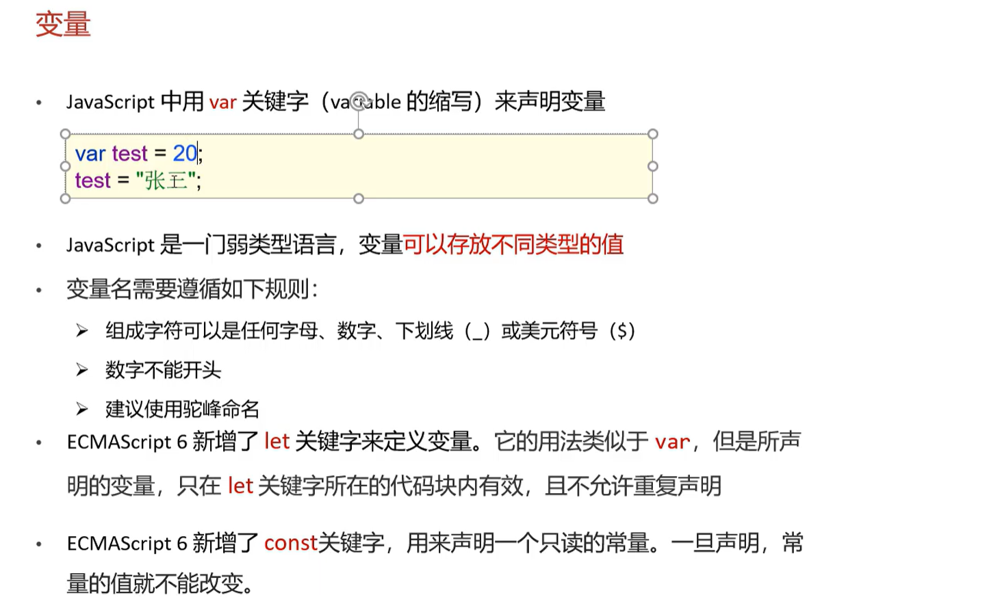
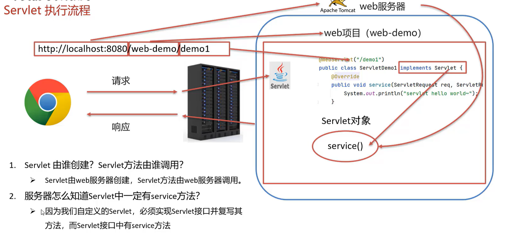

# JavaWeb
> 哎，握草，后端怎么这么坏啊，还要学点前端？

## 前端概述

> 可参考下边网站[W3School](https://www.w3school.com.cn/)
## HTML
### 概述
**HTML（HyperText Markup Language）超文本标记语言** 是一种用于创建网页的标记语言，是一种标准通用标记语言。
- 超文本：超越文本的限制，
- 标记语言：标记语言是一套标记标签，用来定义文档的结构、样式、行为。

### 基本语法
#### 基础标签


#### 转义字符


#### 资源标签

```html
<!-- 尺寸单位
    1. 纯数字 px：像素
    2. 百分比：占父元素的百分比 -->


<audio src="audio.mp3" controls></audio>

<video src="video.mp4" controls></video>
```


#### 超链接
- **`<a>`**
    - `href`：指定访问资源的URL
    - `target`
      - `_self`：默认值，在当前窗口打开
      - `_blank`：在新窗口打开
      - `#`：指定页面内锚点位置


#### 列表标签


#### 表格标签


#### 布局标签
- **`<div>`**
    - 块级元素，可以容纳其他元素，宽度默认是父元素的100%
    - 常用属性：`class`、`id`
- **`<span>`**
    - 行内元素，只能容纳文本，宽度默认是内容的宽度
    - 常用属性：`class`、`id`

#### 表单标签

- **表单项标签**
  - 
   ```html
    <form action="submit.php" method="post">
      <label for="username">用户名：</label>
      <input type="text" name="username" id="username">

      <textarea name="content" id="content" cols="30" rows="10">内容</textarea>

      <select name="gender" id="gender">
          <option value="male">男</option>
          <option value="female">女</option>
      </select>
    </form>
   ```
    
## CSS
### 概述
**CSS（Cascading Style Sheets）层叠样式表** 是一种用于表现HTML文档样式的语言。
- 层叠：多个样式层叠，后面的样式会覆盖前面的样式
- 样式表：定义HTML文档的样式，包括字体、颜色、大小、布局、边框等

### 导入方式


### 选择器

> 选择的优先级：内联样式 > ID选择器 > 类选择器 > 标签选择器

## JavaScript
### 概述
**JavaScript** 是一种动态的脚本语言，是一种轻量级的编程语言。

### 引入方法
- **内部脚本**
  - 
- **外部脚本**
  - 

### 基本语法
#### 输出语句
- `window.alert("")`：弹出警告框
- `console.log("")`：在控制台输出日志
- `document.write("")`：将内容写入当前文档

#### 变量


---

**JavaScript 中分为原始类型和引用类型**
- `number`：数值类型，包括整数、浮点数、NaN
- `string`：字符串类型
- `boolean`：布尔类型，包括true、false
- `undefined`：未定义类型，表示变量没有值
- `object`：引用类型或$NULL$
> `typeof`：返回变量的数据类型


#### 运算符与类型转换
- **运算符**
  - 大体与Java相同，但存在 ==`===`表示严格相等（类型和值都相等）==
- **类型转换**
  - 其他类型转换为`number`
    - `parseInt()`：将字符串转换为整数，若转换失败则返回NaN
    - `+false | +true`：将布尔值转换为0或1

#### 条件语句与函数
- **条件语句**
  - 与Java相同
- **函数**
  
```javascript
  function myFunction(arg1, arg2) {
      // 函数体
      return arg1 + arg2;
  }
```

### 对象
#### Array


#### String


#### 自定义对象


### BOM对象（Browser Object Model）
#### window对象


#### history对象
- `window.history.back()`：后退
- `window.history.forward()`：前进


#### location对象
- `window.location.href`：设置当前页面的URL

### DOM对象（Document Object Model）


#### Element对象
- `document.getElementById()`：获取指定ID的元素
- `document.getElementsByTagName()`：获取指定标签名的所有元素
- `document.getElementsByName()`：获取指定name的所有元素
- `document.getElementsByClassName()`：获取指定类名的所有元素
- `element.innerHTML`：获取或设置元素的内容
- `element.style`：获取或设置元素的样式

### 事件监听
#### 事件绑定


### 正则表达式

> 可参考[菜鸟教程-正则表达式](https://www.runoob.com/regexp/regexp-tutorial.html)


## XML
### 概述
**XML（Extensible Markup Language）可扩展标记语言** 是一种用于标记电子文件的数据格式。

### 语法
**大体与HTML相同，但XML可以自定义标签。**
> 使用DTD（Document Type Definition）定义文档类型，可以对XML文档进行严格的验证。

### 解析XML

> 解析xml文件中空格等字符会被保留。

## Logback 日志
### 体系结构


## Web概述


### HTTP协议
#### 概述


#### 请求数据格式


#### 响应数据格式


#### 状态码
|状态码分类|说明|
|-|-|
|1xx|**响应中**——临时状态码，表示请求已经接受，告诉客户端后继的操作|
|2xx|**成功**——表示请求已经被成功接受，处理已完成|
|3xx|**重定向**——重定向到其它地方：它让客户端再发起一个请求以完成整个处理|
|4xx|**客户端错误**——处理发生错误，责任在客户端|
|5xx|**服务端错误**——处理发生错误，责任在服务端|

> 状态码大全请看[菜鸟教程-状态码](https://www.runoob.com/http/http-status-codes.html)


## Tomcat
### Web服务器
**Web服务器是一个应用程序，对HTTP协议的操作进行封装。**

### Tomcat配置与部署
#### 配置Tomcat
- 出现闪退问题，手动配置JDK路径。


- 修改端口


#### 部署Web应用


## Servlet
### 概述


### 快速入门


### 执行过程


### 生命周期
**Servlet运行在Servlet容器（Web服务器）中，其生命周期由容器来管理，分为四个阶段：**
1. **实例化**：Servlet被创建，实例化。
2. **初始化**：Servlet被初始化，执行init()方法。
3. **请求处理**：客户端请求到达，Servlet被调用，执行service()方法。
4. **销毁**：Servlet被销毁，执行destroy()方法。

### urlPatterns


#### 匹配规则


### HttpServlet
HttpServlet是实现了Servlet接口的抽象类，是Servlet的一种实现方式，它提供了处理HTTP请求的基本方法，包括`doGet()`、`doPost()`等。
- `doGet()`：处理HTTP GET请求
- `doPost()`：处理HTTP POST请求


### Request对象
1. **请求行**
   - `request.getMethod()`：获取请求方法，如GET、POST等
   - `request.getContextPath()`：获取Web应用的上下文路径
   - `request.getRequestURL()`: ==返回StringBuffer对象==，获取请求的完整URL
   - `request.getRequestURI()`：获取请求的相对URL，不包括上下文路径
   - `request.getQueryString()`：获取请求的查询字符串
2. **请求头**
   - `request.getHeader(name)`：获取请求头的值
   - `request.getHeaderNames()`：获取所有请求头的名称
3. **请求体**
   - `ServletInputStream getInputStream()`：获取请求体输入流
   - `BufferedReader getReader()`：获取请求体输入流的BufferedReader对象
4. **请求参数**

> 解决中文乱码问题：
> POST请求：在程序开头设置->`request.setCharacterEncoding("UTF-8");`
> GET请求：==在程序中通过处理字符集编码来解决。（URL解码`URLDecoder.decode(request.getQueryString(), "UTF-8")`）==

5. **请求转发**


### Response对象
#### 设置响应数据


#### 完成重定向


## JSP
### 概述
**JSP（Java Server Pages）Java服务器页面** 是一种动态网页技术，是一种运行在Servlet容器中的Java技术。

$$
  JSP = Java + HTML
$$

> JSP本质上就是个Servlet：
> 

### JSP脚本
- **<%@...%>**：用来设置JSP页面的属性，如`<%@ page import="java.util.*" %>`
- **<%...%>**：内容会直接放在`_jspService()`方法中
- **<%=...%>**：内容会放到`out.print()`方法中输出到客户端，如Servlet中`response.getWriter().write(...)`
- **<%!...%>**：内容会放在除`_jspService()`方法之外


### EL表达式

> 利用转发共享数据，使JSP得到Servlet处理得到的数据。

### JSTL标签库


## 会话跟踪技术
### 概述


### Cookie
- 客户端会话技术，将数据保存到客户端，以后每次请求都携带Cookie数据进行访问
- **Cookie的基本使用**
  - `Cookie cookie = new Cookie("key", "value");`
  - `response.addCookie(cookie);`：添加Cookie到响应头
  - `request.getCookies()`：获取所有Cookie
  - `request.getCookie("key")`：获取指定Cookie
  - `cookie.getName()`：获取Cookie的名称(键)
  - `cookie.getValue()`：获取Cookie的值
- **Cookie使用细节**
  - 

### Session
- 服务器端会话技术，将数据保存到服务器端，以后每次请求都携带Session ID进行访问

- Session是**基于Cookie实现的**， Session ID保存在Cookie中，Cookie保存在客户端，Session保存在服务器端。
- **使用细节**
 


## Filter & Listener
### Filter
#### 概述


#### 基本方法


#### 过滤器链


### Listener
#### 概述


#### 使用


## AJAX
### 概述
- **AJAX (Asynchronous JavaScript and XML)** ：异步的JavaScript 和 XML。
- **作用：**
  - 与服务器进行数据交换
    - 使用$HTML + AJAX技术$替代JSP技术
  - 异步交互：可以在**不重新加载整个页面**的情况下，更新部分内容

> 同步和异步
> 


### 基本用法

> 详情见[W3School-AJAX](https://www.w3school.com.cn/js/js_ajax_intro.asp)


### AXIOS 异步框架


### JSON
#### 概述
- **JSON (JavaScript Object Notation)** ：JavaScript 对象表示法。
- **JSON多作为数据载体**，在网络中进行数据传输。
- 基础语法
  

#### JSON与Java对象互转


## Vue
### 概述


### 基本使用


> 常用指令
> 

### 生命周期

