# Linux
## 基础
### 目录结构
Windows系统是森林，Linux系统是树，树的根是`/`。

> HOME目录(`~`)：`/home/用户名`

### 命令入门
#### 命令格式
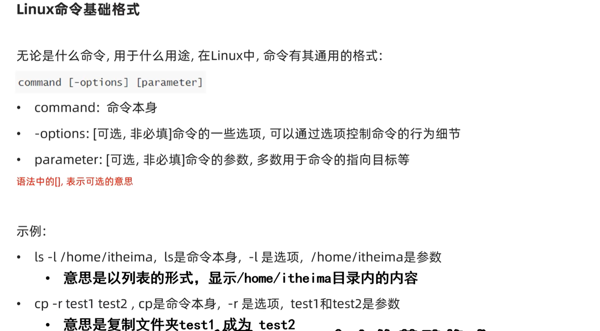
> 命令选项是可以混合使用的

#### ls命令
`ls [-a -l -h] [Linux路径]`
- 默认：平铺简略显示当前目录下的文件和目录。
- `-a`：显示所有文件，包括隐藏文件。
- `-l`：以详细列表形式显示文件。
- `-h`：以人类可读的格式显示文件大小（多组合使用，单独使用跟默认效果一样）。

#### cd命令、pwd命令
`cd [Linux路径]`
- cd = Change Directory，切换当前工作目录。
- 无参：切换到用户的HOME目录。
- 有参：切换到对应路径目录。

`pwd`
- pwd = Print Working Directory，显示当前工作目录。

#### mkdir命令
`mkdir [-p] Linux路径`
- `-p`：递归创建目录，即创建多级目录。

#### touch命令、cat命令、more命令
`touch Linux文件路径`
- touch = 新建文件，创建空文件。

`cat [-n] Linux文件路径`
- cat = 查看文件内容。
- `-n`：显示行号。

`more Linux文件路径`
- more = 分页查看文件内容。
- 按空格翻页，按`q`退出。

#### cp命令、mv命令、rm命令
`cp [-r] 源文件路径 目标文件路径`
- cp = Copy，复制文件或目录。
- `-r`：递归复制目录，用于复制文件夹。

`mv 源文件路径 目标文件路径`
- mv = Move，移动文件或目录。
- 如果目标文件存在，则覆盖。
- 如果目标文件不存在，则创建（类似改名效果）。

`rm [-r -f] Linux文件路径`
- rm = Remove，删除文件或目录。
- `-r`：递归删除目录，用于删除文件夹。
- `-f`：强制删除，无需确认。

#### which命令、find命令
`which 命令名`
- which = 查找命令的绝对路径。
> 命令其实就是个程序，用which指令可以查看这个程序文件位置。

`find 起始路径 -name "被查找文件名"`
`find 起始路径 -size (+|-)n[kMG]`
    - 参数+、-表示大于、小于n[kMG]的文件。
    - n表示大小数字
    - kMG表示单位

#### echo命令、tail命令和重定向符
`echo 内容`
- echo = 输出内容到屏幕或文件。
- echo \`pwd\`：输出当前目录路径（用``号括起指令，输出指令输出内容）。

> 输出重定向符号`>`和`>>`的区别：
> - `>`：输出重定向，将原有内容覆盖，即删除原有内容，重新输出。
> - `>>`：追加重定向，将原有内容追加到末尾，即不删除原有内容，继续输出。

`tail [-f -num] Linux文件路径`
- tail = 显示文件末尾内容。
- `-f`：实时监控文件，显示新增内容。
- `-num`：显示文件末尾的num行内容（默认是10行）。

#### grep命令、wc命令和管道符
`grep [-n] 关键字符串 文件路径`
- grep：从文件中通过关键字过滤文件行。
- `-n`：显示匹配行号。

`wc [-c -m -l -w] 文件路径`
- wc：统计文件行数、字数、字节数、单词数。
- `-c`：字节数。
- `-m`：字数。
- `-l`：行数。
- `-w`：单词数。

> 管道符：`|`，将前一个命令的输出作为后一个命令的输入。
> 如`cat test.txt | grep "hello"`，表示将`test.txt`文件内容作为`grep`命令的输入，输出包含`hello`的行。

### vim
#### 概述
Vim是Linux系统中最流行的文本编辑器。

#### 工作模式
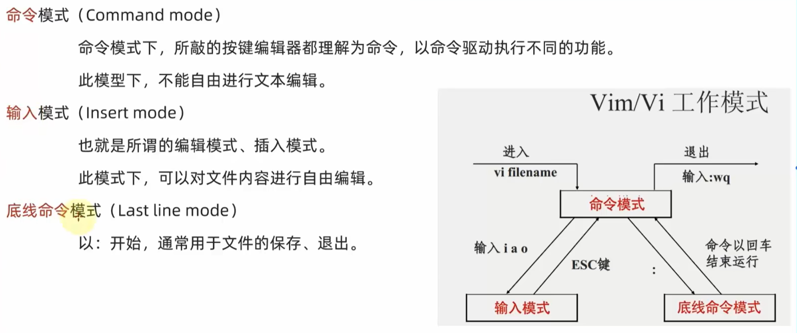

#### 底线命令模式命令
- `:wq`：保存并退出。
- `:q!`：强制退出，不保存。
- `:set nu`：显示行号。
- `:set nonu`：隐藏行号。
- `:set paste`：设置粘贴模式。
- `:set nopaste`：取消粘贴模式。

## 用户和权限
### root用户
- `su - [用户名]`：切换到其他用户。
- `sudo su`：切换到root用户。
- `sudo 命令`：以root权限运行命令。
- `exit`：退出当前用户。

> 配置sudo权限
> 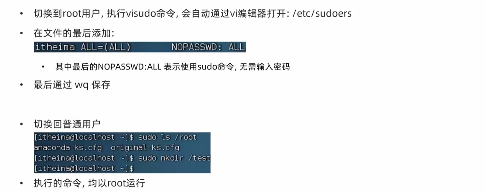

### 用户与用户组
- `getent passwd`：查看所有用户及其信息。

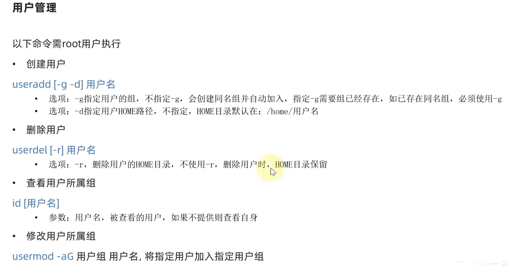

### 权限
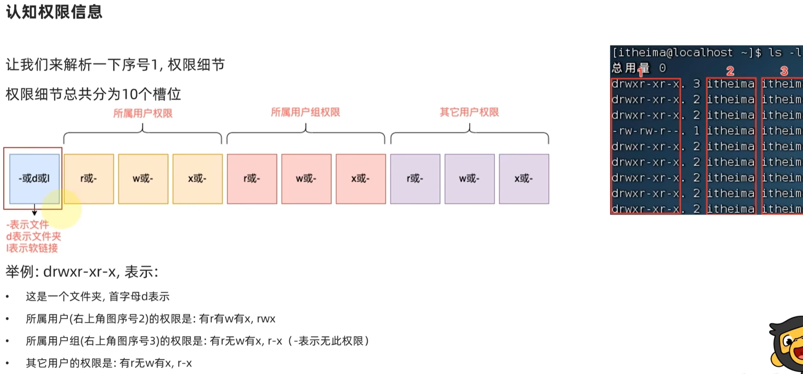
- `r`：可读。
- `w`：可写。
- `x`：可执行。

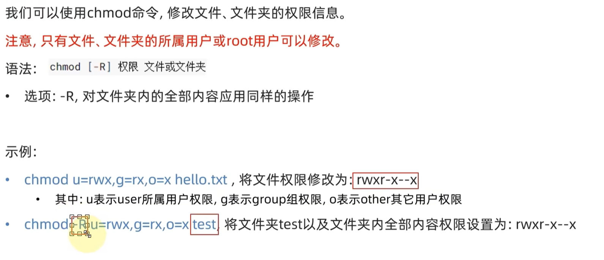

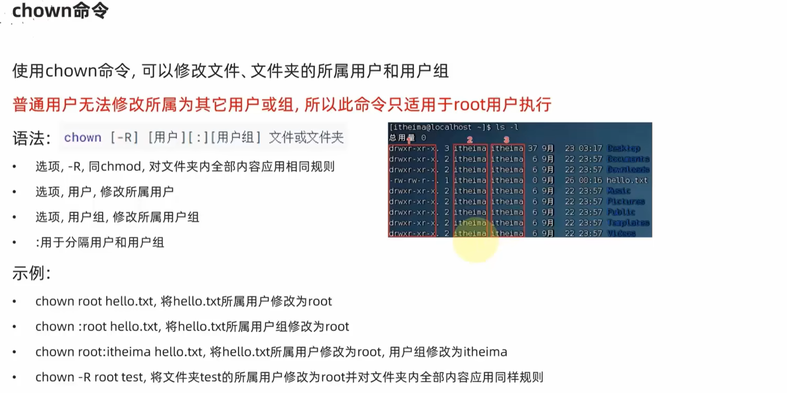

## 进阶
### 软件包安装
- CentOS：.rpm格式的软件包(yum)。
- Ubuntu：.deb格式的软件包(apt)。
- `-y`表示自动确认。
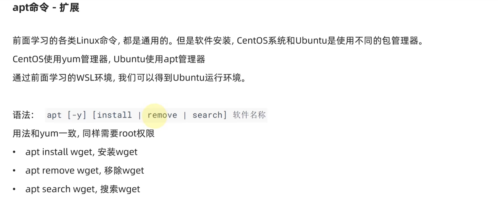

### systemctl控制软件服务
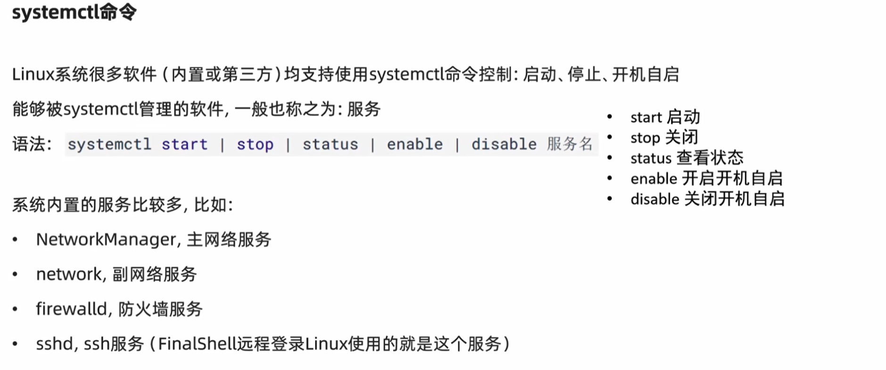

### 软连接
在系统中创建软连接，可以将文件、文件夹链接到其他位置。
类似于Windows系统中的快捷方式。

`ln -s 源文件路径 目标文件路径`
- `-s`：创建软连接。

### 日期和时区
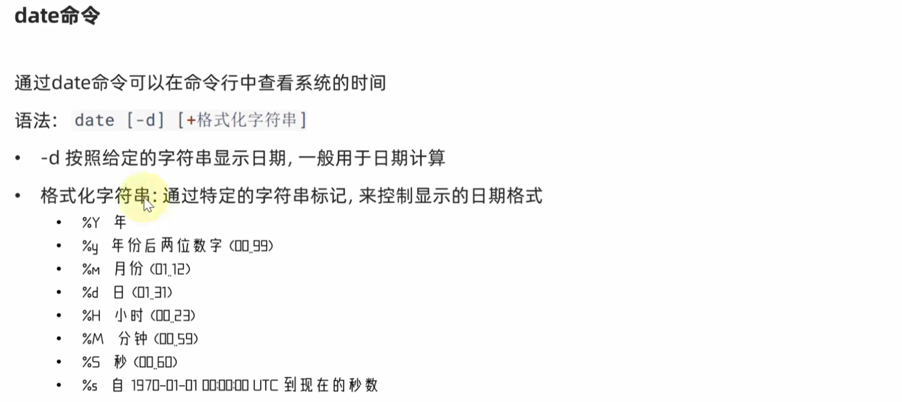
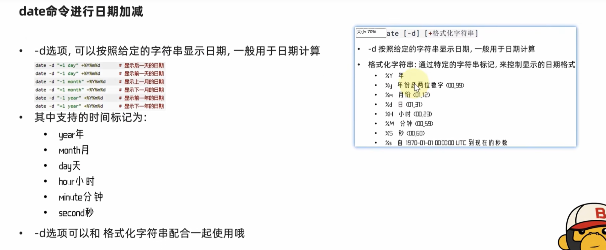

### 网络请求和下载
- `ping 目标IP`：测试网络连通性。
- `wget 下载地址`：下载文件。
- `curl 下载地址`：发出网络请求。

### 进程管理
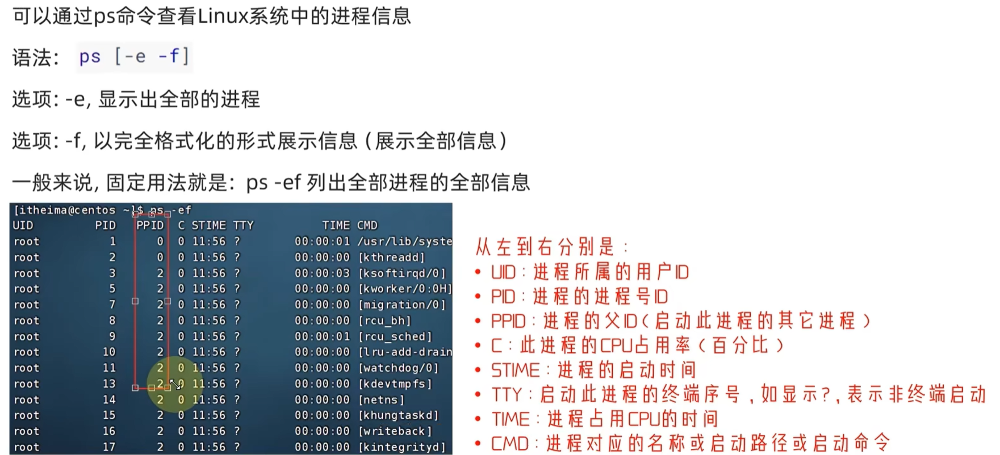
- `kill -9 进程号`：强制杀死进程。

### 主机状态查看
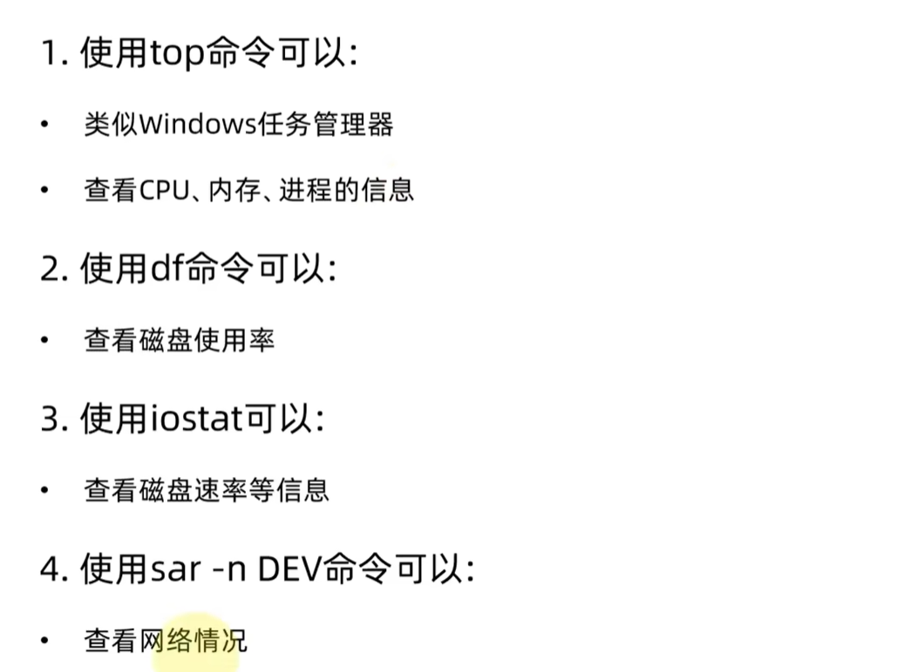

### 环境变量
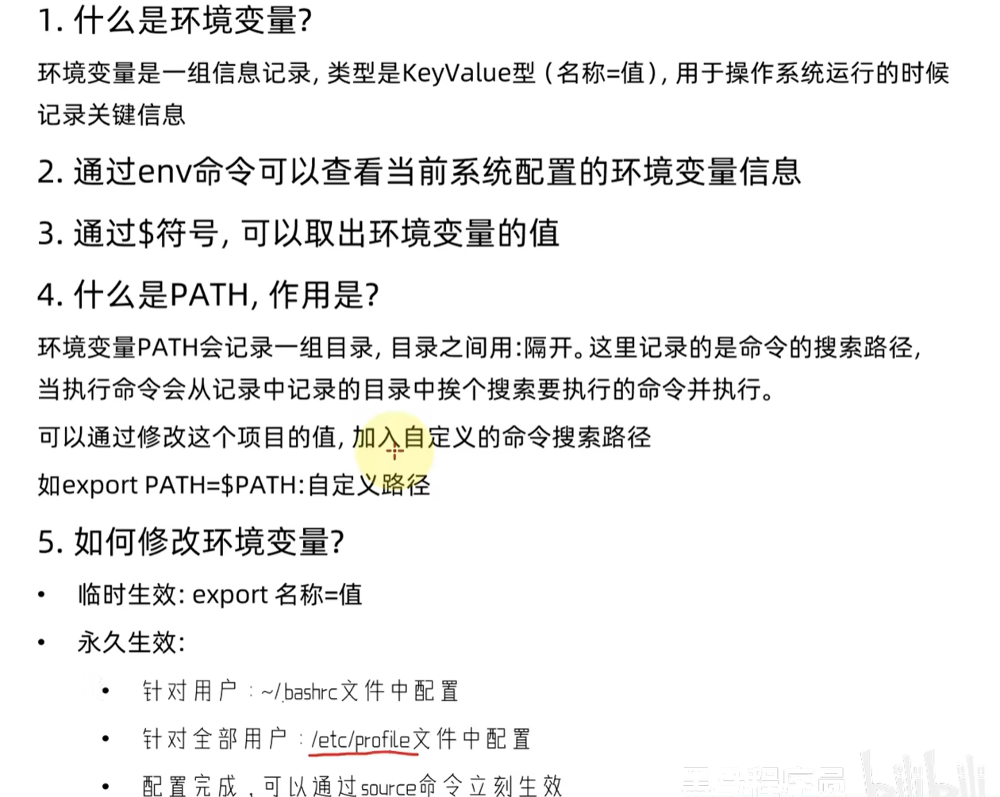

### 解压、压缩
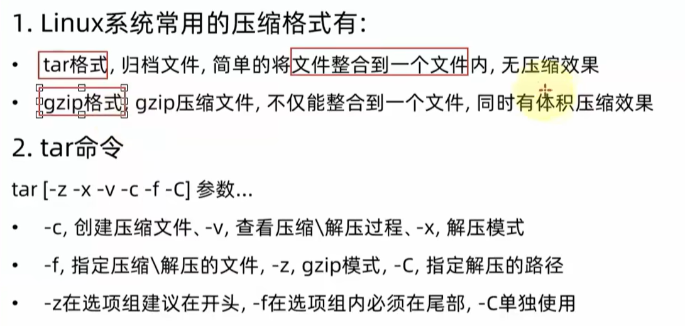