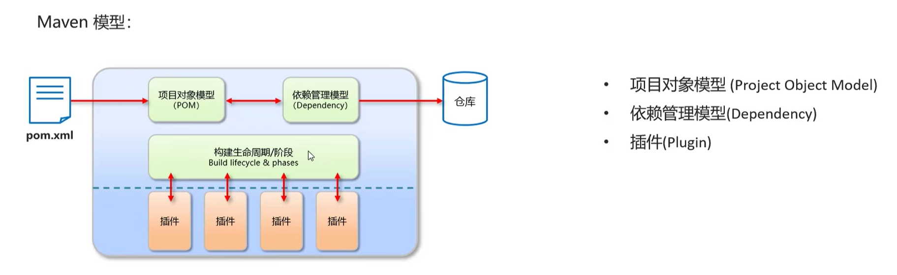
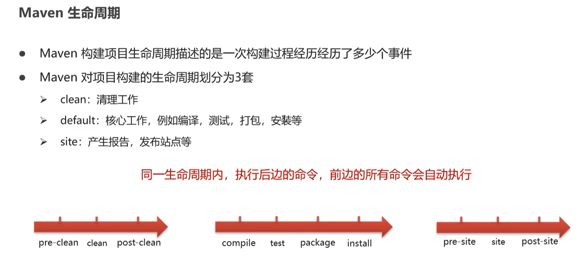
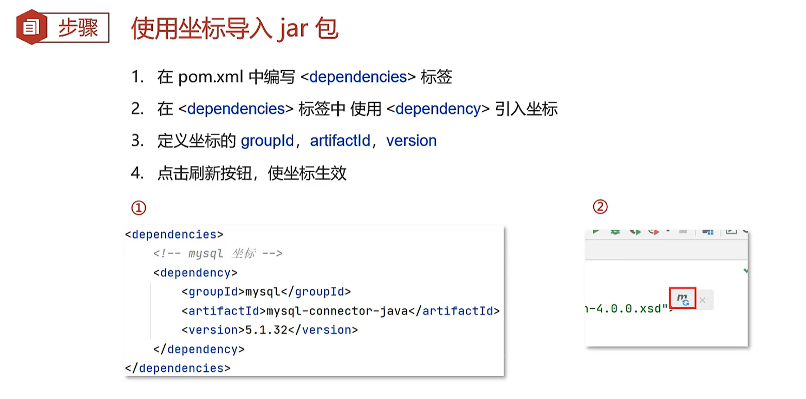
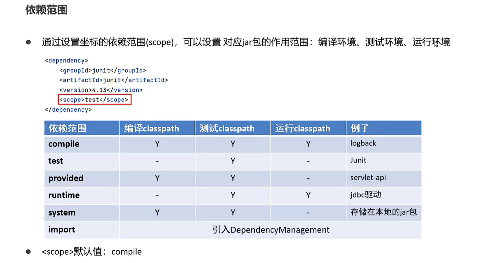

# Maven
> Apache太牛逼了 :smile:

## 什么是 Maven
**Maven是专门用于管理和创建Java项目的工具，它的主要功能有**
- 提供了一套标准化的项目结构
- 提供了一套标准化的构建流程（编译，测试，打包，发布……）
- 提供了一套依赖管理机制（管理项目所依赖的第三方资源）

## 常用命令
- `mvn compile`：编译项目
- `mvn test`：测试项目
- `mvn package`：打包项目
- `mvn install`：安装项目到本地仓库
- `mvn clean`：清理项目
> Maven的生命周期
> 

## Maven坐标
**坐标是Maven资源的唯一标识，Maven使用坐标来定义项目或引入项目中需要的依赖，它主要组成为**
- `groupId`：定义当前Maven项目所属的组织或团队
- `artifactId`：定义当前Maven项目的名称
- `version`：定义当前Maven项目的版本号
- `packaging`：定义当前Maven项目的打包类型（如jar，war，ear等）

## 依赖管理

---

