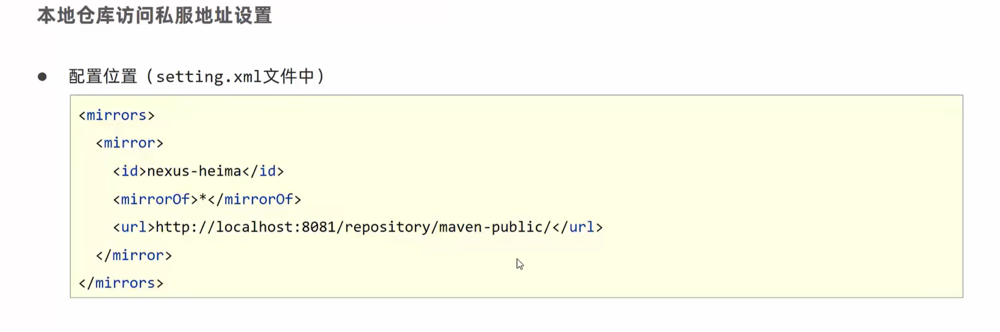

# Maven
> Apache太牛逼了 :smile:
## 基础
### 什么是 Maven
**Maven是专门用于管理和创建Java项目的工具，它的主要功能有**
- 提供了一套标准化的项目结构
- 提供了一套标准化的构建流程（编译，测试，打包，发布……）
- 提供了一套依赖管理机制（管理项目所依赖的第三方资源）


### 常用命令
- `mvn compile`：编译项目
- `mvn test`：测试项目
- `mvn package`：打包项目
- `mvn install`：安装项目到本地仓库
- `mvn clean`：清理项目
> Maven的生命周期
> 

### Maven坐标
**坐标是Maven资源的唯一标识，Maven使用坐标来定义项目或引入项目中需要的依赖，它主要组成为**
- `groupId`：定义当前Maven项目所属的组织或团队
- `artifactId`：定义当前Maven项目的名称
- `version`：定义当前Maven项目的版本号
- `packaging`：定义当前Maven项目的打包类型（如jar，war，ear等）

### 依赖管理


---


## 进阶
### 分模块开发


### 依赖
#### 依赖传递
- 直接依赖
- 间接依赖


#### 依赖管理


#### 可选依赖与排除依赖
- 可选依赖：`<dependency>...<optional>true</optional></dependency>`
- 排除依赖：`<dependency>...<exclusions><exclusion><groupId>groupId</groupId><artifactId>artifactId</artifactId></exclusion></exclusion></exclusions>`


### 聚合

```xml
<packaging>pom</packaging>
<modules>
    <module>module1_filepath</module>
    <module>module2_filepath</module>
</modules>
```


### 继承
- 父工程`pom.xml`
```xml
<dependencies>
    <dependency>
        <groupId>group_id1</groupId>
        <artifactId>artifact_id1</artifactId>
        <version>version</version>
    </dependency>
</dependencies>

<dependencyManagement>
    <dependencies>
        <dependency>
            <groupId>group_id2</groupId>
            <artifactId>artifact_id2</artifactId>
            <version>version</version>
        </dependency>
    </dependencies>
</dependencyManagement>
```

- 子工程`pom.xml`
```xml
<parent>
    <groupId>parent_group_id</groupId>
    <artifactId>parent_artifact_id</artifactId>
    <version>parent_version</version>
    <relativePath>../pom.xml</relativePath>
</parent>

<dependencies>
    <dependency>
        <!-- 引入父工程中的可选依赖 -->
        <groupId>group_id2</groupId>
        <artifactId>artifact_id2</artifactId>
    </dependency>
    <!-- 非可选依赖自动引入 -->
</dependencies>
```


### 属性
```xml
<properties>
    <spring.version>5.1.9.RELEASE</spring.version>
</properties>

<dependencies>
    <dependency>
        <groupId>org.springframework</groupId>
        <artifactId>spring-core</artifactId>
        <version>${spring.version}</version>
    </dependency>
</dependencies>
```

### Props文件属性
- 
- 
- 

### 版本属性


### 多环境开发

- 构建指令
  - `mvn 指令 -P 环境ID`


### Nexus私服
- 
- 
- 
- 
- 
- 