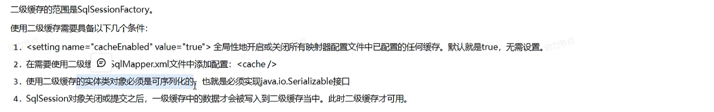

# MyBatis
> 还是会“白学”，后边还有Spring Boot :D。

## JDBC
### 什么是 JDBC

> 了解即可，经典“白学”，如今有MyBatis等等帮助我们更好地Java-to-SQL。


### 简单流程
```java
public class Test {
    @Test
    public void test() throws Exception {
        // 1. 注册 JDBC 驱动
        Class.forName("com.mysql.jdbc.Driver");
        // DriverManager.registerDriver(new com.mysql.jdbc.Driver());
        
        // 2. 获得数据库连接
        String url = "jdbc:mysql://localhost:3306/DBname?SSL=false&useServerPrepStmts=true";
        String username = "root";
        String password = "password";
        Connection conn = DriverManager.getConnection(url, username, password);
        
        // 3. SQL 语句
        String sql = "SELECT * FROM table_name";
        
        // 4. 获得执行语句对象
        Statement stmt = conn.createStatement();
        
        // 5. 执行 SQL 语句，并获得结果集
        ResultSet rs = stmt.executeQuery(sql);
        
        // 6. 处理结果集
        while (rs.next()) {
            // 处理每一行数据
        }
        
        // 7. 关闭资源
        rs.close();
        stmt.close();
        conn.close();
    }
}
```

### JDBC API
#### DriverManager 驱动管理类
- **作用**
  1. 注册驱动：`DriverManager.registerDriver(Driver driver)`
  2. 获得数据库连接
    

#### Connection 数据库连接对象
- **作用**
  1. 获得执行语句对象
       - `Statement createStatement()`：获取普通执行SQL对象
       - `PreparedStatement prepareStatement(String sql)`：获取预编译SQL执行对象，防止SQL注入
       - `CallableStatement prepareCall(String sql)`：获取执行存储过程的对象
  2. 管理事务
  
  ```java
  try {
    conn.setAutoCommit(false); // 开启事务
    // 事务内的操作
    Statement stmt = conn.createStatement();
    int ret1 = stmt.executeUpdate("INSERT INTO table_name (column1, column2) VALUES (value1, value2)");
    int ret2 = stmt.executeUpdate("UPDATE table_name SET column1 = value1 WHERE column2 = value2");
    // 处理执行结果
    // ...
    // 事务提交
    conn.commit();
  }
  catch (Exception e) {
    // 事务回滚
    conn.rollback();
    e.printStackTrace();
  }
  finally {
    // 关闭资源
    conn.close();
  }
  ```
#### Statement 执行语句对象
- **作用**
  1. 执行 SQL 语句
     - `boolean execute(String sql)`：执行各种操作，并返回是否执行成功
     - `int executeUpdate(String sql)`：执行增删改DML操作，并返回受影响的行数[DDL语句也可，但即使成功返回值可能为0]
     - `ResultSet executeQuery(String sql)`：执行查询DQL操作，并返回结果集
  2. 获得执行结果

#### ResultSet 执行结果集对象
- **作用**
  - 封装了DQL查询语句的结果
    - `boolean next()`：移动到下一行，并返回是否该行是否有效
    - `X getXXX(int columnIndex[String columnLabel])`：获取当前行指定列的X值
> 注意：columnIndex索引从1开始。

#### PreparedStatement 预编译SQL执行对象


---


### 数据库连接池

```java
public class Test {
    @Test
    public void test() throws Exception {
        // 1. 加载jar包
        // 2. 创建配置文件*.properties
        // 3. 加载配置文件
        Properties prop = new Properties();
        prop.load(new FileInputStream("db.properties"));

        // 4.获取连接池对象
        DataSource dataSource = DruidDataSourceFactory.createDataSource(prop);

        // 5. 从连接池中获取连接
        Connection conn = dataSource.getConnection();

        // 6. 使用连接...
    }
}
```

## 什么是 MyBatis
**MyBatis是一款持久层框架，用于简化JDBC开发。**
> JavaEE 三层架构：表现层、业务层、持久层。

## MyBatis快速入门
> 可以查看[官网](https://mybatis.net.cn/) 

- `<properties resource = "db.properties"/>`：加载配置文件
- `mybatis-config.xml`：配置 MyBatis 的核心文件，能替换链接信息，解决硬编码问题，下边展示`environment`标签的配置：
  
- `xxxMapper.xml`：定义 MyBatis 映射文件，用于定义 SQL 语句和 SQL 语句的结果映射
  
  - `namespace`：命名空间，用于标识 MyBatis 映射文件
  - `id`：标识 MyBatis 映射文件中的 SQL 语句
  - `resultType`：定义 SQL 语句的结果映射类型

---

```java
public static void main(String[] args) throws IOException {
        // 1. 加载mybatis的核心配置文件，获取SqlSessionFactory
        String resource = "mybatis-config.xml";
        InputStream inputStream = Resources.getResourceAsStream(resource);
        SqlSessionFactory sqlSessionFactory = new SqlSessionFactoryBuilder().build(inputStream);

        // 2. 获取SqlSession对象，用它来执行SQL语句，可以传一个布尔参数，默认true表示自动提交事务，默认false表示手动提交事务
        SqlSession sqlSession = sqlSessionFactory.openSession(true);

        // 3. 执行Sql
        List<User> users = sqlSession.selectList("test.selectAll");

        // 4. 处理结果
        System.out.println(users);

        // 5. 释放资源
        sqlSession.close();
    }
```

## Mapper接口代理及映射基本SQL


- 创建同名`xxxMapper`接口：
  
- 按要求配置修改`mybatis-config.xml`和`xxxMapper.xml`文件
- 并根据`xxxMapper.xml`里的配置，在同名`xxxMapper`接口中声明对应语句
- 使用：
  ```java
  public static void main(String[] args) throws IOException {
        // 1. 加载mybatis的核心配置文件，获取SqlSessionFactory
        String resource = "mybatis-config.xml";
        InputStream inputStream = Resources.getResourceAsStream(resource);
        SqlSessionFactory sqlSessionFactory = new SqlSessionFactoryBuilder().build(inputStream);

        // 2. 获取SqlSession对象，用它来执行SQL语句，可以传一个布尔参数，true表示自动提交事务，默认false表示手动提交事务
        SqlSession sqlSession = sqlSessionFactory.openSession(true);

        // 3. 执行Sql
        // List<User> users = sqlSession.selectList("test.selectAll");
        UserMapper mapper = sqlSession.getMapper(UserMapper.class);
        List<User> users = mapper.selectAll();

        // 4. 处理结果
        System.out.println(users);

        // 5. 释放资源
        sqlSession.close();
    }
    ```

### Mapper查看详情


### Mapper条件查询
- **参数相关**
  

- **条件查询**
  

- **动态条件查询**
    
    


### Mapper添加和修改
- **添加**
  - 基本添加
    
  - 获取插入主键
    

- **修改**
  - 

### Mapper删除

> 还可以继续美化：
> `foreach`语句中可以`open = "("`和`close = ")"`，可以省略原先的括号，更加简洁。


## Mapper的参数传递


## **注解开发**

> @Results注解：用于配置结果集，可以配置多个，每个结果集对应一个`resultType`
> @Results({
>   @Result(property = "id", column = "id"),
>    @Result(property = "name", column = "name")
> })

## 高级映射
### 多对一


### 一对多


## 缓存
### 概述


### 一级缓存
- 存放在SqlSession对象中，一个SqlSession对应一个缓存
- **销毁缓存**
  - `sqlSession.clearCache()`：清空当前SqlSession缓存
  - 执行了UPDATE、INSERT、DELETE语句

### 二级缓存
- 存放在SqlSessionFactory对象中
- **配置**
  
- **销毁缓存**
  - 执行了UPDATE、INSERT、DELETE语句
- **设置**
  

## 逆向工程
依照数据库表生成对应的实体类，并生成对应的Mapper接口和Mapper.xml文件。

---

# MyBatis-Plus
> [官网](https://baomidou.com/)
## 入门步骤


## 常用注解
- `@TableName`：指定表名
- `@TableId`：指定主键
- `@TableField`：指定普通字段名
- `@TableLogic(value = "1", delval = "0")`：指定逻辑删除字段 `value`表示逻辑未删除值，`delval`表示逻辑删除值
> 

## CRUD


### 分页查询
1. 配置拦截器
  ```java
  public class MpConfig {
  @Bean
    public MybatisPlusInterceptor mybatisPlusInterceptor() {
        // 定义Mp拦截器
        MybatisPlusInterceptor mybatisPlusInterceptor = new MybatisPlusInterceptor();
        // 添加具体拦截器
        mybatisPlusInterceptor.addInnerInterceptor(new PaginationInnerInterceptor());
        return mybatisPlusInterceptor;
    }
  }
```

2. 调用分页查询
```java
Page<User> page = new Page<>(1, 10);
IPage<User> userIPage = userMapper.selectPage(page, null);
```

### 条件查询


> 链式编程默认`and`，可以使用`or()`改变。
> `null`值处理：

### 查询投影

> 建议用传统MyBatis

### 逻辑删除

> 推荐使用全局配置：