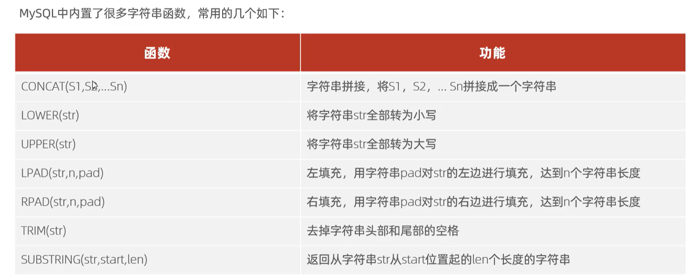
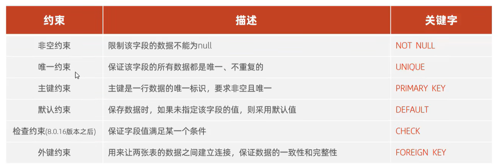
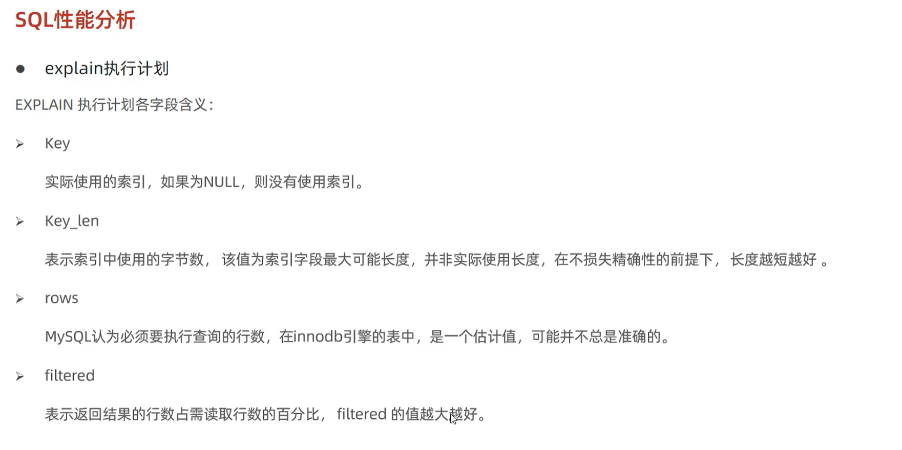

# MySQL
> SQL大一统！

## 数据库简介
### 什么是数据库 DB
数据库是 **按照数据结构来组织、存储和管理数据的仓库**，是一个长期存储在计算机内、有组织、可共享、统一管理的大量数据的集合。


### 数据库管理系统 DBMS
数据库管理系统（Database Management System，DBMS）是管理数据库的软件，它包括数据库的建立、维护、使用、备份、恢复等功能。

#### 数据库管理系统类型
##### 关系型数据库
关系型数据库是最常见的数据库类型，它以==关系模型（二维表格）== 来存储和管理数据，关系型数据库管理系统（RDBMS）包括 MySQL、Oracle、SQL Server、PostgreSQL 等。

##### 非关系型数据库管理系统
非关系型数据库（NoSQL）是一种非关系数据库管理系统，它不基于关系模型，而是以键值对、文档、图形等非结构化数据存储。非关系型数据库包括 MongoDB、Couchbase、Redis 等。


### SQL语言
SQL（Structured Query Language，**结构化查询语言**）是关系型数据库管理系统用来管理关系数据库的语言。SQL语言包括：
- **DQL（Data Query Language，数据查询语言）**
- DDL（Data Definition Language，数据定义语言）
- DML（Data Manipulation Language，数据操纵语言）
- DCL（Data Control Language，数据控制语言）
- TPL（Transaction Processing Language，事务处理语言）
- CCL（Cursor Control Language，指针控制语言）


> 
>   DBMS、SQL、DB之间的关系：
> > DBMS通过执行SQL来操作DB中的数据


## 登录MySQL及常用命令
### 本地登录和远程登录
- **本地登录**
  - `mysql -u USERNAME -p`：输入密码后登录
  - `mysql -u USERNAME -p PASSWORD`：直接输入密码登录

- **远程登录**
  - `mysql -h HOSTNAME -u USERNAME -p`：指定远程主机的IP地址或域名
  - `mysql -h HOSTNAME -u USERNAME -p PASSWORD`：直接输入密码登录远程主机

> 默认情况下，`USERNAME:root`是最高权限的，不允许远程访问。


## 数据库表
|name|age|gender|
|----|---|------|
|Tom|20|male|
|Jane|25|female|

- ==表（table）是数据库存储数据的基本单元==
  - 行：记录，一条记录就是一**行**数据
  - 列：字段，一**列**数据就是一个字段（name字段、age字段、gender字段）
    - 字段的**数据类型**：
      - 无符号标识符：`unsigned`
      - 整型类型：`tinyint`、`smallint`、`mediumint`、`int`、`bigint`
      - 浮点类型：`float(M,D)`、`double(M,D)`、`decimal(M,D)`
        - `123.45`： $ M = 5, D = 2$
      - 字符串类型：定长`char(M)`、变长`varchar(M)`
      - 日期类型：`date`、`time`、`year`、`datetime`

## 定义语句 DDL
### 库的常用命令
- `show databases;`：显示所有数据库。
- `create database [if not exists] DBNAME;`：创建数据库。
- `drop database DBNAME;`：删除数据库。
- `use DBNAME;`：选择数据库。
- `select database();`：显示当前数据库的名称。
- `source FILEPATH\FILENAME.sql;`：执行SQL脚本文件。

### 表的常用命令
- `show tables;`：显示当前数据库的所有表。
- `desc 表名;`：显示表的结构。

#### 创建与删除表
**创建基本语法：**
```sql
create table TABLE_NAME (
    字段名 数据类型 [comment '注释'],
    字段名 数据类型,
    字段名 数据类型 
)[comment '注释'];
```
> `show create table 表名;`：显示创建表的SQL语句。
---
```sql
# 创建表employees
create table employees (
    employee_id int unsigned primary key comment '员工编号',
    first_name varchar(50) not null comment '姓',
    last_name varchar(50) not null comment '名',
    hire_date date not null comment '入职日期',
    salary decimal(10,2) not null comment '薪水'
) comment '员工信息表';
```
---
**删除基本语法：**`drop table [if exists] 表名;`


#### 修改表结构
##### 添加字段
**基本语法：**`alter table 表名 add 字段名 数据类型 [comment '注释'];`
```sql
# 添加字段 department_id 到 employees 表
alter table employees add department_id int unsigned comment '部门编号';
```
##### 修改字段
1. **修改数据类型基本语法：**`alter table 表名 modify 字段名 新数据类型 [comment '注释'];`
2. **修改字段名基本语法：**`alter table 表名 change 旧字段名 新字段名 数据类型 [comment '注释'];`

##### 删除字段
**基本语法：**`alter table 表名 drop 字段名;`

##### 修改表名
**基本语法：**`alter table 表名 rename to 新表名;`


## 操作语句 DML
### 添加数据
1. **给指定字段添加：**`insert into 表名 [字段1,字段2,字段3...] values (值1,值2,值3...);`
2. **批量添加数据：**`insert into 表名 [字段1,字段2,字段3...] values (值1,值2,值3...),(值1,值2,值3...),(值1,值2,值3...),...;`
> 如无直接指出字段名，则按表结构顺序添加。

### 修改数据
1. **修改指定字段：**`update 表名 set 字段名=新值 [where 条件];`
2. **修改多个字段：**`update 表名 set 字段1=新值1,字段2=新值2,字段3=新值3 [where 条件];`
> 如无条件约束，则全部修改。

### 删除数据
**删除指定行：**`delete from 表名 [where 条件];`


## 单表查询语句 DQL
### 基本查询
#### 查询一个字段
查询一个字段：一个表有多列，查询其中的一列。
基本格式：`select 字段名 from 表名;`
```sql
select employee_id from employees;
```

#### 查询多个字段
查询多个字段：一个表有多列，查询其中的多列。
基本格式：`select 字段1,字段2,字段3 from 表名;`
```sql
select employee_id, first_name, last_name from employees;
```
> 显示顺序与查询语句中列出的顺序相同。


#### 查询所有字段
查询所有字段：一个表有多列，查询所有列。
基本格式：`select * from 表名;`
```sql
select * from employees;
```

#### 查询过程参与运算及别名
```sql
# 查询员工编号及用其月薪计算年薪，并将年薪显示为“year_salary”列 
# as 可写可不写
# 名字中含空格时，需用引号括起来
select employee_id, month_salary * 12 (as) 'year_salary' from employees;
```

### 条件查询
**基本语法**：`select 字段名 from 表名 where 条件;`
#### 简单条件查询
```sql
# 查询薪水不等于5000的员工编号和薪水 不等于号'<>'和'!='都可
# 等于号'=' 而非'=='
select employee_id, salary from employees where salary <> 5000;
```

#### 区间查找
```sql
select employee_id, hire_date from employees where hire_date between '2010-01-01' and '2015-12-31';
```

#### is null 和 is not null
```sql
# 查询员工编号为空的员工
select employee_id from employees where employee_id is null;
```

#### in 和 not in
```sql
# 查询员工编号为1001或1002的员工
# in 会忽略‘NULL’值，not in 则不忽略
select employee_id from employees where employee_id in (1001, 1002);
```
### 模糊查询
**语法格式：**`select 字段名 from 表名 where 字段名 like '模式串(通配符表达式)';`
> 正则表达式：`rlike`或`regxp`
#### 通配符表达式
- `%`：匹配任意字符串
- `_`：匹配单个字符

#### 模糊查询示例
```sql
# 查询姓名中包含“王”的员工
select employee_id, first_name, last_name from employees where first_name like '%王%';
```
```sql
# 查询姓名中第二个字为“小”的员工
select employee_id, first_name, last_name from employees where first_name like '_小%';
```
```sql
# 查询姓名中带有为“_”的员工
select employee_id, first_name, last_name from employees where first_name like '%\_%';
```

### 聚合函数
- `count()`：统计行数
- `sum()`：求和
- `avg()`：求平均值
- `max()`：求最大值
- `min()`：求最小值
> NULL值不参与聚合函数的运算
```sql
# 查询员工数量 总行数
select count(*) from employees;

# 查询薪水总和
select sum(salary) from employees;

# 查询薪水平均值
select avg(salary) from employees;
```


### 分组查询
#### 基本语法
**语法格式：**`select 字段名 from 表名 group by 字段名 [having 分组后的条件(可用聚合函数)];`
```sql
# 分别查询男女员工数量
select gender, count(*) from employees group by gender;

# 查询薪水大于5000的工作及平均薪水
select job, avg(salary) from employees group by job having avg(salary) > 5000;
```


### 排序查询
#### 基本语法
**语法格式：**`select 字段名 from 表名 order by 字段名 [asc|desc];`
> `asc` 表示升序，`desc` 表示降序。

#### 多个字段排序
```sql
# 查询员工编号、姓名、薪水，并按薪水升序排序；如果薪水相同，则按员工编号降序排序
select employee_id, first_name, last_name, salary from employees order by salary asc, employee_id desc;
```
- 可以采用编号：
  ```sql
  # 查询员工编号、姓名、薪水，并按薪水升序排序；如果薪水相同，则按员工编号降序排序
  select employee_id, first_name, last_name, salary from employees order by 3 asc, 1 desc;
  ```

### 分页查询
#### 基本语法
**语法格式：**`select 字段名 from 表名 limit 开始位置, 显示数量;`
$$
    开始位置 = (页码 - 1) * 前边每页平均显示数量 = 前边的行数
$$


### distinct去重
**基本语法：**`select distinct 字段名 from 表名;`
==不会改变原表，而是返回去重后的新表==
```sql
# 查询员工编号不重复的员工
select distinct employee_id from employees;
```
> `distinct` 只能出现在“最前方”，`distinct`后边的字段会**联合去重**


### 执行顺序
```sql
from -> where -> group by -> having -> select -> order by -> limit
```

## 控制语句 DCL
### 用户管理
1. 查询用户
   ```sql
   # 查询所有用户
   use mysql;
   select * from user;
   ```

2. 创建用户
   ```sql
   # 创建用户
   create user '用户名'@'主机名' identified by '密码';
   # '主机名'为'%' 表示允许从任意主机连接
   ```

3. 修改用户密码
   ```sql
   # 修改用户密码
   alter user '用户名'@'主机名' identified with mysql_native_password by '新密码';
   ```

4. 删除用户
   ```sql
   # 删除用户
   drop user '用户名'@'主机名';
   ```

### 控制权限


---

1. 查询权限
   ```sql
   # 查询所有权限
   show grants;

   # 查询指定用户的权限
   show grants for '用户名'@'主机名';
   ```

2. 授予权限
   ```sql
   # 授予权限
   grant 权限列表 on 数据库.表名 to '用户名'@'主机名';
   ```

3. 撤销权限
   ```sql
   # 撤销权限 
   revoke 权限列表 on 数据库.表名 from '用户名'@'主机名';
   ```

> 表名为`*`表示对当前数据库所有表的权限。


## 函数
### 字符串函数
- `left(str, len)`/`right(str, len)`：从字符串左边/右边截取指定长度的字符
- `length(str)`：返回字符串长度
- `char_length(str)`：返回字符串字符长度
- `group_concat([distinct] colHeadName [order by] [separator])`：将多行数据合并为一行，并用指定分隔符分隔



### 数值函数


### 日期函数

- `date_format(date, format)`：格式化日期
  - `format`：日期格式串，如`%Y-%m-%d %H:%i:%s`
```sql
select year(now());

# interval 间隔
select date_add(now(), INTERVAL 70 DAY);
select date_sub(now(), INTERVAL 70 DAY);

# 返回天数差值
select datediff('2021-01-01', '2021-01-02');
```

### 窗口函数
- `rank()/dense_rank()`：返回当前行的排名（`dense_rank()`相同值相同排名）
```sql
# 窗口函数
# 计算每个部门的平均薪水
select dept_id, avg(salary) over(partition by dept_id) as avg_salary from employees;
```

### 流程控制函数


## 约束
**约束是作用于表中字段上的规则，用于限制存储在表中的数据。**

> 约束是作用在表中字段上的，可以在创建表/修改表的时候添加约束。

```sql
create table employees (
    employee_id int unsigned primary key auto_increment comment '员工编号',
    ename varchar(10) not null unique comment '员工姓名',
    hire_date date not null comment '入职日期',
    salary decimal(10,2) check(salary > 0) comment '薪水',
    constraint fk_emp_dept_id foreign key (dept_id) references departments(dept_id) on update cascade on delete set null
) comment '员工信息表';
```

### 外键约束
**外键约束是用于两个表之间建立联系的约束，它保证了两个表中数据的一致性。**
- `alter table 表名 add constraint 外键名称 foreign key (子表字段名) references 父表名(父字段名) [on update|delete 动作]`
- `alter table 表名 drop foreign key 外键名称`


### 外键更新


## 多表查询 DQL
### 多表查询
- `cross join`：==笛卡尔积==，返回所有可能的组合
#### 连接查询

- 内连接：`select 字段1,字段2 from 表1 inner join 表2 on 条件`或`select 字段1,字段2 from 表1,表2 where 表1.字段=表2.字段`
```sql
select * from emp, dept where emp.dept_id = dept.dept_id;

select * from emp inner join dept on emp.dept_id = dept.dept_id;
```

- 左外连接：`select 字段1,字段2 from 表1 left [outer] join 表2 on 条件`
```sql
select e.*, d.name from emp e left join dept d on e.id = d.id;
```
- 右外连接类似
- 自连接：**相当于把一个表分为两个表，然后进行连接**
```sql
# 相当于emp表分为下属表和领导表
select * from emp t1, emp t2 where t1.manager_id = t2.id;
```


#### 子查询
**嵌套查询**
- 标量子查询
   ```sql
   # 标量子查询 子查询返回一行一列
   select * from emp where dept_id = (select id from dept where name = 'dept_name');
   ```
- 列子查询
  - 
  ```sql
  # 列子查询 子查询返回多行多列
  select * from emp where dept_id in (select dept_id from dept where name = 'dept_name');
  ```

- 行子查询
  ```sql
  # 行子查询 子查询返回一行多列
  select * from emp where (sal, manager_id) = (select sal, manager_id from emp where emp_id = 1001);
  ```

- 表子查询
  - 结合列子查询和行子查询
  ```sql
  # 表子查询 子查询返回多行多列
  select * from emp where (sal, manager_id) in (select sal, manager_id from emp where dept_id > 1001);
  ```

#### 联合查询
```sql
select 字段列表 from 表1...
union [all|distinct]
select 字段列表 from 表2...
```
> 要求列数相同且注意：==UNION会首先合并结果，然后才考虑结果集的排序和限制。==

#### 视图
- `select 字段列表 from 视图名`：使用视图查询数据


## 事务
**事务是指作为一个整体，对数据库进行操作的一组操作。这些操作要么同时成功，要么同时失败。**
### 操作事务
```sql
# 方法一 修改autocommit属性
# 查看事务状态 默认自动
select @@autocommit;

# 设置事务手动提交 0 手动 1 自动 
set autocommit = 0;

# 事务语句
select * from account where name = 'kanade';
update account set balance = balance - 100 where name = 'kanade';
update account set balance = balance + 100 where name = 'chitanda';

# 提交事务
commit;

# 回滚事务
rollback;
```

---

```sql
# 方法二 使用事务块
start transaction;

# 事务语句
select * from account where name = 'kanade';
update account set balance = balance - 100 where name = 'kanade';
update account set balance = balance + 100 where name = 'chitanda';

# 提交事务
commit;

# 回滚事务
rollback;
```


### 事务特性
- **原子性（Atomicity）**：事务是一个不可分割的工作单位，事务中包括的诸操作要么全部成功，要么全部失败。
- **一致性（Consistency）**：事务必须是使数据库从一个一致性状态变到另一个一致性状态。一致性与原子性是密切相关的。
- **隔离性（Isolation）**：一个事务的执行不能被其他事务干扰。即一个事务内部的操作及使用的数据对并发的其他事务是隔离的，并发执行的各个事务之间不能互相干扰。
- **持久性（Durability）**：持续性也称永久性，指一个事务一旦提交，它对数据库中数据的改变就应该是永久性的。接下来的其他操作或故障不应该对其有任何影响。

### 事务隔离级别


### 数据库设计

#### 多种表间关系
##### 一对多
**采用外键约束。**

##### 多对多
**采用第三张中间表，通过第三张表的两个外键约束，分别指向两个表的主键。**

> 以学生选课为例，学生表和课程表为主表，中间表为选课表，通过选课表的两个外键约束，分别指向学生表和课程表的主键。

##### 一对一
**在任意一方加入外键，关联另一方主键并设置外键为`unique`**


## MySQL体系结构

- **连接层**
  - 最上层是一些客户端和链接服务器，负责处理客户端的连接请求，以及向服务器发送请求。
- **服务层**
  - 连接层之下是服务层，负责处理数据库的各种请求。主要是完成大多数的核心服务功能，如SQL接口
- **引擎层**
  - 引擎层是MySQL的核心，负责存储和处理数据。MySQL支持多种存储引擎，包括InnoDB、MyISAM、Memory等。
- **存储层**
  - 存储层负责数据的物理存储，包括数据文件、索引文件、临时表等。


### 存储引擎
#### 概述
**存储引擎就是存储数据、建立索引、更新查询数据等技术的实现方式**
- 常用方法
  - `show create table 表名`：查看表的创建语句
  - `show engines`：查看支持的存储引擎
  - `create table 表名(字段列表) engine=存储引擎`：创建表指定存储引擎
  - `alter table 表名 engine=存储引擎`：修改表的存储引擎

#### InnoDB


#### MyISAM


#### Memory


#### 三种引擎的区别与选择

> 选取InnoDB：对事务的完整性、并发条件下数据的一致性要求高，数据操作包含很多更新删除操作。
> 选取MyISAM：应用以读取和插入操作为主。
> 选取Memory：适合于临时数据，如缓存、队列等。


## 索引
### 概述


### 结构
###### 基本概述


###### B+树索引


###### Hash索引


> 
> B+树非叶子节点仅存放键值，不存放数据；而B树存放。
> 导致B+树一个节点（固定大小）能存放键的数目增多，意味着树的度数增大，树的高度减小，查询效率增大。


### 分类
###### 基础索引分类


###### InnoDB的索引


### 语法


> 如果没有对应索引，则会进行全表扫描。

### 性能分析
###### 查看执行频次


###### 慢查询日志


###### profile


###### explain



### 创建与使用
#### 使用规则
###### 最左前缀法则


###### 范围查询


###### 索引失效
- 索引列上进行运算操作
- 字符串不加引号
- 模糊匹配符号右端
- `or`条件连接的各列中存在无索引的列（因为不如直接单次遍历查询）
- MySQL评估适合遍历扫描

###### SQL提示


> 当单列索引和组合索引同时存在且满足要求时，MySQL会优先选择组合索引。

###### 覆盖索引


###### 前缀索引


> 使用前缀索引一定会回表。


## SQL优化
### 插入数据


> 主键优化：
> 
> 


### order by优化

> 

### group by优化
- 可以建立索引来优化

### limit优化


### count优化


### update优化


## 存储对象
### 视图
###### 概述


###### 基本用法


###### cascaded && local


> 视图插入时，会对视图的依赖视图进行更新操作，如果依赖视图有`with check option`，则会进行检查。
> cascaded相当于让自己的依赖视图都添加上`with check option`，local相当于只对自己添加`with check option`。


###### 视图更新


### 存储过程
###### 概述

> 相当于函数

###### 基本用法


###### 变量


> 如果没有特意指定，默认是SESSION会话变量
> MySQL-Server重启后，所设置的全局变量会失效，如果想要永久保存可以在配置文件中配置。


###### 进阶
- 控制流程：`if [] then ... elseif [] then ... else ... end if`
- 参数：`in/out/inout`
- 循环：
  - `while [] do ... end while`
  - `repeat ... until [] end repeat`
  - `[begin_label:]loop ...[leave/iterate] end loop [end_label]`
- 游标,==相当于ResultSet==：

- 条件处理程序：


### 存储函数


### 触发器
###### 概述


###### 基本用法


## 锁
### 全局锁

> 
>

### 表级锁
###### 表锁


###### 元数据锁 meta data lock


###### 意向锁


### 行级锁
###### 行锁


> 

###### 间隙锁 && 临键锁


## InnoDB引擎
### 逻辑存储结构


### 架构
###### 内存结构
- 缓冲池


- 更改缓冲区


- 自适应哈希
- 日志缓冲区

###### 磁盘结构
- System Tablespace：系统表空间，存储更改缓冲区、数据字典、事务信息等。
- File-Per-Table Tablespaces：文件-表空间，存储表数据和索引。
- General Tablespace：通用表空间，存储无表空间文件的表数据。
- Undo Tablespace：撤销表空间，存储undo log日志。
- Temporary Tablespace：临时表空间，存储临时表数据。
- Doublewrite Buffer：双写缓冲区，用于磁盘数据与内存数据同步。
- Redo Log：重做日志，存储修改信息，用于数据恢复。

| 特性         | Redo Log         | Undo Log                |
| ---------- | ---------------- | ----------------------- |
| **主要用途**   | 崩溃恢复、事务持久性       | 事务回滚、MVCC               |
| **记录内容**   | 数据页的物理更改         | 事务更改前的原始数据              |
| **存储位置**   | MySQL 数据目录下的日志文件 | InnoDB 系统表空间（`ibdata1`） |
| **事务提交后**  | Redo Log 保留      | Undo Log 根据需要自动清理       |
| **与事务的关系** | 确保事务的持久性         | 支持事务的回滚和并发控制            |


###### 后台线程


### 事务原理
###### 概述


###### redolog


###### undolog

> insert语句的undolog只在回滚时需要，故事务正常提交后，可被立即删除。

### MVCC
###### 概述


###### 隐式字段


###### undolog版本链


###### readview

> 
> > ==应该是trx_id >= max_trx_id(即当前最新事务ID + 1)==

## 运维
### 主从复制


### 分库分表


### 读写分离

