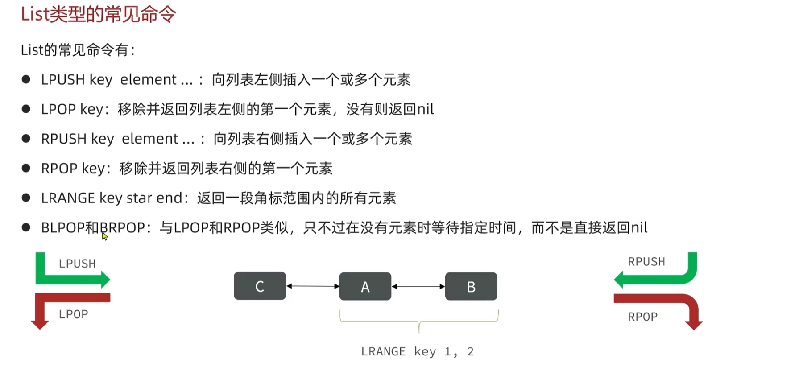
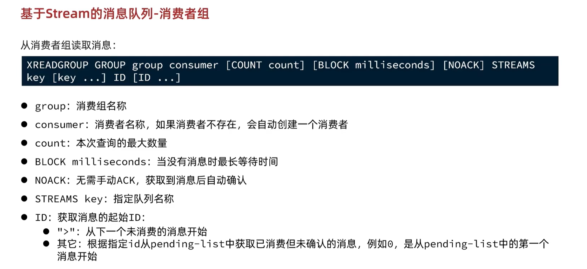

# Redis

## 基础篇
### NoSQL


### Redis概述


### 通用命令
- `keys pattern`：查询符合给定模式的键
- `del key_name`：删除给定键
- `exists key_name`：检查给定键是否存在
- `expire key_name n_seconds`：为给定键设置过期时间
- `ttl key_name`：查看给定键的剩余过期时间

### Redis数据类型
- `help @数据类型`：查看数据类型相关命令


### String类型


> 


### Hash类型


### List类型
List与Java中LinkedList类似，双向链表。




### Set类型
Set与Java中HashSet类似，不允许重复元素。


### SortedSet/ZSet类型


## Redis-Java-Clients
### Jedis
- 引入依赖
    ```xml
    <dependency>
        <groupId>redis.clients</groupId>
        <artifactId>jedis</artifactId>
        <version>3.2.0</version>
    </dependency>
    ```

- 使用jedis
    ```java
    class JedisApplicationTests {

        private Jedis jedis;

        @BeforeEach
        void setUp() {
            // 建立连接
            jedis = new Jedis("$IPAddr", $Port);
            // 设置密码
            jedis.auth("$password");
            // 选择库
            jedis.select(0);
        }

        @Test
        void testString() {
            // 方法名称就是redis的命令名
            String res = jedis.set("username", "kanade");
            System.out.println(res);

            String name = jedis.get("username");
            System.out.println(name);
        }

        @AfterEach
        void tearDown() {
            // 关闭链接
            if (jedis != null) jedis.close();
        }
    }
    ```
> 


### Spring Data Redis


---
- Spring封装了Redis的命令为RedisTemplate


## 应用
### 缓存
#### 更新方案
- 选取更新数据库时删除Cache的方案，下次查询时再写入Cache。


#### 缓存穿透

> 

#### 缓存雪崩


#### 缓存击穿
逻辑击穿：多个请求同时查询==一个==缓存失效的key，导致大量请求直接访问数据库。


### 超卖问题


### 分布式锁
几种分布式锁的实现方式：


#### Lua脚本
- Redis提供了Lua脚本功能，可以保证原子性操作。
- `eval "$(cat script.lua)" 0`：简单执行lua脚本文件，**用$和cat命令得到脚本内容。**

> 

#### Redisson
###### 快速入门
- Redisson是一个分布式协调框架，封装了Redis的一些操作（Lua脚本），提供了多种分布式锁的实现方式。
- 引入依赖
- 配置Redisson
```java
@Configuration
public class RedissonConfig {
    @Bean
    public RedissonClient redissonClient() {
        Config config = new Config();
        config.useSingleServer().setAddress("redis://$IPAddr:$Port").setPassword("$password");
        return Redisson.create(config);
    }
}
```
- 使用Redisson
```java
@Service
public class RedissonService {
    @Autowired
    private RedissonClient redissonClient;

    public void lock() {
        // 获取锁：可重入，制定锁的名称
        RLock lock = redissonClient.getLock("lock");
        // 类setnx命令尝试锁，参数分别是最大等待时间，锁的过期时间，时间单位
        boolean isLock = lock.tryLock(1, 10, TimeUnit.SECONDS);
        if (isLock) {
            try {
                // 业务逻辑
            } finally {
                lock.unlock();
            }
        }
    }
}
```


###### 可重入锁、锁重复、看门狗机制


> 
> > tryLock方法中：不设置leaseTime或设置leaseTime为-1，则启动看门狗机制，锁的过期时间为30s，自动续期。
> 1. 正常情况下，看门狗机制正常工作，自动续费锁，只能显式调用unlock方法释放锁。
> 2. 如果业务出现异常，看门狗机制与Redis服务器失去联系，锁经过30s后自动过期，此时锁被自动释放。


###### multi-lock


> 必须同时从各个节点获取锁，才算获取到锁。


### 异步优化
###### 概述


### 消息队列
###### 概述
异步处理超卖订单时，我们开始是使用Java提供的阻塞队列实现的，存在问题。
- 与Java程序绑定，JVM有内存限制，无法处理大量请求。
- 如果队列意外丢失，数据也会丢失。

###### Redis消息队列


- 基于List结构实现的消息队列，生产者和消费者都可以往队列中写入和读取消息。
  - `BLPOP`、`BRPOP`：阻塞式读取，直到队列有消息才返回。
  - 
---

- `PubSub`-`Publish/Subscribe`模式：发布者和订阅者模式，订阅者可以订阅一个或多个频道，当有消息发布到该频道时，所有订阅该频道的订阅者都会收到消息。
  - 
  - 缺点：
    - 不支持数据持久化
    - 无法避免消息丢失
    - 消息堆积有上限

---
- `Stream`：Redis的一种数据类型，可以实现一个功能完善的消息队列。
- 单消费模式：
  - 
  - 
  - 缺点：
    - 有漏读风险
- 消费组模式：
  - 
  - 
  - 

> 同一个消费者组中的消费者共用一个游标，但同一个消息队列的不同消费者组游标相互独立。

### Feed流
- Feed：投喂。推送行为。


### GEO数据结构


#### 附近商铺功能
首先需要将数据库中的商铺经纬度信息存入Redis的GEO数据结构中。
因为MySQL没有提供处理类GEO数据结构的函数，所以需要使用Redis的命令实现。


### BitMap
- 01串：Redis中下标从左到右数。


### HyperLogLog
#### 基本概念


#### 应用


## 高级
### 分布式缓存
#### Redis持久化
###### RDB持久化


> 


###### AOF持久化


> 

###### RDB和AOF的对比


#### 主从架构
###### 概述


###### 配置主从
- 永久配置：
  - `redis.conf`文件中配置`slaveof <masterip> <masterport>`命令，指定主服务器的IP地址和端口。
  - 启动时，Redis会自动从主服务器同步数据。
- 临时配置：
  - `slaveof`命令在运行时执行，指定主服务器的IP地址和端口。
  - `replicaof`
- `INFO replication`命令查看主从关系。

###### 数据同步原理
- 全量同步：

> repl_baklog是专门用来主从复制的一个环形缓冲区

- 增量同步：


###### 优化


#### 哨兵机制Sentinel
###### 概述


###### 心跳机制监控


###### 选举新master
- 先排除断开时间过长节点
- 判断`slave-priority`值，越小优先级越高
- 判断复制偏移量`offset`，越大数据越新
- 最后根据`id`

###### 故障转移


###### RedisTemplate的哨兵模式
- 配置：==配置的是Sentinel的地址，不是Redis的地址，因为Redis集群主从关系一直在变化，要基于Sentinel集群发现Redis主从关系、节点地址。==

- 主从读写分离


#### 分片集群Cluster
###### 概述


###### 配置集群
- 在`redis.conf`中`enable-cluster`设置为`yes`开启集群模式
- 配置集群配置文件名称，不需要我们创建，redis自己维护
  - `cluster-config-file filepath/$port/nodes.conf`
- 启动集群：

- 集群命令：`redis-cli --cluster help`
- 查看集群状态：`redis-cli -p $port cluster nodes`
- 添加节点：`redis-cli --cluster add-node $ip:$port $master_ip:$master_port`
- 分配插槽：`redis-cli --cluster reshard $master_ip:$master_port`

###### 散列插槽Slot


> 使数据与Slot绑定，增加可靠性，即使节点宕机，只需转移Slot中的数据，其他节点依然可以提供服务。

###### 数据迁移


###### RedisTemplate的集群模式
与哨兵模式类似，配置Redis集群的地址，RedisTemplate会自动发现集群的主从关系。


### 多级缓存
###### 概述


###### JVM本地缓存


###### 冷启动和缓存预热


###### 缓存同步


### Redis最佳策略
###### 键值设计
- `业务:属性:id`
- 避免bigKey，避免过长的key，避免过多的key，避免过多的field


###### 批处理
- `MSET`等指令的使用
- 

> pipeline不保证多条指令之间的原子性

- 集群下的批处理


###### 服务端优化
- 持久化配置

- 慢查询
- 命令及安全配置

- 内存配置

- 集群配置和集群、主从选择

## 原理
### 数据结构
#### 动态字符串SDS

> 

#### IntSet


#### Dict


> 

- rehash


#### ZipList
