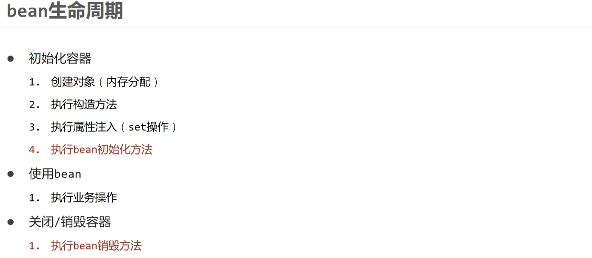

# Spring


## 系统架构


### IoC & DI 思想
#### IoC（Inversion of Control）控制反转
- 对象的创建控制权由程序转移到==外部==，这种思想被称为控制反转。
- Spring提供了一个**IoC容器**，用来充当IoC思想中的外部容器，IoC负责创建和管理对象，这些对象被称为**Bean**。

#### DI（Dependency Injection）依赖注入
- 在容器中建立Bean与Bean之间的依赖关系的过程，被称为依赖注入。


## XML配置以及Bean的使用
### 基础使用


> 这里其实是有点问题的：
> XML配置文件中：`name="bookDao"`中的`bookDao`指代的是Setter方法`setBookDao(BookDao bookDao)`的set==BookDao==


### Spring实例化Bean
- 构造方法：调用无参构造方法实例化对象
- 工厂模式：
  - 静态工厂
  - 实例工厂


> 方式四中，工厂类要实现FactoryBean接口，
> ```java
> public interface FactoryBean<T> {
>     T getObject() throws Exception;
>     Class<?> getObjectType();
>     boolean isSingleton();
> }
> ```
> Spring中配置一般有三种方法：1. XML配置；2. Java接口规范配置；3. Java注解配置


### Bean的生命周期


> Bean的销毁时机
> - 容器关闭时：容器关闭时，容器管理的所有Bean都会被销毁。
>   - 手动关闭容器：`ConfigurableApplicationContext.close()`
>   - 注册关闭钩子，在虚拟机退出前先关闭容器：`ConfigurableApplicationContext.registerShutdownHook()`

> 扩展：十步生命周期：
> 


### 注入
- 基础类型（基本数据类型+String）注入：`value=""`
- 引用类型注入：`ref=""`
```xml
<bean id="bookDao" class="com.example.BookDaoImpl">
    <property name="bookService" ref="bookService"/>
</bean>
```
#### 自动装配
- 基于XML配置：`autowire="byName"`/`autowire="byType"`
- 

#### 集合
- 基于XML配置：`list`、`set`、`map`、`props`
- **`list/set/array`-`value`**:
  - `<list> <value>item1</value> <value>item2</value> </list>`
- **`map`-`entry`**:
  - `<map> <entry key="key1" value="value1"/> <entry key="key2" value="value2"/> </map>`
- **`props`-`prop`**:
  - `<props> <prop key="key1">value1</prop> <prop key="key2">value2</prop> </props>`

#### 加载properties文件


#### 循环依赖

> 三级缓存：
> 

## 注解配置
### 注入
- 配置文件转化为类

- 直接在Bean类上注解
  - @Component("ID")
    - @Repository("ID")
    - @Service("ID")
    - @Controller("ID")
  - @Scope("singleton/prototype")

- 类中方法注解
  - @PostConstruct
  - @PreDestroy

- 依赖注入注解

> 默认@Autowired注解，是根据==类型==注入（**@Resource**注解也可以，推荐，它是根据ID注入的）。
> 试用@Qualifier("bookDao")注解，可以指定对应Bean。
>
> **使用@Value注解，可以直接注入基本类型和String。**

- 加载properties文件


```java
@Component
public class BookDaoImpl implements BookDao {
    @Value("${prop.value}")
    private String value;
    @Autowired
    @Qualifier("bookService")
    private BookService bookService;
}

@Configuration
@PropertySource("classpath:application.properties")
@ComponentScan("com.example")
public class AppConfig {}
```


### 第三方管理
#### Bean
- 在配置类中使用@Bean注解，可以将方法返回值注册为Bean


- 试用@Import注解，可以导入其他配置类到核心配置类中

> 当然你也可以试用@ComponentScan方法扫描配置类所在包，~~但不推荐~~。

#### 依赖注入
- 引用类型：方法形参（==自动装配会按照**类型**进行装配==）
- 简单类型：成员变量

```java
@Configuration
public class AppConfig {
    @Bean // 根据形参类型自动注入
    public DataSource dataSource(BookService bookService) {
        DataSource dataSource = new DataSource(bookService);
        return dataSource;
    }
}
```

## XML和注解配置的整合


## AOP（Aspect Oriented Programming）面向切面编程
### 概述
- AOP（Aspect Oriented Programming）面向切面编程，是Spring框架的一个重要特性。Spring中AOP是无侵入性的。
- 


### 使用入门
- 导入AOP相关包
- 定义通知类
  ```java
  @Component
  @Aspect
  public class MyAdvice {
    @Pointcut("execution(void com.example.BookService.*(..)")
    private void pointcut() {}

    @Before("pointcut()")
    public void before() {
      System.out.println("before");
    }
  }
  ```
- Spring配置类中开启AOP注解驱动支持
  ```java
  @Configuration
  @ComponentScan("com.example")
  @EnableAspectJAutoProxy(proxyTargetClass=true) // 开启AOP注解驱动支持
  public class AppConfig {}
  ```

### 工作流程

> Spring AOP的本质是代理模式。


### AOP切入点表达式

**==切入点通常描述到接口，可以降低耦合。==**
> 通配符
> 


### 通知类型
- @Before：在目标方法执行前执行
- @After：在目标方法执行后执行
- @AfterReturning：在目标方法正常返回后执行
- @AfterThrowing：在目标方法抛出异常后执行
- @Around：在目标方法执行前后执行

```java
@Component
@Aspect
@Order(1) // 定义有多个切面时执行顺序，数字越小优先级越高
public class MyAdvice {
    @Pointcut("execution(void com.example.BookService.*(..)")
    private void pointcut() {}

    @Around("pointcut()")
    public Object around(ProceedingJoinPoint joinPoint) throws Throwable {
      System.out.println("before");
      Object result = joinPoint.proceed();
      System.out.println("after");
      return result;
    }
}
```

> `JoinPoint`->`ProceedingJoinPoint`方法
> - ==如果有JoinPoint参数，必须是第一个参数。==
> - 包含目标方法的所有信息，可以获取方法参数和返回值。  
>   - `joinPoint.getArgs()`：获取方法参数  
>   - `joinPoint.proceed()`：执行目标方法  
>   - `joinPoint.getSignature()`：返回`Signature`类，获取方法签名  
>     - `joinPoint.getSignature().getName()`：获取方法名  
>     - `joinPoint.getSignature().getDeclaringTypeName()`：获取类名  
> - 可以调用`joinPoint.proceed()`方法，执行目标方法。

## Spring对事务的处理

