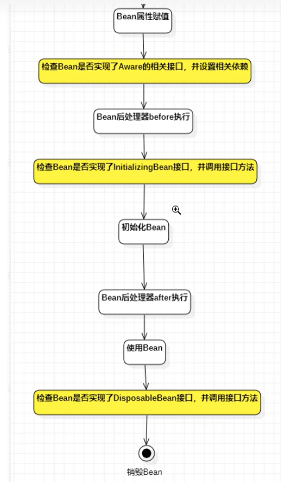
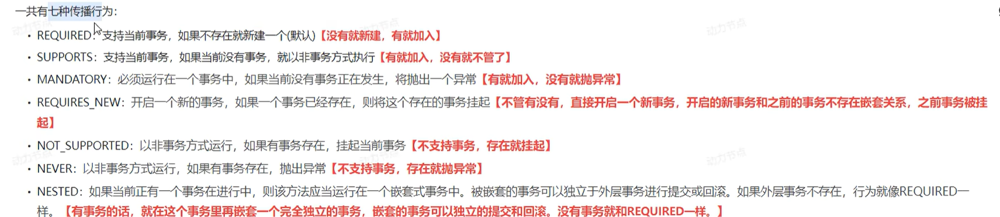

# Spring


## 系统架构


### IoC & DI 思想
#### IoC（Inversion of Control）控制反转
- 对象的创建控制权由程序转移到==外部==，这种思想被称为控制反转。
- Spring提供了一个**IoC容器**，用来充当IoC思想中的外部容器，IoC负责创建和管理对象，这些对象被称为**Bean**。

#### DI（Dependency Injection）依赖注入
- 在容器中建立Bean与Bean之间的依赖关系的过程，被称为依赖注入。


## XML配置以及Bean的使用
### 基础使用


> 这里其实是有点问题的：
> XML配置文件中：`name="bookDao"`中的`bookDao`指代的是Setter方法`setBookDao(BookDao bookDao)`的set==BookDao==


### Spring实例化Bean
- 构造方法：调用无参构造方法实例化对象
- 工厂模式：
  - 静态工厂
  - 实例工厂


> 方式四中，工厂类要实现FactoryBean接口，
> ```java
> public interface FactoryBean<T> {
>     T getObject() throws Exception;
>     Class<?> getObjectType();
>     boolean isSingleton();
> }
> ```
> Spring中配置一般有三种方法：1. XML配置；2. Java接口规范配置；3. Java注解配置


### Bean的生命周期


> Bean的销毁时机
> - 容器关闭时：容器关闭时，容器管理的所有Bean都会被销毁。
>   - 手动关闭容器：`ConfigurableApplicationContext.close()`
>   - 注册关闭钩子，在虚拟机退出前先关闭容器：`ConfigurableApplicationContext.registerShutdownHook()`

> 扩展：十步生命周期：（7步：`BeanPostProcessor`接口`before/after`方法）
> 


### 注入
- 基础类型（基本数据类型+String）注入：`value=""`
- 引用类型注入：`ref=""`
```xml
<bean id="bookDao" class="com.example.BookDaoImpl">
    <property name="bookService" ref="bookService"/>
</bean>
```
#### 自动装配
- 基于XML配置：`autowire="byName"`/`autowire="byType"`
- 

#### 集合
- 基于XML配置：`list`、`set`、`map`、`props`
- **`list/set/array`-`value`**:
  - `<list> <value>item1</value> <value>item2</value> </list>`
- **`map`-`entry`**:
  - `<map> <entry key="key1" value="value1"/> <entry key="key2" value="value2"/> </map>`
- **`props`-`prop`**:
  - `<props> <prop key="key1">value1</prop> <prop key="key2">value2</prop> </props>`

#### 加载properties文件


#### 循环依赖

> 三级缓存：
> 

## 注解配置
### 注入
- 配置文件转化为类

- 直接在Bean类上注解
  - @Component("ID")
    - @Repository("ID")
    - @Service("ID")
    - @Controller("ID")
  - @Scope("singleton/prototype")

- 类中方法注解
  - @PostConstruct
  - @PreDestroy

- 依赖注入注解

> 默认@Autowired注解，是根据==类型==注入（**@Resource**注解也可以，推荐，它是根据ID注入的）。
> 试用@Qualifier("bookDao")注解，可以指定对应Bean。
>
> **使用@Value注解，可以直接注入基本类型和String。**

- 加载properties文件


```java
@Component
public class BookDaoImpl implements BookDao {
    @Value("${prop.value}")
    private String value;
    @Autowired
    @Qualifier("bookService")
    private BookService bookService;
}

@Configuration
@PropertySource("classpath:application.properties")
@ComponentScan("com.example")
public class AppConfig {}
```


### 第三方管理
#### Bean
- 在配置类中使用@Bean注解，可以将方法返回值注册为Bean


- 试用@Import注解，可以导入其他配置类到核心配置类中

> 当然你也可以试用@ComponentScan方法扫描配置类所在包，~~但不推荐~~。

#### 依赖注入
- 引用类型：方法形参（==自动装配会按照**类型**进行装配==）
- 简单类型：成员变量

```java
@Configuration
public class AppConfig {
    @Bean // 根据形参类型自动注入
    public DataSource dataSource(BookService bookService) {
        DataSource dataSource = new DataSource(bookService);
        return dataSource;
    }
}
```

## XML和注解配置的整合


## AOP（Aspect Oriented Programming）面向切面编程
### 概述
- AOP（Aspect Oriented Programming）面向切面编程，是Spring框架的一个重要特性。Spring中AOP是无侵入性的。
- 


### 使用入门
- 导入AOP相关包
- 定义通知类
  ```java
  @Component
  @Aspect
  public class MyAdvice {
    @Pointcut("execution(void com.example.BookService.*(..)")
    private void pointcut() {}

    @Before("pointcut()")
    public void before() {
      System.out.println("before");
    }
  }
  ```
- Spring配置类中开启AOP注解驱动支持
  ```java
  @Configuration
  @ComponentScan("com.example")
  @EnableAspectJAutoProxy(proxyTargetClass=true) // 强制CGLib代理机制：类似继承
  public class AppConfig {}
  ```

### 工作流程

> Spring AOP的本质是代理模式。


### AOP切入点表达式

**==切入点通常描述到接口，可以降低耦合。==**
> 通配符
> 


### 通知类型
- @Before：在目标方法执行前执行
- @After：在目标方法执行后执行
- @AfterReturning：在目标方法正常返回后执行
- @AfterThrowing：在目标方法抛出异常后执行
- @Around：在目标方法执行前后执行

```java
@Component
@Aspect
@Order(1) // 定义有多个切面时执行顺序，数字越小优先级越高
public class MyAdvice {
    @Pointcut("execution(void com.example.BookService.*(..)")
    private void pointcut() {}

    @Around("pointcut()")
    public Object around(ProceedingJoinPoint joinPoint) throws Throwable {
      System.out.println("before");
      Object result = joinPoint.proceed();
      System.out.println("after");
      return result;
    }
}
```

> `JoinPoint`->`ProceedingJoinPoint`方法
> - ==如果有JoinPoint参数，必须是第一个参数。==
> - 包含目标方法的所有信息，可以获取方法参数和返回值。  
>   - `joinPoint.getArgs()`：获取方法参数  
>   - `joinPoint.proceed()`：执行目标方法  
>   - `joinPoint.getSignature()`：返回`Signature`类，获取方法签名  
>     - `joinPoint.getSignature().getName()`：获取方法名  
>     - `joinPoint.getSignature().getDeclaringTypeName()`：获取类名  
> - 可以调用`joinPoint.proceed()`方法，执行目标方法。

## Spring对事务的处理
### 事务管理API
- Spring事务管理API是Spring框架提供的用于管理事务的API。
- Spring事务管理API的核心是`PlatformTransactionManager`接口。
- `PlatformTransactionManager`接口定义了Spring事务管理的基本操作。
- Spring事务管理API的实现有：
  - `DataSourceTransactionManager`：用于管理基于JDBC的事务。
  - `JtaTransactionManager`：用于管理基于分布式的事务。

### 注释
- `@EnableTransactionManagement`
- `@Transactional`
```java
@Configuration
@EnableTransactionManagement
@ComponentScan("com.example")
public class AppConfig {
}

public class TransactionalManager {
    @Autowired
    private DataSource dataSource;

    @Bean
    public PlatformTransactionManager transactionManager(DataSource dataSource) {
        DataSourceTransactionManager transactionManager = new DataSourceTransactionManager();
        transactionManager.setDataSource(dataSource);
        return transactionManager;
    }
}

@Service
public class BookService {
    @Autowired
    private BookDao bookDao;

    @Transactional
    public void addBook() {
        bookDao.add();
    }
}
```

### 事务属性
#### 传播行为


#### 隔离级别


## Spring-MyBatis
### 概述
- Spring-MyBatis是Spring框架与 MyBatis框架的整合。
- [请看官网](https://mybatis.org/spring/zh_CN/index.html)

### 基本使用
- `SqlSessionFactoryBean`：用于创建SqlSessionFactory的Bean。
- `SqlSessionTemplate`：SqlSession升级版，提供更方便的操作方式与生命管理。
- `SqlSessionDaoSupport`：用于提供SqlSession。
- ==如今，SqlSession已经不必我们手动创建，皆由Spring-MyBatis自动帮我们管理。==

```java
@Configuration
public class DBConfig {
    @Bean
    public DataSource dataSource() {
        DriverManagerDataSource dataSource = new DriverManagerDataSource();
        dataSource.setDriverClassName("com.mysql.jdbc.Driver");
        dataSource.setUrl("jdbc:mysql://localhost:3306/test");
        dataSource.setUsername("root");
        dataSource.setPassword("root");
        return dataSource;
    }

    @Bean
    public SqlSessionFactoryBean sqlSessionFactoryBean(DataSource dataSource) {
        SqlSessionFactoryBean sqlSessionFactoryBean = new SqlSessionFactoryBean();
        sqlSessionFactoryBean.setDataSource(dataSource);
        return sqlSessionFactoryBean;
    }

    // @MapperScan注解也可用于扫描Mapper接口
    @Bean
    public MapperScannerConfigurer mapperScannerConfigurer() {
        MapperScannerConfigurer mapperScannerConfigurer = new MapperScannerConfigurer();
        mapperScannerConfigurer.setBasePackage("com.example.mapper");
        return mapperScannerConfigurer;
    }
}

@Service
@Transactional
public class BookService {
    @Autowired
    private sqlMapper sqlMapper; 

    public void addBook() {
        sqlMapper.addBook();
    }
}
```

> 上边代码中，并未显式构建SqlSession和使用Mapper实现类，皆是由Spring-MyBatis自动管理。


## SpringMVC
### 概述
SpringMVC是Spring框架中的一个模块，它是一个基于Java的MVC框架，与Servlet技术相同，是构建Web应用的主流框架。


### MVC配置
```java
// 相当于SpringConfig.xml
@Configuration
@ComponentScan("com.example")
@EnableWebMvc // 开启SpringMVC的注解驱动支持
public class AppConfig implements WebMvcConfigurer {
    // 配置视图控制器：URL与视图资源（需要HTML语法或配置了相关的视图解析器）直接映射，不经过Controller
    @Override
    public void addViewControllers(ViewControllerRegistry registry) {
        registry.addViewController("/").setViewName("index");
    }

    // 配置视图解析器：下方配置的是默认的JSP视图解析器
    @Bean
    public ViewResolver viewResolver() {
        InternalResourceViewResolver viewResolver = new InternalResourceViewResolver();
        viewResolver.setPrefix("/WEB-INF/views/");
        viewResolver.setSuffix(".jsp");
        return viewResolver;
    }
}
```
> 自己配置需要实现WebMvcConfigurer接口，并重写相关方法。
> 如果不实现，则使用默认配置。

### DispatcherServlet
**DispatcherServlet是SpringMVC框架为我们提供的最核心的类，它是整个SpringMVC框架的前端控制器，负责接收HTTP请求、将请求路由到处理程序、处理响应信息，最终将响应返回给客户端。**

```java
@Configuration
@ComponentScan("com.example")
public class AppConfig {
}

// 相当于web.xml
// 存在专门为全注解服务的AbstractAnnotationConfigDispatcherServletInitializer类
// 继承该类，只要传入配置类即可，方便很多。
public class MyWebInitializer extends AbstractDispatcherServletInitializer {
    // 根据配置类创建SpringMVC的前端控制器
    @Override
    protected WebApplicationContext createRootApplicationContext() {
        AnnotationConfigWebApplicationContext context = new AnnotationConfigWebApplicationContext();
        context.register(AppConfig.class);
        return context;
    }

    @Override
    protected WebApplicationContext createServletApplicationContext() {
        return null;
    }

    // 配置DispatcherServlet的url映射 "/"表示除了"*.jsp/*.html"等静态资源外，所有请求都由DispatcherServlet处理
    @Override
    protected String[] getServletMappings() {
        return new String[]{"/"};
    }

    // 配置DispatcherServlet的过滤器
    @Override
    protected Filter[] getServletFilters() {
        CharacterEncodingFilter characterEncodingFilter = new CharacterEncodingFilter();
        characterEncodingFilter.setEncoding("UTF-8");
        return new Filter[]{characterEncodingFilter};
    }
}
```
> 配置SpringMVC的前端控制器，并配置DispatcherServlet的url映射。


> Tomcat在启动时会扫描Web应用的`web.xml`文件或Java配置类，以发现并加载`DispatcherServlet`。
> 主要流程：
> 


### Bean加载控制


### 请求参数传递
- `@RequestParam`：用于从请求参数中获取数据。
- `@RequestHeader`：用于从请求头中获取数据。
- `@RequestBody`：用于从请求体中获取数据(一个方法内只能使用一次)。
- `@CookieValue`：用于从Cookie中获取数据。
- `@EnableWebMvc`：开启SpringMVC的注解驱动支持(JSON对象转换为Bean)。
  - 传入JSON对象时，记得导入`jackson-databind/core/annotations`依赖。
- `@DateTimeFormat`：用于格式化日期参数。
  - 底层是由`Converter`实现的，`Converter`是类型转换器。


### 响应结果
- `@ResponseBody`：用于将方法的返回值作为响应体返回给客户端。
  - 如不使用：则返回的是一个视图，如HTML、JSP等页面。
  - 如使用：则将返回值按类型自动打包进响应体中（`Converter`）。

### Request域数据共享
1. 原始Servlet API处理
2. SpringMVC的`Model`、`Map`或`ModelMap`形参
    ```java
    @Controller
    public class BookController {
        @RequestMapping("/addBook")
        public String addBook(Book book, Model model) {
            // 向Model中添加数据
            model.addAttribute("book", book);
            // 转发到视图
            return "success";
        }
    }
    ```
> `Map`、`Model`和`ModelMap`三者关系：
> ==表面上使用了不同的接口和不同的类，实际上底层都使用了一个对象`BindingAwareModelMap`==

3. 使用`ModelAndView`
    ```java
    @Controller
    public class BookController {
      @RequestMapping("/addBook")
      public ModelAndView addBook(Book book) {
        // 创建ModelAndView对象
        ModelAndView modelAndView = new ModelAndView();
        // 设置视图名
        modelAndView.setViewName("success");
        // 向ModelAndView中添加数据
        modelAndView.addObject("book", book);
        return modelAndView;
      }
    }
    ```
> 不管用什么方法，底层都会返回**ModelAndView对象**


### Session域数据共享
- 使用Servlet API中的`HttpSession`
- `@SessionAttributes`注解
  ```java
  @Controller
  @SessionAttributes(value = "book") // "book"存放在Session域中
  public class BookController {
    @RequestMapping("/addBook")
    public ModelAndView addBook(Book book) {
      ModelAndView modelAndView = new ModelAndView();
      modelAndView.setViewName("success");
      modelAndView.addObject("book", book);
      return modelAndView;
    }
  }
  ```

### Application域数据共享
- 使用Servlet API中的`ServletContext`

### 从DispatcherServlet到View


### 转发与重定向
```java
@Controller
public class MyController {
  @RequestMapping("/a")
  public String aHandler() {
    return "forward:/b"; // "redirect:/b" 重定向
  }

  @RequestMapping("/b")
  public String bHandler() {
    return "index";
  }
}
```


### 静态资源的请求处理
**配置Tomcat的`DefaultServlet`处理静态资源请求**


### RESTFul
#### 概述


#### 使用
- URL:`"/user/{var_name}"`
- `@PathVariable`：用于从路径中获取数据。
```java
@RequestMapping(value = "/user/{id}", method = RequestMethod.GET)
@ResponseBody
public User getUser(@PathVariable("id") int id) {
    // 根据id查询用户信息
    return userDao.getUser(id);
}
```


#### 前端发送PUT、DELETE请求
使用隐藏域，Spring中会处理披着`POST`请求的`PUT`和`DELETE`请求。
```html
<form action="/user/1" method="post">
  <input type="hidden" name="_method" value="PUT">
  <input type="submit" value="修改">
</form>

<form action="/user/1" method="post">
  <input type="hidden" name="_method" value="DELETE">
  <input type="submit" value="删除">
</form>
```
> ==`@EnableWebMvc`注解开启注解驱动支持，可以自动处理隐藏域的`_method`参数。(必须是这个名字)==

