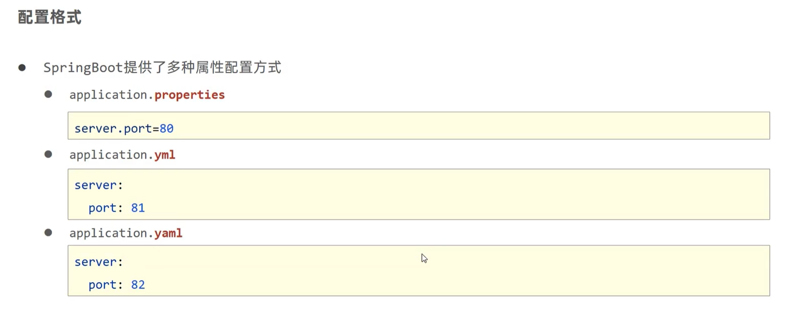
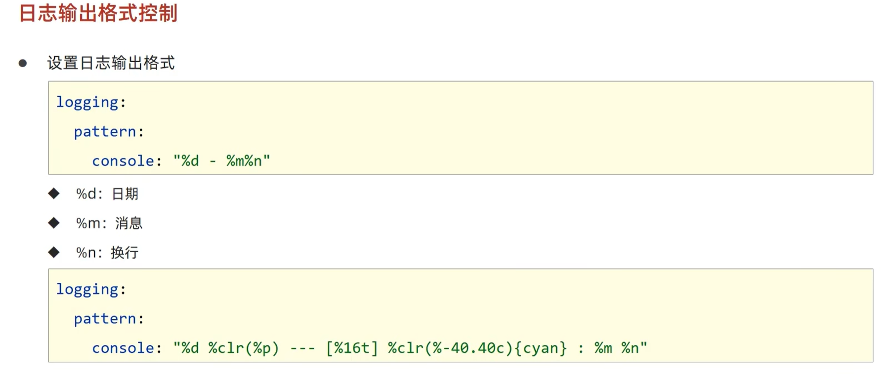

# Spring Boot
> 神一般的存在。

## 基础
### 起步依赖


### 配置文件


### YAML
#### 基本概述


> 数组类似MARKDOWN中的列表
> ```yaml
> # 数组
> fruits:
>   - apple
>   - banana
>   - orange
> # 使用变量
> baseDir: /usr/local/
> tmpDir: ${baseDir}/tmp
> 
> # 转义字符 双引号括住会解析
> lesson: "Spring Boot\n\nYAML\n\n"
> ```

> ==优点：容易阅读、容易与脚本语言交互、重数据轻格式==

#### 读取YAML
- 
- 
- 

### 打包

> 请导入`spring-boot-maven-plugin`插件打包（不过如今都会自动导入）

### 多配置文件


### 多环境
#### 配置
- YAML
    

- Properties
    

> 

#### 运行


#### Maven和SpringBoot的多环境兼容
- **Maven的配置作为主导**
- 
- 
- 

> `@...@`也可以
> 

### 配置文件分类

> `file`指打包后`target`目录下
> `classpath`指项目结构`src/main/resources`目录下

### 整合第三方工具
#### JUnit


#### MyBatis

> 使用`@Mapper`注释，标注要MyBatis代理的Mapper接口


### 日志
#### 使用

> 
> 可以用lombok的注解`@Slf4j`省去创建Logger对象的过程


#### 日志级别
- `TRACE`：细粒度信息，一般用于开发阶段
- `DEBUG`：调试信息，一般用于调试问题
- `INFO`：一般信息，如程序启动、关闭、正常运行等
- `WARN`：警告信息，如配置错误、不推荐配置等
- `ERROR`：错误信息，如程序崩溃、异常等
- `FATAL`：严重错误信息，如程序崩溃、无法启动等

#### 日志输出格式


#### 日志文件


## 开发应用
### 热部署

> 热部署
> - ==重启（Restart）==：自定义开发代码，包含类、资源、配置文件等，加载位置：restart类加载器
> - 重载（Reload）：jar包，加载位置：base类加载器

### Bean绑定属性
#### 基本用法
- `@ConfigurationProperties(prefix = "xxxx")`：读取配置文件中的属性，并绑定到Bean中
- `@EnableConfigurationProperties(xxxx.class)`：启用配置文件绑定功能
> `@EnableConfigurationProperties`是告诉配置类，如果用到某个类就要从`xxxx.class`类中读取属性绑定到Bean中，**此时已经绑定了一次！**

> 宽松绑定：`@ConfigurationProperties`注解允许JavaBean属性名与配置文件中的对应名宽松绑定。

#### 常用计量单位应用


#### 数据校验
就像JDBC一样，Java提供了大量数据校验的注解和接口。


### Web开发
#### 简介
SpringBoot基本都帮我们配置好了。

#### 静态资源
- `classpath:/static(or /public or /resources or /META-INF/resources)`：将静态资源放在该目录下。
    - 默认静态映射：`/**`：先去找Controller，找不到就交给静态资源处理器。
    - 配置静态映射路径：`spring.mvc.static-path-pattern`
    - 修改静态资源文件夹路径：`spring.mvc.resource.static-locations: [classpath:/new_path]`
    - 访问`webjars`：`http://localhost:8080/webjars/jquery/3.5.1/jquery.min.js`(按照依赖中文件路径)


#### Index页面
- 静态资源路径下放置`index.html`文件，访问`http://localhost:8080/`会自动跳转到该页面。
- `@Controller`处理`\index`请求，返回`index.html`页面。

#### favicon.ico
- 静态资源路径下放置`favicon.ico`文件。


### 测试
#### 启动Web服务


#### 虚拟请求测试


#### 模拟测试匹配


> 可以采用事务控制`@Transactional`防止测试类脏了数据库数据。


#### 随机测试用例


### SQL解决方案
#### 内嵌数据库

> 内嵌数据库，不需要安装数据库，启动速度快，适合测试环境。


### NoSQL解决方案
#### Redis

> 注意：StringRedisTemplate和RedisTemplate。


### 缓存Cache
- 导入Maven坐标`spring-boot-starter-cache`
- 配置类注释`@EnableCaching`
- 注解`@Cacheable(value = "cacheName", key = "#id")`缓存方法返回值
> `#id`会自动匹配方法参数作为查询`cacheName`缓存的key值，若有则会直接返回。


### 任务
#### 概念


> Spring Task是一个轻量级的任务调度框架，可以用来代替Quartz等定时任务框架。
> - `@EnableScheduling`：配置类注解开启定时任务功能
> - `@Scheduled(cron = "*/5 * * * * *")`：注解配置定时任务，`cron`表达式表示每5秒执行一次


## 原理
### Bean的加载方式


### 自动配置原理
- `@SpringApplication`
  - `@EnableAutoConfiguration`
    - `@AutoConfigurationPackage`：自动配置包扫描（配置类所在的包）
    - `@Import(AutoConfigurationImportSelector.class)`：先确定所有自动配置类（`META-INF/spring.factories`），然后根据`@Conditional`决定是否导入某个自动配置类
> ImportSelector接口：`selectImports`方法返回所有需要导入的配置类。是一种批量导入Bean的方式。


> 可以自己配置，自己配置优先级大于自动配置，会覆盖。
> 

> SpringBoot最佳实践
> 


### 启动流程
#### 阶段一：加载各种配置信息，初始化各种配置对象

- `ResourceLoader`：资源加载器，用于加载各种配置文件，包括`application.properties`、`application.yml`等。
- `webApplicationType`：Web应用类型，`NONE`表示非Web应用，`SERVLET`表示Servlet应用，`REACTIVE`表示Reactive应用。

#### 阶段二：初始化容器
创建容器，加载配置。

---
> 
> 