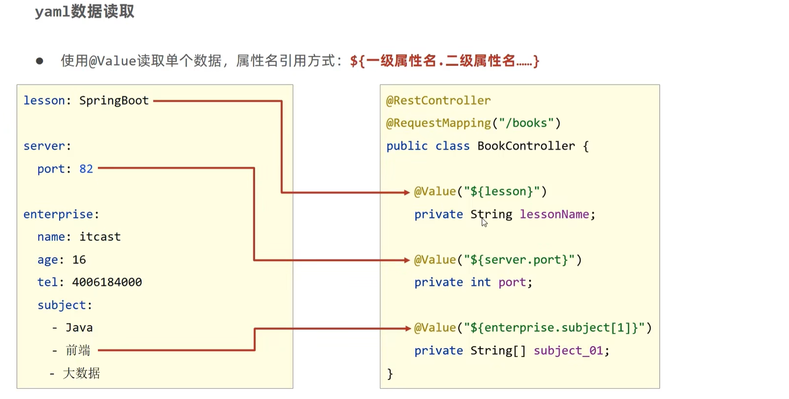
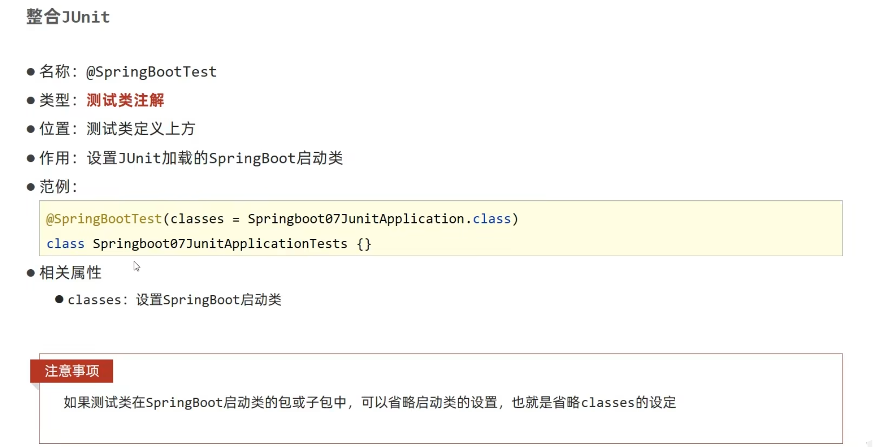
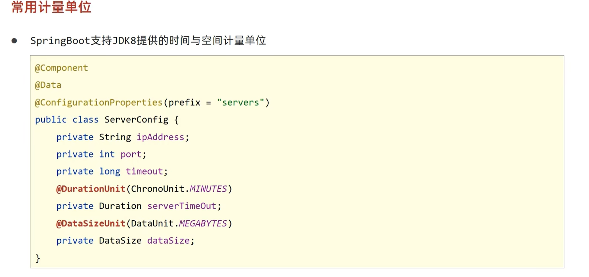

# Spring Boot
> 神一般的存在。

## 基础
### 起步依赖


### 配置文件


### YAML
#### 基本概述


> 数组类似MARKDOWN中的列表
> ```yaml
> # 数组
> fruits:
>   - apple
>   - banana
>   - orange
> # 使用变量
> baseDir: /usr/local/
> tmpDir: ${baseDir}/tmp
> 
> # 转义字符 双引号括住会解析
> lesson: "Spring Boot\n\nYAML\n\n"
> ```

> ==优点：容易阅读、容易与脚本语言交互、重数据轻格式==

#### 读取YAML
- 
- 
- 

### 打包

> 请导入`spring-boot-maven-plugin`插件打包（不过如今都会自动导入）

### 多配置文件


### 多环境
#### 配置
- YAML
    

- Properties
    

> 

#### 运行


#### Maven和SpringBoot的多环境兼容
- **Maven的配置作为主导**
- 
- 
- 

> `@...@`也可以
> 

### 配置文件分类

> `file`指打包后`target`目录下
> `classpath`指项目结构`src/main/resources`目录下

### 整合第三方工具
#### JUnit


#### MyBatis

> 使用`@Mapper`注释，标注要MyBatis代理的Mapper接口


### 日志
#### 使用

> 
> 可以用lombok的注解`@Slf4j`省去创建Logger对象的过程


#### 日志级别
- `TRACE`：细粒度信息，一般用于开发阶段
- `DEBUG`：调试信息，一般用于调试问题
- `INFO`：一般信息，如程序启动、关闭、正常运行等
- `WARN`：警告信息，如配置错误、不推荐配置等
- `ERROR`：错误信息，如程序崩溃、异常等
- `FATAL`：严重错误信息，如程序崩溃、无法启动等

#### 日志输出格式


#### 日志文件


## 开发应用
### 热部署

> 热部署
> - ==重启（Restart）==：自定义开发代码，包含类、资源、配置文件等，加载位置：restart类加载器
> - 重载（Reload）：jar包，加载位置：base类加载器

### Bean绑定属性
#### 基本用法
- `@ConfigurationProperties(prefix = "xxxx")`：读取配置文件中的属性，并绑定到Bean中
- `@EnableConfigurationProperties(xxxx.class)`：启用配置文件绑定功能
> `@EnableConfigurationProperties`是告诉配置类，要从`xxxx.class`类中读取属性绑定到Bean中，**此时已经绑定了一次！**

> 宽松绑定：`@ConfigurationProperties`注解允许JavaBean属性名与配置文件中的对应名宽松绑定。

#### 常用计量单位应用



#### 数据校验
就像JDBC一样，Java提供了大量数据校验的注解和接口。


### 测试
