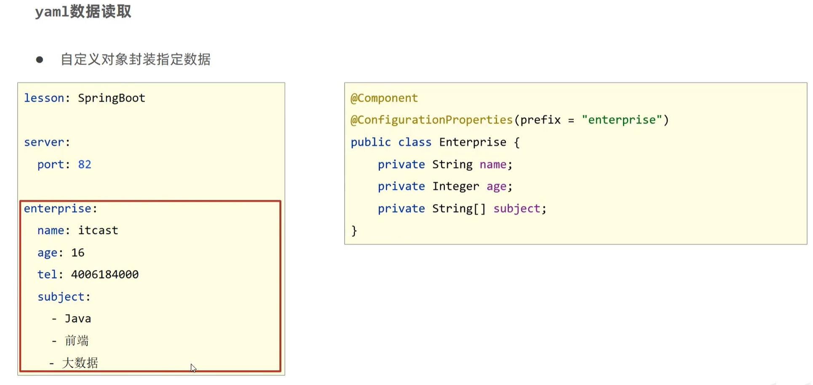

# Spring Boot
## 起步依赖


## 配置文件


## YAML
### 基本概述

> 数组类似MARKDOWN中的列表
>
> ```yaml
> # 数组
> fruits:
>   - apple
>   - banana
>   - orange
> ```

> ==优点：容易阅读、容易与脚本语言交互、重数据轻格式==

### 读取YAML
- 
- 
- 

## 多环境
### 配置
- YAML
    

- Properties
    

### 运行


### Maven和SpringBoot的多环境兼容
- **Maven的配置作为主导**
- 
- 
- 