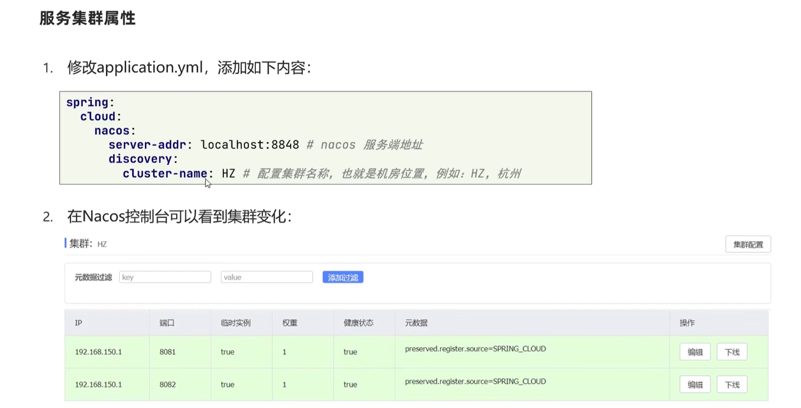

# 微服务[SpringCloud]
## Eureka注册中心
### 基本原理


### 搭建Eureka服务
###### 注册Server端
- 引入依赖
```xml
<dependency>
    <groupId>org.springframework.cloud</groupId>
    <artifactId>spring-cloud-starter-netflix-eureka-server</artifactId>
</dependency>
```
- 配置文件
```yaml
server:
  port: 8761
# Eureka服务器自己也是个微服务，所以也要注册到Eureka服务器当中
spring:
  application:
    name: eureka-server
eureka:
  client:
    servive-url:
      defaultZone: http://localhost:8761/eureka/
```

- `@EnableEurekaServer`

###### 注册Client端
- 引入依赖
```xml
<dependency>
    <groupId>org.springframework.cloud</groupId>
    <artifactId>spring-cloud-starter-netflix-eureka-client</artifactId>
</dependency>
```
- 配置文件
```yaml
spring:
  application:
    name: eureka-client
eureka:
  client:
    service-url:
      defaultZone: http://localhost:8761/eureka/
```

###### 服务发现


## Ribbon负载均衡
### 基本原理


> 

### 负载均衡规则配置


### 加载策略


## Nacos
### 注册中心功能
#### 简单搭建
- 下载启动Nacos服务端
- 微服务项目导入客户端依赖
- 项目配置Nacos服务器地址

#### 服务分级存储模型

> 

#### 负载均衡规则
###### NacusRule
- 优先选择同集群服务实例列表
- 确定列表后再采用随机负载均衡挑选实例

###### 权重控制
- Nacos控制台可以设置实例权重
- 权重值在0-1之间，1代表最高权重，0代表最低权重（完全不会被访问）

#### 环境隔离-namespace

> 

#### Nacos注册服务流程


### 配置中心功能
#### 配置管理功能
###### 概述

> 在Nacos控制端中，可以对配置进行管理，包括配置的添加、删除、修改、查询等操作。

###### 配置拉取流程

> 

#### 配置热更新


#### 多环境配置共享


> 优先级：
> 服务名-profile.yaml > 服务名.yaml > application-profile.yaml > application.yaml 

#### 集群搭建


> MySQL存储配置信息，用于Nacos集群同步配置信息。

## Feign
### 基本使用


### 自定义配置


### 性能优化


## Gateway网关
### 网关概念

> 


### 简单搭建
- 引入SpringCloudGateway依赖和Nacos服务发现依赖
- 配置Gateway路由规则


### 路由断言工厂


### 路由过滤器
###### Spring提供过滤器工厂


> 可以在Gateway映射微服务配置中配置Fliters，也可在Gateway整个服务中配置default-filters。

###### 自定义过滤器[全局过滤器GlobalFilter]


###### 过滤器执行顺序


### 跨域问题


