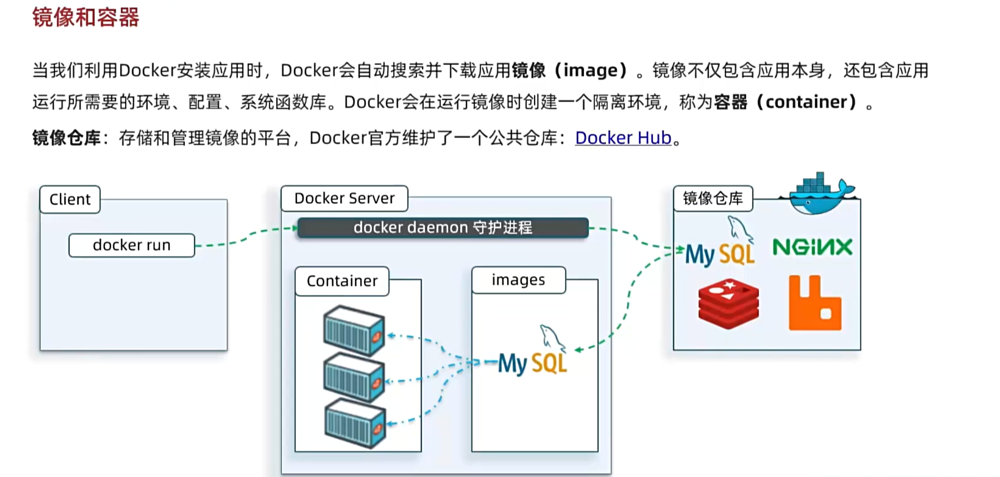

# Docker
## 镜像和容器

> 

## 命令
### 基本解读

### 常用命令

## 数据卷
### 概述

### 常用命令
- 挂载数据卷需要在容器创建时完成，可以用指令`docker run -v volume_name:container_path`中指定。
> 可以不走数据卷，走本地目录挂载`docker run -v /local_path:/container_path`

## 自定义Image
### 镜像结构

### Dockerfile

## 网络

## DockerCompose

