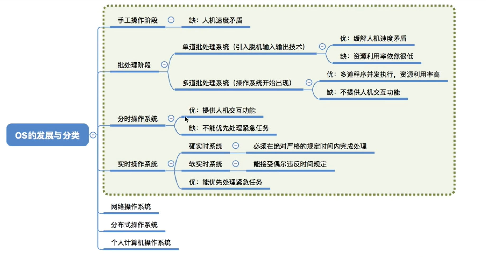
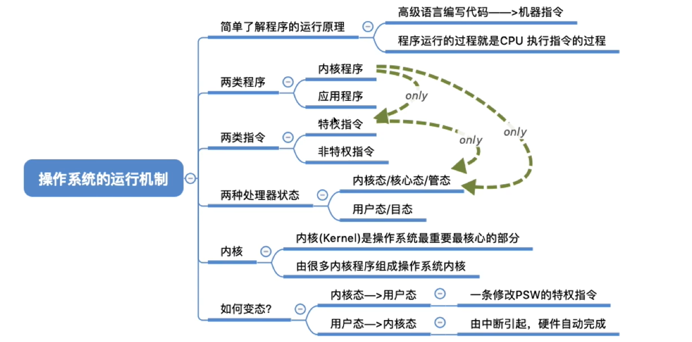
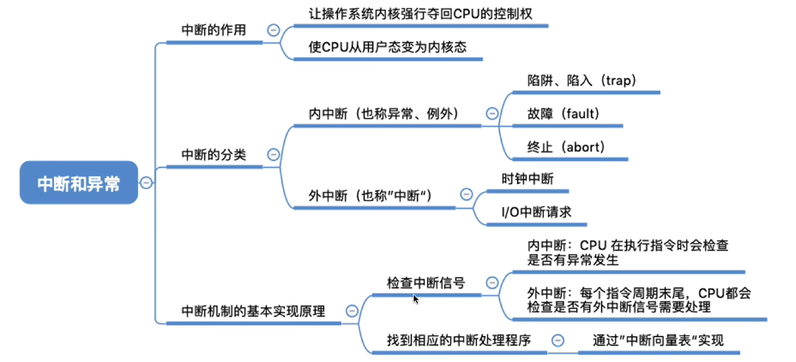
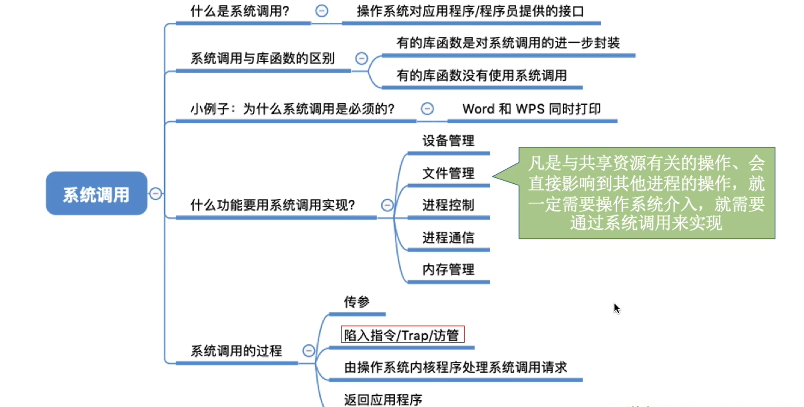
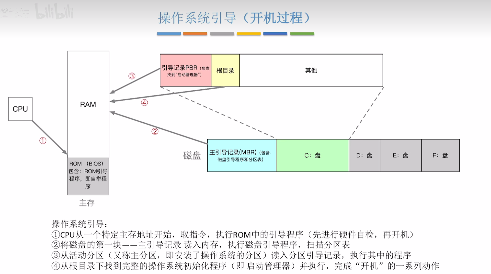
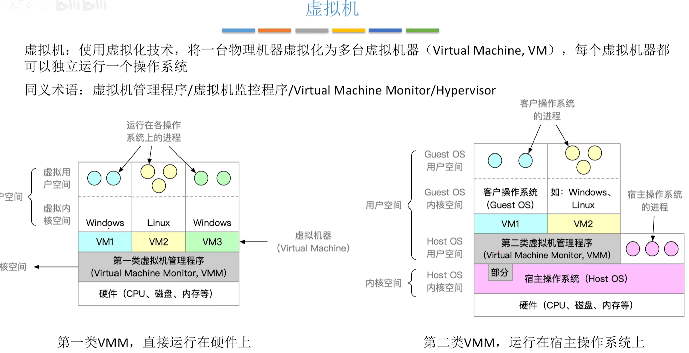
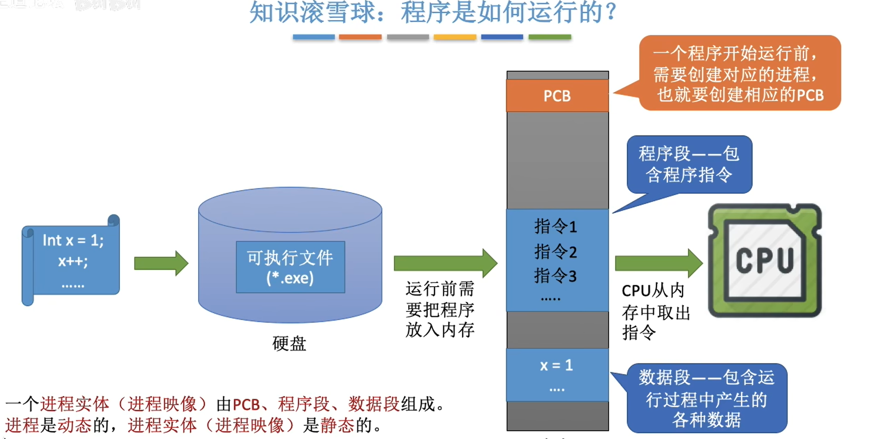
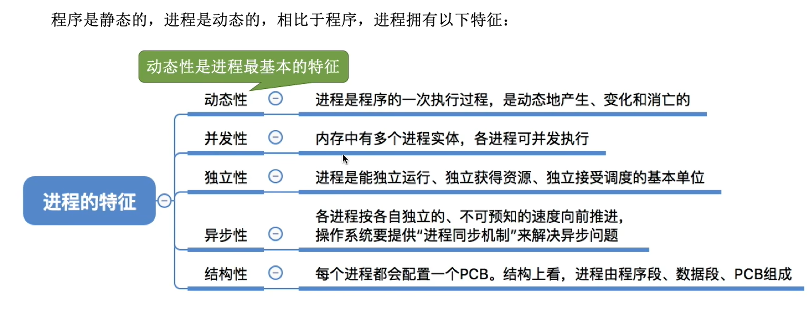

# 操作系统

## 操作系统的概念

### 定义
**操作系统**是指**控制和管理整个计算机系统的硬件和软件资源**，并合理地组织调度计算机工作和资源的分配；**以提供给用户方便、有效的接口和使用环境为目的**；是计算机系统的最基本的**系统软件**。
- 操作系统是系统资源的管理者
- 向上层提供方便易用的服务

$$
    \text{计算机硬件} \rightarrow \text{操作系统} \rightarrow \text{应用软件} \rightarrow \text{用户}
$$

### 操作系统的功能
- 资源的管理
  - 处理机管理：分配和调度系统资源，控制程序的执行
  - 存储器管理：管理系统存储器，包括内存、磁盘、磁带机等
  - 文件管理：管理文件，包括目录、文件、设备等
  - 设备管理：管理计算机外部设备，包括输入输出设备、网络设备等
- 向上层提供服务
  - GUI
  - 命令接口
  - 程序接口
- 对硬件机器的扩展：有机结合CPU等硬件

### 操作系统的特征
#### 并发
**指多个事件在同一时间间隔内发生。宏观上时间是同时发生的，微观上是交替运行的。**
> 并行微观上也是同时发生的。

#### 共享
**指系统中的资源可供多个并发进程共同使用。共享资源包括内存、磁盘、网络等。**
- 互斥共享：一个资源同时只允许一个进程使用
- 同时访问：多个进程可以同时访问一个资源

#### 虚拟
**指把一个物体的实体变为若干个逻辑上的对应物。**
- 空分复用技术，如虚拟存储器技术
- 时分复用技术，如虚拟CPU

#### 异步
**指由于资源有限，进程的执行不是一贯到底，而是走走停停，进程以不可预知的速度向前推进，不受其他进程的影响。**

> 并发和共享互为存在条件
> 没有并发和共享，就谈不上虚拟和异步，因此==并发和共享是操作系统的两个最基本的特征==

### 操作系统的发展与分类

### 操作系统的运行机制
#### CPU内核态与用户态
- 内核态：CPU处于此态时，可以执行特权指令。
- 用户态：CPU处于此态时，只能执行非特权指令。
> CPU依靠PSW寄存器的标志位来判断当前运行的状态，当PSW的T位为1时，CPU处于内核态；当T位为0时，CPU处于用户态。

#### 中断与异常

#### 系统调用

> 陷入指令是非特权指令，在CPU用户态执行。

### 操作系统引导（开机过程）

### 虚拟机

## 处理机管理
### 进程
#### 概念
**进程**是*动态*的，是程序的一次执行过程；==是进程实体的运行过程，是系统进行资源分配和调度的基本单位。==
> 程序：程序是静态的，是指令的集合。

#### 组成
> PCB是给操作系统用的
> 程序段、数据段是给进程自己用的
##### PCB
**操作系统需要对各个并发运行的进程进行管理，==但凡管理时所需要的信息都会被放在一个数据结构 $PCB(Process \space Control \space Block)$== 中**

- **PCB**
  - 进程描述信息
    - ==进程标识符PID==
    - 用户标识符UID
  - 进程控制和管理信息
  - 资源分配清单
  - 处理机相关信息

###### 程序段、数据段
- 程序段：进程执行的指令
- 数据段：进程执行时产生的各种数据

> 

#### 特征
