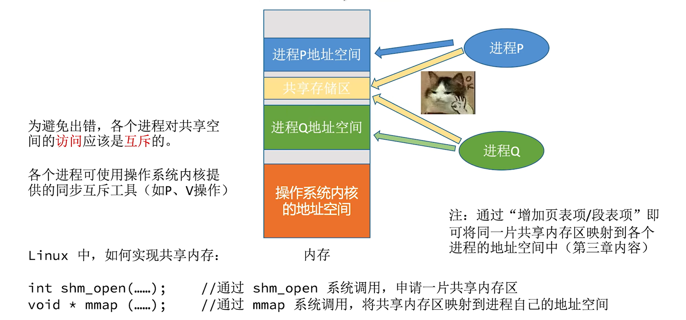
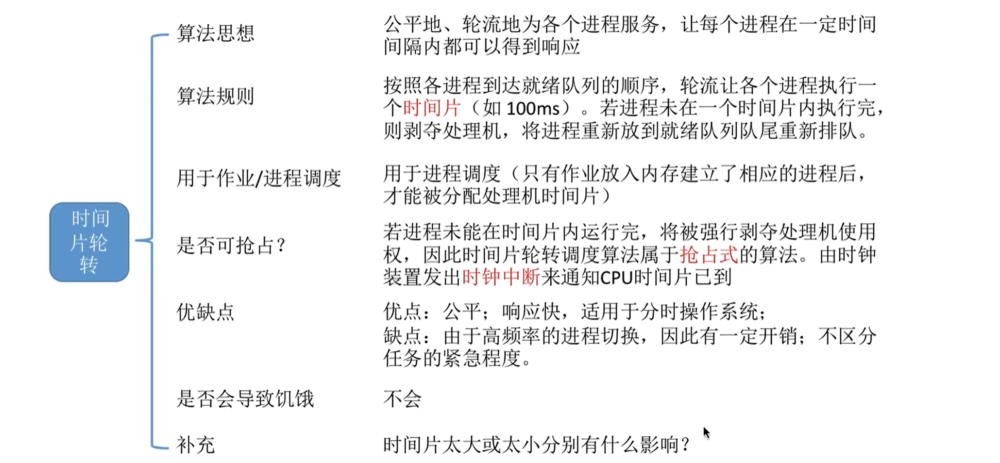
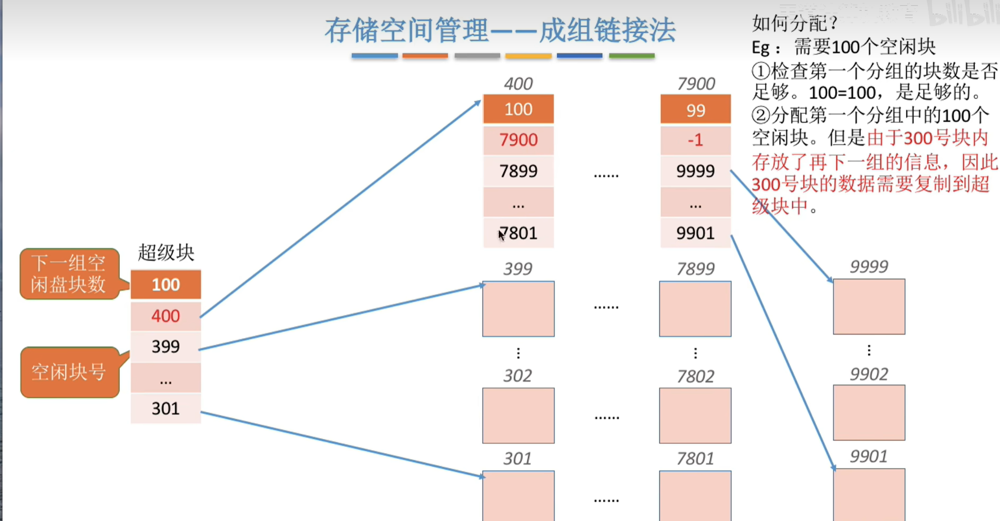

# 操作系统

## 操作系统的概念

### 定义
**操作系统**是指**控制和管理整个计算机系统的硬件和软件资源**，并合理地组织调度计算机工作和资源的分配；**以提供给用户方便、有效的接口和使用环境为目的**；是计算机系统的最基本的**系统软件**。
- 操作系统是系统资源的管理者
- 向上层提供方便易用的服务

$$
    \text{计算机硬件} \rightarrow \text{操作系统} \rightarrow \text{应用软件} \rightarrow \text{用户}
$$

### 操作系统的功能
- 资源的管理
  - 处理机管理：分配和调度系统资源，控制程序的执行
  - 存储器管理：管理系统存储器，包括内存、磁盘、磁带机等
  - 文件管理：管理文件，包括目录、文件、设备等
  - 设备管理：管理计算机外部设备，包括输入输出设备、网络设备等
- 向上层提供服务
  - GUI
  - 命令接口
  - 程序接口
- 对硬件机器的扩展：有机结合CPU等硬件

### 操作系统的特征
#### 并发
**指多个事件在同一时间间隔内发生。宏观上时间是同时发生的，微观上是交替运行的。**
> 并行微观上也是同时发生的。

#### 共享
**指系统中的资源可供多个并发进程共同使用。共享资源包括内存、磁盘、网络等。**
- 互斥共享：一个资源同时只允许一个进程使用
- 同时访问：多个进程可以同时访问一个资源

#### 虚拟
**指把一个物体的实体变为若干个逻辑上的对应物。**
- 空分复用技术，如虚拟存储器技术
- 时分复用技术，如虚拟CPU

#### 异步
**指由于资源有限，进程的执行不是一贯到底，而是走走停停，进程以不可预知的速度向前推进，不受其他进程的影响。**

> 并发和共享互为存在条件
> 没有并发和共享，就谈不上虚拟和异步，因此==并发和共享是操作系统的两个最基本的特征==

### 操作系统的发展与分类

### 操作系统的运行机制
#### CPU内核态与用户态
- 内核态：CPU处于此态时，可以执行特权指令。
- 用户态：CPU处于此态时，只能执行非特权指令。
> CPU依靠PSW寄存器的标志位来判断当前运行的状态，当PSW的T位为1时，CPU处于内核态；当T位为0时，CPU处于用户态。

#### 中断与异常

#### 系统调用

> 陷入指令是非特权指令，在CPU用户态执行。

### 操作系统引导（开机过程）

### 虚拟机

## 处理机管理
### 进程
#### 概念
**进程**是*动态*的，是程序的一次执行过程；==是进程实体的运行过程，是系统进行资源分配和调度的基本单位。==
> 程序：程序是静态的，是指令的集合。

#### 组成
> PCB是给操作系统用的
> 程序段、数据段是给进程自己用的
##### PCB
**操作系统需要对各个并发运行的进程进行管理，==但凡管理时所需要的信息都会被放在一个数据结构 $PCB(Process \space Control \space Block)$== 中**

- **PCB**
  - 进程描述信息
    - ==进程标识符PID==
    - 用户标识符UID
  - 进程控制和管理信息
  - 资源分配清单
  - 处理机相关信息

###### 程序段、数据段
- 程序段：进程执行的指令
- 数据段：进程执行时产生的各种数据

> 

#### 特征

#### 状态与转换

##### 进程的组织
- 链式方式
- 索引方式

#### 进程控制
##### 原语的原子性

##### 创建原语
- 申请空白PCB
- 为新进程分配资源
- 初始化PCB
- 将PCB插入就绪队列

##### 撤销原语
- 从PCB集合中找到指定PCB
- 若进程正在运行，立即剥夺CPU，将CPU分配给其他进程
- 终止其所有子进程
- 回收其资源到父进程或操作系统
- 删除PCB

##### 阻塞和唤醒原语

##### 切换原语

#### 进程通信 PIC
##### 共享存储

> 分为数据结构、存储区两种。

##### 消息传递
- 直接通信

- 间接通信

##### 管道通信

### 线程
#### 与进程的区别

#### 特点

#### 实现方式与模型

### 调度
#### 分类、层次
- 高级调度

- 低级调度

- 中级调度

> 七状态状态：
> 

> 三层调度的对比
> 

#### 时机与切换

#### 调度算法
##### 评估标准

##### 先来先服务 FCFS

##### 短作业优先 SJF

##### 高响应比优先 HRRN

##### 时间片轮转 RR

##### 优先级调度

> 

##### 多级反馈队列调度

##### 多级队列调度

### 同步与互斥
#### 概念

#### 进程互斥实现方法
###### 软件方法
- 单标志法
- 双标志先检查法
- 双标志后检查法
- Peterson算法
  

###### 硬件方法
1. 中断

2. TestAndSet指令

3. Swap指令

#### 信号量机制
##### 概念

##### 信号量解决互斥、同步问题

#### 死锁
###### 概述

###### 预防死锁

###### 避免死锁
银行家算法：

###### 检测和解除死锁
- 检测死锁

- 解除死锁
  - 资源剥夺法
  - 撤销进程法
  - 进程回退法

## 内存管理
### 基本知识
#### 内存管理的概念

#### 内存映射

#### 覆盖和交换
###### 覆盖技术

###### 交换技术

### 内存分配
#### 连续分配
###### 三种分配

###### 动态分区分配算法
- 首次适应算法：按地址递增排序
- 最佳适应算法：按容量递增排序
- 最大适应算法：按容量递减排序
- 邻近适应算法：按地址递增排序，但每次都从上次查询结束位置开始查找

#### 非连续分配
###### 基本分页存储管理

###### 基本分段存储管理

###### 段页式管理

### 虚拟内存

###### 页面置换算法
- 最佳置换算法：每次淘汰最少使用的页面
- 先进先出置换算法：每次淘汰最先进入的页面（硬件要求大）
- 最近最久未使用置换算法：每次淘汰最久没有被访问的页面
- 时钟置换算法：每次淘汰最久没有被访问的页面，但需要维护一个访问位图
- 优化时钟置换算法：

###### 页面分配策略

> 抖动：原因是分配给进程的物理块不够。

## 文件管理
### 逻辑结构
###### 无结构文件
文件内部的数据就是一系列二进制流或字符流组成。

###### 有结构文件

### 文件目录

### 物理结构
- 连续分配
- 链式分配（隐式链接）（每个盘块包含一个指针）
- 链式分配（显示连接）（存在FAT-文件分配表，存放每个盘块的下一个盘块号）

- 索引分配

### 存储空间管理

### 文件操作

### 文件共享
- 硬链接

- 软连接（快捷方式）

## IO
### IO控制器

###### 控制方式
- 程序控制方式

- 中断驱动方式
- DMA方式

- 通道方式

### 机器磁盘
#### 磁盘结构

> 磁头默认在最外圈。

#### 磁盘调度算法
- 先来先服务调度算法（FCFS）
- 最短寻道时间优先算法（SSTF）
- 扫描算法（SCAN）（电梯算法，往右要到底）
- LOOK算法（电梯算法，无需到底）
- 循环扫描算法（C-SCAN，左右到底）
- C-LOOK算法（C-SCAN，无需到底）

> 

#### 引导块

