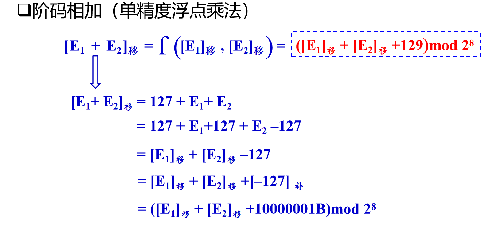
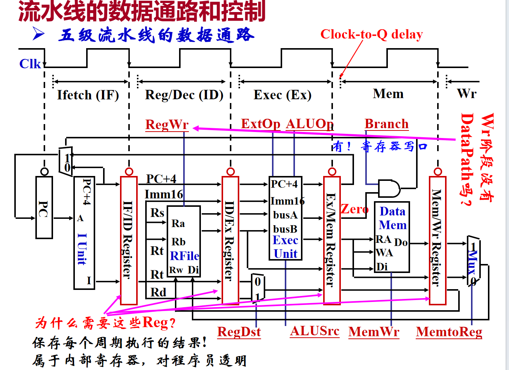
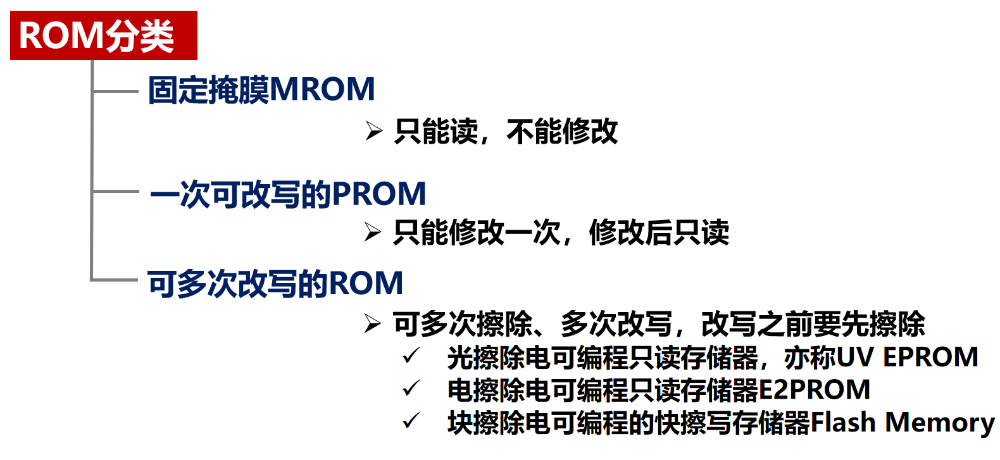
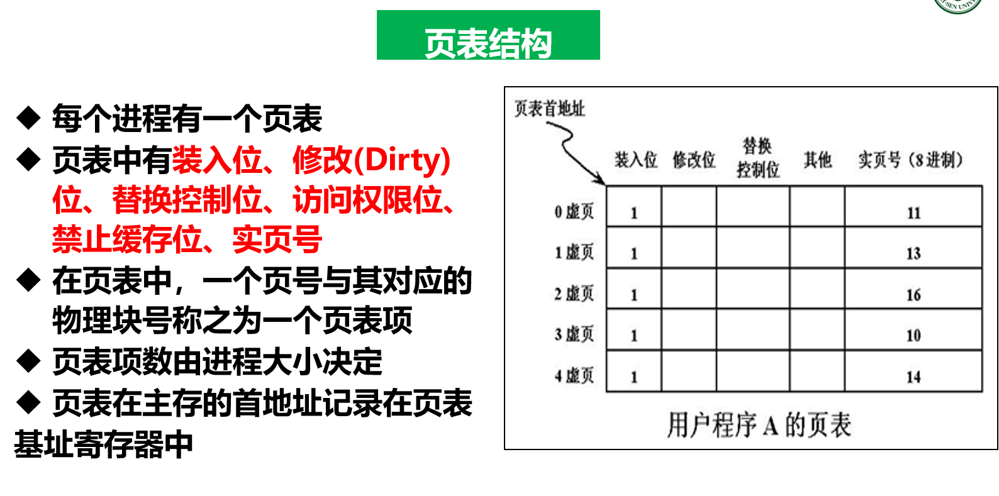

# 计算机组成原理笔记
> 学了这个也不会修电脑
## 计算机概要与技术
### 概述
**图灵机**
  1. 解决了如何自动实现状态变化的方法。
  2. 图灵的指令系统单一不够完善，没能将指令存储起来重复使用。
  3. **图灵被誉为计算机科学之父**。

**冯诺依曼结构**


  - 计算机由运算器、控制器、存储器、输入设备、输出设备五大部分组成。

**计算机层次结构**

> 红色条代表指令系统（ISA，Instruction Set Architecture），它是计算机软/硬件的交界面。

**从程序到电子信号**
$$
  \text{预处理} \rightarrow \text{编译} \rightarrow \text{汇编} \rightarrow \text{链接} \rightarrow \text{加载} \rightarrow \text{执行}
$$

**打开机箱**
- 处理器
  - 功能：执行指令，产生结果。
  - 结构：运算器（ALU）、控制器、寄存器。
- 存储器
  - 功能：存储数据、指令。
  - 结构：内存（Cache, 主存）、外存（硬盘、光盘、磁带等）。
- 输入/输出设备
  - 功能：输入数据、输出结果。
  - 结构：I/O控制器（**控制外设工作，完成主机和外设之间的通信**）、I/O设备（输入输出信息）。

### 计算机性能计算
**性能指标**
- 完成单个任务的时间（响应时间）
  - 执行时间
  - 等待时间或时延
- 单位时间完成的任务量
  - 吞吐量（Throughput）
  - 带宽（Bandwidth）

**注意事项**
- 响应时间（用户感受到的）
  - CPU时间：CPU真正花费在程序执行上的时间：
    - 用户CPU时间：用来运行用户代码的时间
    - 系统CPU时间：为执行用户程序而需运行一些操作系统代码的时间
- 其他时间：等待I/O操作完成或CPU花在其他用户程序的时间

> 计算机系统性能 $\neq$ CPU性能
> - 系统性能(System performance)：**表示系统响应时间**，与CPU之外的其他部分都有关系
> - CPU性能(CPU performance)：**表示用户CPU时间**
> ==主要讨论CPU性能：CPU真正用在用户程序上的时间==

**功耗**
$$
  \begin{split}
  P &= \frac{1}{2} \times C\times U^2 \times f \\
    &= W \times f \\
    &= \frac{W}{T}
  \end{split}
$$

### 计算机的发展
**Amdahl定律（并行计算性能加速比公式）**
$$
  S_A = \frac{1}{s + (1 - s) / N}
$$
> $S_A$：并行计算性能加速比
> $s$：串行部分占整个程序工作量的比例
> $N$：处理器数量
- 公式推论：对计算机系统的某个部分采用并行优化措施后所获得的计算机性能的提高是有上限的，这个上限取决于串行部分所占的比例

**Gustafson定律**
- 任何足够大的任务均可被有效并行化
- 只要问题规模可扩展，并行所带来的加速比就可扩展

## 指令：计算机的语言
### 指令系统概述
#### 两种类型
**复杂指令系统（CISC）**：
- 主要特点：
  1. ==指令系统复杂==
  2. ==指令周期长==
  3. ==各种指令都能访问存储器==
  4. 有专用寄存器
  5. ==采用微程序控制==
  6. 难以进行编译优化生成高效目标代码
- 存在的问题：
  1. 研制周期长
  2. 难以保证正确性且难以维护
  3. ==效率低下（一般程序中简单指令占多数，且少量的复杂指令占用了大量存储容量）==
   
**精简指令系统（RISC）**：
- 主要特点：
  1. 简化的指令系统
  2. ==以寄存器-寄存器方式工作==
  3. ==指令周期短==
  4. ==采用大量通用寄存器，以减少访存次数==
  5. ==采用组合逻辑电路控制，不用或少用微程序==
  6. 采用优化的编译系统
  7. ==必须通过流水线控制器来实现==

#### 指令格式及其中功能
$$
  \text{指令格式} = \text{操作码} + \text{地址码}
$$
> ==指令操作码一般不等长==（无论RISC还是CISC）
> 操作码不等长 $\neq$ 指令不等长

##### 操作码
- **基本思想：指令的操作码部分采用可变长度的编码。操作码的编码长度分成几种固定长的格式，操作码的位数随地址数的减少而增加，这被大多数指令集采用。**


##### 寻址方式
- 立即寻址
- 存储器直接寻址
- 寄存器直接寻址
- 存储器间接寻址
- 寄存器间接寻址
- 偏移寻址：**位移量的单位是字节数，目标地址-基址地址=位移量**
  - 相对寻址
  - 基址寻址
  - 变址寻址 ：==数组访问==
- 堆栈寻址

### 数据在计算机中的表示
#### 字长与字
- **字长与字**
  - 字长：字长是指CPU中数据通路的宽度，**等于CPU内部总线的宽度或运算器的位数或通用寄存器的宽度等**
    - ==$机器字长 = 通用寄存器宽度 = ALU宽度$，指令寄存器宽度不一定（考虑CISC指令集）==
  - 字：字是处理信息的单位，和字长的宽度可以一样，也可以不同，通常是字节的整数倍
  - ==现代计算机已经不区分这两个概念==
#### 数据的表示
- **浮点数的表示**
  - 偏置常数：`float : 127`，`double : 1023`
  - 单精度规格化数阶码范围为$[1, 254]$。
  - 双精度规格化数阶码范围为$[1, 2046]$。
  - `float`各段位数为 $sign(1) + exponent(8) + significand(23)$
  - `double`各段位数为 $sign(1) + exponent(11) + significand(52)$
$$
  Value = (-1)^{Sign} \times (1 + Significand) \times 2^{Exponent -127}
$$
> 上式是单精度规格化浮点数的计算公式，`Significand`为尾数部分，`Exponent`为指数部分，`Sign`为符号位。
- **浮点数中的非规格化数**
  

- **ASCII码表示十进制数**
> 例：
> 十进制数+236表示为：32 33 36H
> 0011 0010 0011 0011 0011 0110B
> 进制数-2369表示为：32 33 36 ==7==9H
> 0011 0010 0011 0011 0011 0110 ==0111== 1001B


---
---
- **BCD码表示十进制数**


> 注：字节需补齐


#### 数据的度量与存储
- **大端存储**
- **小端存储**
- **数据对齐**
- **数据纠错**
  1. 在源部件求出奇(偶)校验位P
  $$
  \begin{split}
  &奇校验，则 P = b_{n-1} \oplus b_{n-2} \oplus ... \oplus b_{1} \oplus b_{0} \oplus 1 \\
  &偶校验，则 P = b_{n-1} \oplus b_{n-2} \oplus ... \oplus b_{1} \oplus b_{0}
  \end{split}
  $$

  2. 在目的部件求出奇(偶)校验位P''
  $$
  \begin{split}
  &奇校验，则 P'' = b'_{n-1} \oplus b'_{n-2} \oplus ... \oplus b'_{1} \oplus b'_{0} \oplus 1 \\
  &偶校验，则 P'' = b'_{n-1} \oplus b'_{n-2} \oplus ... \oplus b'_{1} \oplus b'_{0}
  \end{split}
  $$

  3. 计算最终的校验位P*,并根据其值判断有无奇偶错
  $$
  \text{$假定P在目的部件接收到的值为P'$}\\
  P^* = P' \oplus P''\\
  Result = 
  \begin{cases}
  \text{有奇数个位错} & \text{if } P^* \neq 0 \\
  \text{数据正确或有偶数个位错} & \text{if } P^* = 0
  \end{cases}
  $$
> 缺点很明显，只能揪出"奇数个位错"，不能揪出"偶数个位错"。

>扩展： **海明码检/纠错**
> 设校验位的个数为$k$，数据中的错误位数为$m$，能检测到的错误位数为$g$。
> 有 $m + k + g \leq 2^k$

### 基本指令
> 以MIPS指令集为例

#### 三种指令结构
1. `R-Type`指令：`op rs, rt, rd shamt, funct`
    - `funct`：`R-Type`指令的`op`字段特定为`000000`，具体操作由`funct`字段给定。
2. `I-Type`指令：`op rs, rt, imm`
   - `imm` : 立即数，常数或寄存器中的数值。下一个指令地址计算公式为$PC + 4 + imm（汇编语言上看到的imm，机器码上看到的imm要×4）$ 。
3. `J-Type`指令：`op addr`
   - `addr` : **无条件转移地址的低26位。将PC高4位拼上26位直接地址，最后两个`0`就是32位目标地址。**


==关于地址的计算，目前可以确定的是所有参与计算的`PC`值，都是要`+4`后的==
==汇编语言是给人看的，机器代码是机器看的==
> 位移量指目标地址与当前地址的差值
#### 条件转移测试方法
- 常用四个标志：
  - `SF`：符号标志，当运算结果的最高位为1时，置1，否则置0。
  - `ZF`：零标志，当运算结果为0时，置1，否则置0。
  - `OF`：溢出标志，当运算结果超过运算范围时，置1，否则置0。
  - `CF`：进位标志，当运算结果的最高位产生进位时，置1，否则置0。

> $CF = sub \oplus Carry$
> `sub`是`是否为减法`，`Carry`是`是否产生进位（减法运算要转换为加法运算）`

#### 过程与函数
过程允许程序员使用参数将过程与其余的程序和数据分离，只允许传递参数(输入值)和返回结果。
- MIPS指令系统为过程调用分配了7个32位寄存器
  - $\$a_0$ ~ $\$a_3$：四个参数寄存器，用于传递参数
  - $\$v_0$ ~ $\$v_1$：两个储值寄存器，用于保存返回值
  - $\$ra$：一个返回地址寄存器，用于保存返回地址

MIPS汇编语言包含一个过程指令：跳转到某个地址的同时将下一条指令的地址保存在寄存器$ra中。

> 如果寄存器不够用怎么办，用**栈**！


> **注：该图栈顶是在图的底部。**
> 完成图中操作后，%esp开始随Callee程序的进入下降，直到该程序结束，根据%ebp实现返回。


## 计算机中的运算
### 基础运算
- 位运算
- 逻辑运算
- 移位运算
  - **负偶数可以右移当做除法，但负奇数不行。**
- 加减法运算
  - 溢出处理：采用$mod 4补码$，两位符号位
  
- 加法器的设计：串行与并行

> **移码的加减运算**：
> $[E_1]_{移} \plusmn$ $[E_2]_{移}$ = $[E_1 \plusmn E_2]_{补}$
> ==即移码间的加减的值等于相应真值加减后的补码形式==
> 又根据真值补码和移码的关系：符号位相反、数值位相同（因为偏移数为$2^{n - 1}$）可求得运算后的移码。
> **溢出判断**：如果两个加数（移码）的符号相同，且与和数的符号也相同，则发生溢出。

### 乘法运算
- 原码乘法：

- **补码乘法**：
  - **Booth算法**：
    - 被乘数采用$mod 4补码$


  - 快速乘法：
    - 2位Booth算法
    - 柱形乘法器、阵列乘法器
    - 考了就给

### 除法运算
- 余数恢复法：垃圾算法，考了我吃
- **加减交替法**：


> **最后得到的余数需要重新右移$n$位，得到真正的余数。**


> 上述都是原码除法，补码除法不做要求。

- 快速除法：阵列除法器

### 浮点运算
- 加减运算：
  - 对阶：==小的向大的对齐==。
    - 因为尾数可以右移，不能左移。
  - 尾数相加减
  - 规格化
  - 舍入
    - 向$0$方向舍入
    - 向$+\infty$方向舍入
    - 向$- \infty$方向舍入
    - 四舍五入
> 注意判断是否有溢出


- 乘除运算：
  - 阶码相加：

  - 阶码相减：

  - 规格化：

  - 舍入
  - 溢出判断

### 警钟长鸣
1. **浮点数运算不满足结合律，$x + (y + z) \neq (x + y) + z$。**
2. **对于整数，左移指令不相当于将原数与2的幂次方相乘；右移指令也不相当于将原来的整数除以2的幂次方。**
3. **并不是只有数学家才需要关注浮点数的精度问题。**


## 处理器

**CPU主要由数据通路和控制器组成**
- 数据通路：实现指令集中所有指令的操作功能
- 控制器：控制数据通路中各部件进行正确操作
### 数据通路
- **数据通路的组成**
  - 组合逻辑元件（操作元件）（ALU）：==不需要时钟信号来定时==
  - 存储元件（状态元件）（寄存器、指令存储器、数据存储器）：==需要时钟信号来定时==

- **数据通路类型**
  - 单总线数据通路：所有数据都通过一条总线传输，效率低下
  - 多总线数据通路：数据通过多条总线传输
    - 三总线数据通路：两条传输源数据，一条传输目标数据
  - 流水线数据通路：数据通过流水线传输，每个时钟周期传输一部分数据

### 单周期控制器与多周期控制器
**回顾D-触发器**

- 建立时间`Setup Time`：在触发时钟边沿之前输入必须稳定
- 保持时间`Hold Time`：在触发时钟边沿之后输入必须保持
- `Clock-to-Q Time`：**在触发时钟边沿，输出并不能立即变化**
  - 切记：==状态单元的输入信息总是在一个时钟边沿到达后的`Clock-to-Q Time`时才被写入到单元中，此时的输出才反映新的状态值==
> 即数据的输入有一定“延迟”

#### 单周期控制器
- **控制信号的取值**
  - 公共操作：取指令和计算下条指令地址PC
  - R-Type指令(`add` `sub`等)
  - 立即数指令(`ori`等)
  - 访存指令(`lw` `sw`等)
  - 分支指令(`beq` `bne`等)
  - 跳转指令(`jar`等)

**下举例一些重要操作的控制信号：**
```java
取指令: Instruction ← M[PC]
```


```java
jump指令: PC ← address
```


> 下边是主要操作的控制信号表


**特点或缺陷**
- ==单周期处理器的CPI为1==，所有指令的执行时间都以最长的`load`指令为准
- 时钟周期远大于其他指令实际所需的执行时间，效率极低
- **控制信号在整个指令执行过程中保持不变**，通过真值表即可实现控制器！


#### 多周期控制器
**特点及设计要求**
- 把指令执行分成多个阶段，各阶段在一个时钟周期内完成
  - 时钟周期以**最复杂阶段所花时间**为准
  - 尽量分成大致相等的若干阶段
  - 每个阶段内最多只能完成：**1次访存**或**寄存器堆读/写**或**ALU运算**
- 每步都设置相应的存储元件，执行结果都保存到相应单元中
- ==很多控制信号的取值会在指令执行过程中发生改变！==


**基于上述特点及要求，多周期控制器将指令分为了以下五个阶段**
$$
取指 \rightarrow 译码（取源操作数） \rightarrow 执行 \rightarrow 访存 \rightarrow 写回
$$

==单周期控制器和多周期控制器同样存在竞争问题，主要是写使能信号到来时，写入数据是否已经稳定的竞争问题==
**多周期控制器的解决方案**：
- 确认地址和数据在第N周期结束时已稳定
- 使写使能信号在一个周期后(即：第N+1周期)有效
- 在写使能信号无效前地址和数据保持不变

**多周期控制器控制信号的生成**
- 硬布线：采用组合逻辑设计方法用硬连线路(PLA)实现
- 微程序：用ROM存放微程序实现

### 流水线控制器
#### 概述与特点
==流水线控制器CPI无限接近1，或者说可以看作1==
**指令集特点**
  - 指令长度尽量一致：有利于简化取指令和指令译码操作
  - 指令格式少，且源寄存器位置相同：有利于在指令未知时预取操作数 
  - 只有`load` `store`指令需要访存操作
  - 数据和指令在内存中需要对齐存放，有利于减少访存次数和流水线的规整

#### 数据通路和控制


- **三种冒险**
  1. 资源竞争：不同阶段的资源竞争，如：ALU、寄存器堆、指令存储器
  2. 数据冒险：后面指令用到前面指令结果，但结果还没产生
  3. 控制冒险：转移指令或异常处理改变了程序顺序执行流程，而顺序执行指令在目标地址产生之前已被取出

- **资源竞争的解决方案**
  - 规定流水线数据通路中功能部件的设置原则为：**每个部件在特定的阶段被用！**
    - 将`Instruction Memory`和`Data Memory`分开
    - 将寄存器读口和写口独立开来


- **数据冒险的解决方案**
  - 硬件阻塞：硬件通过阻塞`stall`方式（加气泡）阻止后续指令执行，一直延迟到有新值以后！
  - 软件加上若干无用指令：==最差方案==
  - **利用`DataPath`中的中间数据**
    - `Forwarding`：把数据从流水段寄存器中直接取到ALU的输入端
    - 寄存器写/读口分别在前/后半周期，使写入被直接读出
  - 编译优化调整指令顺序(指令静态调度)

- **控制冒险的解决方案**
  - 硬件阻塞：硬件通过阻塞`stall`方式（加气泡）阻止后续指令执行，一直延迟到有新值以后！
  - 软件加上若干无用指令：==最差方案==
  - **分支预测**
    - 简单（静态）预测
    - **动态预测：根据历史记录（BHT）来预测本次分支的结果**
    - ==可以将分支结果产生提前到译码阶段，降低预测失败带来的后果==
  - 延迟分支(编译优化指令顺序)：把分支指令前面的与分支指令无关的指令调到分支指令后面执行，以填充延迟时间片，不够时用nop操作填充。

### 异常与中断
**异常的分类**

>**思考：哪些故障补救后可继续执行，哪些只好终止当前进程？**
>1. 缺页等：补救后可继续，回到发生故障的指令重新执行
>2. 溢出、除数为0、非法操作、内存保护错等：终止当前进程
>3. 自陷：回到当前指令的下一条指令执行

**异常处理**


- **异常处理中的难点**
  - **外部中断与特定指令无关，如何确定处理点？**
    - 可在IF段或WB段中进行中断查询，需要保证当前WB段的指令能正确完成，并在有中断发生时，确保下个时钟开始执行中断服务程序
  - **检测到异常时，指令已经取出多条，当前PC的值已不是断点，怎么办？**
    - 指令地址存放在流水段寄存器中，把这个地址送到EPC保存，以实现精确中断
  - **出现多个异常，或中断相关的寄存器不够用，怎么办？**
    - 根据优先级分配
  - **异常处理过程中，又发生新异常或中断，怎么办？**
    - 利用中断屏蔽和中断嵌套机制来处理

### 指令级并行
- 指令级并行：指令之间如果不存在依赖关系，可以同时执行
- 指令级并行的实现方法
  - 超标量：一条指令同时执行多个操作
  - 矢量：一条指令同时执行多个数据

- 线程级并行：多个线程同时执行
- 线程级并行的实现方法
  - 硬件支持：多核处理器
  - 软件支持：线程调度、线程同步、线程通信

## 微程序控制器


## 存储器
### 存储器概述
#### 存储器层级结构
$$
  寄存器 \rightarrow 缓存 \rightarrow 主存 \rightarrow 外存
$$
==从左到右，容量越来越小，速度越来越快==
==CPU可以根据指令直接访问寄存器、缓存、主存，而外存需要通过I/O设备访问==

#### 存储器分类
**按于计算机中的应用分类**
- 寄存器：用触发器实现
- Cache：用SRAM实现
- 主存：用DRAM实现
- 外存：用磁盘、磁带、磁盘阵列、光盘等实现

**按信息的保存性质分类**


### 内存的技术指标
- 存储容量
- 存取时间$T_A$与存取周期$T_S$，$T_A < T_S$
- 存储带宽与存取宽度
- 可靠性
- 功耗与集成度：**DRAM的集成度高于SRAM**
...

### Ramdom Access Memory(RAM)
**地址译码**


**SRAM与DRAM**
||DRAM|SRAM|
|-|-|-|
|存储原理|电容|触发器|
|集成度|高|低|
|芯片引脚|少|多|
|速度|慢|快|
|价格|低|高|
|刷新|有|无|
|应用|主存|Cache|

**DRAM的刷新**
- 集中式刷新
- 分散式刷新
- 透明式刷新

### Read-Only Memory(ROM)
- ==只能随机读的存储器==


### 内存设计
1. **容量扩展**，$T = \lceil \frac{M}{m} \rceil \times \lceil \frac{N}{n} \rceil$
2. **负载性能计算与分析**，$L = \lceil \frac{M}{m} \rceil \times \lceil \frac{N}{n} \rceil \times f$
3. **速度估算**,系统存储周期$T_{SM}$
  

### Cache高速缓存
**程序访问局限性**
- 时间局限性
- 空间局限性

#### Cache与主存之间的映射

**共有三种映射方式**
- 组相联映射：上图已给出
- 直接映射：即组相联中一块一组
- 全映射：即组相联N块一组

#### Cache与主存的地址
Cache地址
`valid: 1位` (`dirty: 1位`) (`LRU/LFU: a位`) `tag: k位` `data: b位` 
> `valid`表示该块是否有效；`tag`标记该块数据取自主存中哪一群；`data`为存储的数据；`dirty`表示该块数据是否发生过修改；`LRU/LFU`表示该块最近被访问的次数/最近最少使用次数。

主存地址
`tag: k位` `组号: g位` `块内地址: c位`
> `tag`标记该块数据取自主存中哪一群；`组号`表示该块数据对应Cache的组；`块内地址`表示该块数据在组内的偏移地址。

#### 命中与失效


#### Cache的一致性问题
**主要是Cache与主存的数据不一致的问题**

- **Cache的写机制**
  - **写命中，即数据在Cache中**
    - Write Through：
    - Write Back：
  - **写缺失，即数据不在Cache中**
    - Allocate on Write：更新主存块中相应单元，再将该主存块装入Cache中
    - No Allocate on Write：更新主存中相应单元，不将该块写回Cache中

#### Cache的替换策略
- FIFO
- LRU
- LFU
- Random

### 虚拟存储器


#### 分区
- 简单分区
- 可变长分区
- **分页**：
  

#### 组织方式
**三种方式**
- 页式
- 段式
  - 段本身是程序的逻辑结构所决定的一些独立部分，所以==分段对程序员是不透明的(而分页对程序员却是透明的)==
- 段页式

> 由于组织方式和Cache与主存映射方式雷同，下只讲述页式的虚拟存储器。

**地址格式**
- 虚存：`虚拟页号` `页内地址`
- 主存：`实际页号` `页内地址`
==虚存位数一般比实际页号位数多，原因：磁盘空间更大==

**引入页表（Page Table）**


> 注意：页表存放在**主存**中

**访问时的异常情况**
- ==**缺页**== 
- 保护违例

==**引入快表（TLB）**==
**快表使用Cache来储存部分页表项，快表与页表的关系类似于Cache与主存的关系**


**查找进程物理地址优先级**
$$
    快表 \rightarrow (页表 \rightarrow) \begin{cases}主存 & 如果页表项有效 \\ 外存 & 如果页表项无效\end{cases}
$$

**查找数据优先级**
$$
    寄存器 \rightarrow Cache \rightarrow 主存
$$

==**访问主存次数情况**==


## I/O系统
**未完待续...**